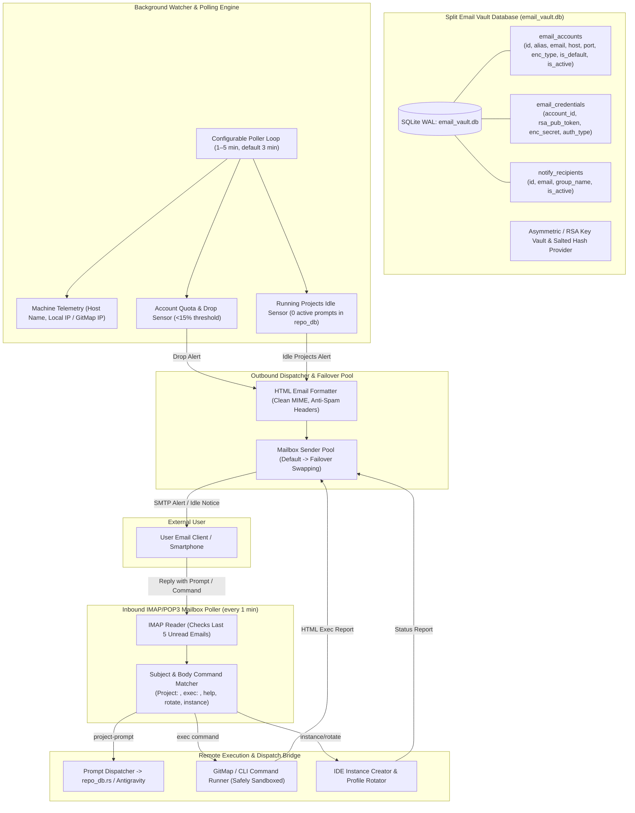

# Email Dispatch, Mailbox Remote Management, Split Security Vault DB, and Bidirectional Remote Execution Specification

> **Specification Index:** `02-spec/21-app/16-email-dispatch-mailbox-remote-management-and-split-security-db.md`
> **Application:** Antigravity-Manager (`alimtvnetwork/Antigravity-Manager`)
> **Version:** `4.18.0`
> **Authority:** Production Architectural Specification
> **Status:** Active

---

## 1. User Request (Verbatim)

```text
Okay. The way that I wanted to change, make changes, uh, is a few new things. Okay? So first of all, we can have, uh, some of the email accounts, uh, we can give a, a multiple email account user and email, uh, accounts will be saved as aliasing and email account password would be saved as, uh, SSH RSA key so that no one can encrypt back. Uh, the password would be saved in a separate database. So create a, a new split database for the passwords, it stores for the email so that it's, it's very much secure. Okay. Now, there'll be a plain window where we can insert the email password, its, uh, port, uh, all the things that is required for SMTP, IMAP, um, et cetera, to connect and read the mailbox. So add all these boxes. Okay? So we should be able to import-export the, uh, email using JSON and also the CSV and also the Excel, two ways. Okay? That needs to be additional code, additional system I want you to write like this. And why I'm adding this, so there would be a default email address. Now, we can select that, uh, default email address. The way that it would work is that the default email address will allow us to, to basically, um, um, basically do the, um, uh, sending to the user. So we can, we can have like the email addresses and also we can have notified email. So notified email means that can ha- have multiple or can be a group. Um, so what is the notify email? Notify email will work, uh, as following. So if we add the email, email sender, that means mailboxes, then from the mailboxes, usually by default one would be used. If the default one cannot, then it would use the next box or so on. So usually by default it would be one, but we can add more to have, uh, swapping in the mailboxes. The way that it would work is that, um, let's say, um, a instance or a machine. So it would know about the machine information, what is the machine name, and, uh, in this machine, whatever the projects was running, uh, for this Antigravity, it would know that information as well. Let's say every, uh, five minutes or three minutes, so that could be configurable in terms of minutes. Usually, it would be, uh, three minutes, every three minutes, it would check whether the Antigravity prompts are running, uh, which projects are running, uh, and every three minutes it'll check like what is the current, uh, let's say accounts credit, how much it is losing. So if it loses less than the amount, then it would email, send an email to the, uh, notified email section. What-whatever that is there, it could be group or multiple. Okay? So it would send the email using the mailbox if it is configured. If not, then it skip. Okay, so the code needs to be very nicely written, uh, as additional s-stuff. Okay? So two ways it would send the notification, and we can check which type of notification we wanted to receive. For example, uh, we could see the notification just before, um, the workspace switch. It could send an email. Um, we could, um, yeah, we, we could do another thing. We could do like workspace, um, check if workspace has no prompt. Okay? So if the workspace has no prompt, so this is also a notification that, uh, it would send an email to the user like, "There is no prompt. Would you like to send something to this project? These, these, these projects are available." The user can name the project on the root as a subject. Okay? So it would try to match the subject and there would be a format like project colon and then the subject. It would try to match the project, uh, uh, lowercase with the starting with, if that matches in whatever the email backs project prompt, project hyphen prompt. If that instruction comes, only then... And it needs to be last five instructions. So it would check like every one minute. Okay? Uh, not, not like very frequently. So that would also be configurable like one minute, two minute, how we want to do it. So it would read and, and if there is no instruction running, then it would send an email. If it gets a email back with the same format that it is expected or probably a reply like this, this project, "That's the two projects we're running," so it would send two projects email. Like, "These two projects has no prompts running." So user can just reply back with the prompt, and that prompt is going to run automatically. So it's going to read the mailbox and then going to run automatically on this Antigravity, and this is how it's going to work automatically, uh, without the user, uh, being the machine, so it can communicate automatically. So in the future, we will add the endpoint to deal with the situation. So put a question mark in the spec for the endpoints in the future. But for now, I think, uh, this is the way that it would work, and you tell me the architecture, how I design, how I think of it. Uh, do you like it or not?

So all of these should be additional settings, uh, in the Settings tab. It should have nicely placed with the UI so that the UI is not broken. Remember that. So, um, if nothing is less working, it needs to have the error wrapper and stack trace and the error model so that I can copy-paste and give it to you. Remember that. And, uh, we can also run commands in the machines, okay, because it would actually contains the machine information and its IP so that, uh, when it returns back, it, it would understand that, okay, so now this command is for this IP machine, okay? Local IP, not something else. So using the git map, it would, it would know that this is the IP of the machine. And then when the email back, email says like IP this, and this is the prompt instruction that actually has come, so it's going to run. So we could send the email back in two ways. One is the prompt, another could be running an executive instruction. So inside the executive instruction, we could run a git map command, and if we run it, we will get a reply back in the email, um, um, using whatever happened. So it would be nicely encoded so that it does not email flag, okay? Nicely wr- write the email as a format in HTML so that it looks nice and goes to the email box. Remember that. Okay. All right. I think, um, this is kind of the stuff, um, overall that we could rely on. Uh, there'll be new ideas, so I will share that later. But this is kind of it. So you can start with this and make sure that, uh, it has the tests, everything is covered nicely. Um, small, small functions, uh, write it, uh, write the test properly if possible. I'm not sure about the Rust, how the package and things are written. If it's like Go, then try to create small packages so that the code can be tested and do not, uh, create a overlook or issues. Okay. So error manage, I, I do think that it is not followed properly. I think you need to focus on this furthermore

One thing here I think that is kind of must, so rotating and creating instance, that should also be possible through email. So you should have formatting and things like that. I could check it out, uh, the formats, uh, how it's going to do that. So I should be able to create instance of the IDE anytime I want using the email. The format should also give an example inside the email. So if I say help, that would actually give how, how many types of email that I could send, what type of, uh, instance it would run. So I could only do the execution stuff using Git map and others, uh, in the command line. I could, I could do, uh, let's say prompt injection. I mean, send the prompt to the IP machine, and also I could just name the prompt. It would find the prompt and try to execute that as well. Um, it would have, uh, all kinds of things. Um, um, also it can tell me what type of, uh, projects are running, what prompts are running. Uh, I could see that in the email if I request to. And if, uh, no prompts are running, then it would immediately let us know, like these are the three projects it was running, now it has like nothing. So it should revert back, and these all settings needs to be, uh, import and export using JSON and also the, um, the SQLite DB. Remember that the setting import-export is very much priority. Make sure that we have this feature. Uh, is it, is it clear? Do you have any question and confusion? The first thing it should be written the verbatim what I've given in the spec folder properly inside the folder 21 spec. Have the spec, write it there, and then break it down to smaller pieces and try to do each one of the tasks. Make sure no task is remain. So first is create a bullet point of the task so that nothing is pending, nothing is missed. Remember that
```

---

## 2. System Architecture Overview



---

## 3. Split Vault Database Schema (`email_vault.db` & `email_passwords.db`)

The email subsystem operates two isolated SQLite databases for defense-in-depth security:
1. **`email_vault.db`**: Configuration, mailboxes, notification recipients, settings, and inbound audit logs.
2. **`email_passwords.db`**: Completely isolated split database storing credential secrets, OpenSSH RSA public key identities, and salt derivations.

Both databases operate in SQLite WAL mode with `busy_timeout = 5000` and foreign keys enabled:

### 3.1 Table: `email_accounts` (`email_vault.db`)
```sql
CREATE TABLE IF NOT EXISTS email_accounts (
    id TEXT PRIMARY KEY,
    alias TEXT NOT NULL,
    email TEXT NOT NULL,
    smtp_host TEXT NOT NULL,
    smtp_port INTEGER NOT NULL DEFAULT 587,
    imap_host TEXT NOT NULL,
    imap_port INTEGER NOT NULL DEFAULT 993,
    encryption_type TEXT NOT NULL DEFAULT 'TLS', -- TLS, STARTTLS, SSL, NONE
    is_default BOOLEAN NOT NULL DEFAULT 0,
    is_active BOOLEAN NOT NULL DEFAULT 1,
    created_at INTEGER NOT NULL,
    updated_at INTEGER NOT NULL
);
```

### 3.2 Table: `email_credentials` (`email_passwords.db`)
```sql
CREATE TABLE IF NOT EXISTS email_credentials (
    account_id TEXT PRIMARY KEY,
    auth_type TEXT NOT NULL DEFAULT 'password', -- password, rsa_key, oauth2
    encrypted_secret TEXT NOT NULL,
    rsa_public_fingerprint TEXT NOT NULL,
    ssh_rsa_public_key TEXT NOT NULL,
    salt TEXT NOT NULL,
    updated_at INTEGER NOT NULL
);
```

### 3.3 Table: `notify_recipients`
```sql
CREATE TABLE IF NOT EXISTS notify_recipients (
    id TEXT PRIMARY KEY,
    email TEXT NOT NULL,
    group_name TEXT NOT NULL DEFAULT 'default',
    is_active BOOLEAN NOT NULL DEFAULT 1,
    created_at INTEGER NOT NULL
);
```

### 3.4 Table: `email_notification_settings`
```sql
CREATE TABLE IF NOT EXISTS email_notification_settings (
    id TEXT PRIMARY KEY DEFAULT 'global',
    is_enabled BOOLEAN NOT NULL DEFAULT 0,
    polling_interval_minutes INTEGER NOT NULL DEFAULT 3,
    inbox_check_interval_minutes INTEGER NOT NULL DEFAULT 1,
    notify_on_quota_drop BOOLEAN NOT NULL DEFAULT 1,
    quota_drop_threshold_percent INTEGER NOT NULL DEFAULT 15,
    notify_on_workspace_switch BOOLEAN NOT NULL DEFAULT 1,
    notify_on_idle_workspace BOOLEAN NOT NULL DEFAULT 1,
    allow_remote_prompt_execution BOOLEAN NOT NULL DEFAULT 1,
    allow_remote_cli_execution BOOLEAN NOT NULL DEFAULT 1,
    allow_remote_instance_rotation BOOLEAN NOT NULL DEFAULT 1,
    local_machine_name TEXT NOT NULL DEFAULT '',
    local_machine_ip TEXT NOT NULL DEFAULT '',
    updated_at INTEGER NOT NULL
);
```

### 3.5 Table: `email_inbound_audit_log`
```sql
CREATE TABLE IF NOT EXISTS email_inbound_audit_log (
    id TEXT PRIMARY KEY,
    message_id TEXT NOT NULL,
    sender_email TEXT NOT NULL,
    subject TEXT NOT NULL,
    action_type TEXT NOT NULL, -- prompt_injection, cli_exec, instance_create, rotate, help, ignored
    action_payload TEXT NOT NULL,
    execution_status TEXT NOT NULL, -- success, error, rejected
    execution_result TEXT NOT NULL,
    received_at INTEGER NOT NULL
);
```

---

## 4. Inbound Email Command Specification

The inbound mail parser matches the last 5 unread emails using deterministic subject and body conventions:

| Command Type | Subject Pattern | Body Format | Action Executed | Reply Sent |
|---|---|---|---|---|
| **Prompt Injection** | `Project: <project-name>` or `project-prompt: <name>` | Multi-line prompt text | Injects prompt into matching active running project via `repo_db` / IPC | HTML receipt with timestamp & machine IP |
| **Named Prompt Exec** | `prompt: <name>` or `named-prompt: <name>` | Optional query or empty | Dispatches saved/backed-up prompt matching query to running workspace | HTML receipt with matched prompt & timestamp |
| **CLI / GitMap Exec** | `exec: <ip>` or `command: <ip>` | Shell / GitMap command (e.g. `gitmap status`) | Sandboxed execution of approved commands on matching local machine IP | Full formatted HTML console log |
| **Instance Launch** | `instance: new` or `instance: create` | Profile name or arguments | Calls `clone_instance_executable` or launches isolated profile | Confirmation with process PID & port |
| **Account Rotation** | `rotate: accounts` or `account: rotate` | Optional target email/profile | Calls `/admin/accounts/rotate` or switches to next highest quota profile | New active profile status & quota table |
| **Status / Query** | `status` or `query: projects` | (Empty or any) | Retrieves running projects and active prompt queue | Summary card of projects and queue |
| **Interactive Help** | `help` | (Empty or any) | Returns complete instruction manual with syntax examples | Formatted HTML help catalog |

---

## 5. Import & Export Formats

Settings, mailboxes, and recipient lists support two-way import and export:
1. **JSON (`.json`):** Full configuration serialization with sanitized credential placeholders or encrypted vault export.
2. **CSV (`.csv`):** Standard comma-separated format for mailboxes (`alias,email,smtp_host,smtp_port,imap_host,imap_port,encryption_type,is_default`) and recipients (`email,group_name,is_active`).
3. **Excel (`.xlsx`):** Multi-sheet workbook (`Mailboxes`, `Recipients`, `Settings`) for bulk enterprise management.

---

## 6. Future REST API Endpoints

> [!NOTE]
> The following endpoints are reserved for future external microservices and webhook integrations. (Marked with `?` as specified by user).

- `POST /api/v1/email/inbound/webhook`? — Inbound webhook for push-based mail services (SendGrid / Mailgun / Postmark).
- `POST /api/v1/email/dispatch/prompt`? — Direct programmatic prompt dispatch endpoint.
- `GET /api/v1/email/status`? — Mailbox health check and SMTP/IMAP connectivity probe.
