# Email Intelligence, Immediate Acknowledgment Receipts, and Universal Settings Import/Export Specification

> **Specification Index:** `02-spec/21-app/17-email-intelligence-acknowledgment-and-universal-import-export.md`
> **Application:** Antigravity-Manager (`alimtvnetwork/Antigravity-Manager`)
> **Version:** `4.49.0`
> **Authority:** Production Architectural Specification
> **Status:** Active / Ready for Implementation

---

## 1. User Request (Verbatim)

```text
Inside the email, it should have, let's say, intelligence to figure out if there's a mistake or close enough command. It will immediately let the user know that, yes, we have received it. So acknowledgment. Okay, that needs to be sent from the email account. That is very important. And all the email and everything, this needs to have a, how can I say it? Recent import-export system. So all the settings inside this tool should have import-export settings. Import-export using JSON or SQLite, both ways are fine. Any sensitive data should be base and encoded 64 multiple times with some number, so that it cannot drag back directly. Okay, remember that. Yeah, so try to have this so that we can import and export nicely, don't have any issues. Okay, also write respect for this, and then probably in the future, we will try to implement it. Is it here?
```

---

## 2. Executive Architecture Overview

```mermaid
flowchart TB
    subgraph InboundEmailPipeline ["1. Inbound Intelligence & Dual-Stage Receipts"]
        UserMail["User Email / Smartphone"]
        IMAPPoller["IMAP Poller (1–3 min / 5–10s adaptive)"]
        FuzzyMatcher["Fuzzy / Typo Intelligence Matcher\n(Levenshtein <= 2, Prefix, Aliases)"]
        AckSender["Stage 1: Immediate Acknowledgment Receipt\n(Sent via SMTP within 2s of receipt)"]
        ExecutionEngine["Command Executor\n(Prompt / PowerShell / CMD / GitMap / Instance)"]
        FinalReportSender["Stage 2: Execution Result Receipt\n(HTML stdout/stderr, exit code, duration)"]

        UserMail -->|Send Instruction| IMAPPoller
        IMAPPoller --> FuzzyMatcher
        FuzzyMatcher -->|Parsed / Resolved| AckSender
        AckSender -->|Immediate Confirmation| UserMail
        FuzzyMatcher -->|Execute Action| ExecutionEngine
        ExecutionEngine --> FinalReportSender
        FinalReportSender -->|Final Report| UserMail
    end

    subgraph UniversalImportExport ["2. Universal Settings Import/Export System"]
        UIExport["UI Settings: Export All"]
        UIImport["UI Settings: Import All"]
        SettingsAggregator["Universal Settings Aggregator\n(Email, Mailboxes, Recipient Groups, Watcher,\nProxy, Supabase Endpoints, Instance Profiles)"]
        Codec["Reversible Multi-Pass Base64 Codec\n(Format: N:<encoded_payload>)"]
        JSONFormat["JSON Format (.json)"]
        SQLiteFormat["SQLite Snapshot (.db)"]

        UIExport --> SettingsAggregator
        SettingsAggregator --> Codec
        Codec --> JSONFormat
        Codec --> SQLiteFormat

        JSONFormat --> UIImport
        SQLiteFormat --> UIImport
        UIImport --> Codec
        Codec -->|Restore Config| SettingsAggregator
    end
```



---

## 3. Inbound Command Intelligence & Fuzzy Matching

### 3.1 Typo Tolerance & Fuzzy Rules
When users email instructions from mobile devices, typos and abbreviated commands frequently occur. The system implements a 3-tier matching engine:
1. **Tier 1 — Exact Match:** Canonical prefixes (`project:`, `exec:`, `powershell:`, `cmd:`, `gitmap:`, `ff`, `status`, `rotate:`).
2. **Tier 2 — Known Aliases & Normalized Variations:**
   - `powershell:` aliases: `pwsh:`, `ps:`, `posh:`, `pwshell:`
   - `cmd:` aliases: `bat:`, `batch:`, `terminal:`, `command:`
   - `gitmap:` aliases: `gm:`, `git-map:`, `gitmap-scan:`
   - `project:` aliases: `proj:`, `prj:`, `project-prompt:`, `workspace:`
   - `ff` aliases: `fastforward`, `fast-forward`, `next`, `double-play`, `play`
   - `status` aliases: `stat`, `info`, `health`, `how many machines`, `nodes running`, `cluster`
   - `rotate` aliases: `rot`, `switch-account`, `next-account`, `rotate: accounts`
   - `instance: new` aliases: `instance: create`, `new-instance`, `spawn-instance`, `clone-instance`
3. **Tier 3 — Fuzzy Distance Matching (Levenshtein $\le 2$):**
   - Typos like `pwoershell` $\rightarrow$ `powershell` (distance 2).
   - Typos like `prject:` $\rightarrow$ `project:` (distance 1).
   - Typos like `isntance:` $\rightarrow$ `instance:` (distance 2).
   - Typos like `sttaus` $\rightarrow$ `status` (distance 2).

### 3.2 Fuzzy Match Resolution Contract
```rust
#[derive(Debug, Clone, PartialEq, Eq)]
pub enum CommandResolution {
    ExactMatch(InboundAction),
    FuzzyResolved {
        action: InboundAction,
        original_token: String,
        matched_command: String,
        confidence_percent: u8,
    },
    AmbiguousOrInvalid {
        original_subject: String,
        suggested_commands: Vec<String>,
    },
}
```

---

## 4. Dual-Stage Email Receipt Lifecycle

To eliminate user anxiety over whether a remote command reached the node, the engine executes a strict **two-stage notification pattern**:

```
[User Sends Email]
       │
       ▼
[Node IMAP Poller Reads Email]
       │
       ├──────────────────────────────────────────────┐
       ▼                                              ▼
[Stage 1: Immediate Acknowledgment]         [Stage 2: Execution Engine]
• Sent immediately (< 2 seconds).           • Runs prompt / script / rotation.
• Informs user: "Command Received".         • Captures stdout, stderr, exit code.
• Confirms target Node, IP, Instance.       • Formats full HTML report.
• If typo resolved, informs user of fix.    • Sends Final Execution Receipt.
```

### 4.1 Stage 1: Immediate Acknowledgment Receipt
- **Subject:** `[ACK] Command Received: <Command_Type> on [<Node_Alias>]`
- **Body Elements:**
  - Status: `RECEIVED & PROCESSING` (Green badge).
  - Target Node Name and Local IP Address.
  - Target Instance Name / Sequence ID.
  - Recognized Command Type and Extracted Parameters.
  - Typo notice (if fuzzy-matched): *"Note: Corrected typo 'pwoershell' to 'powershell' (Confidence: 92%)."*
  - Timestamp of receipt (UTC).

### 4.2 Stage 2: Final Execution Result Receipt
- **Subject:** `[SUCCESS|ERROR] Command Executed: <Command_Type> on [<Node_Alias>]`
- **Body Elements:**
  - Status: `COMPLETED` or `FAILED` (with exit code).
  - Execution duration (e.g. `1.24s`).
  - Formatted monospace terminal log block (`stdout` and `stderr`).
  - Next state summary (e.g., active account, remaining quota percentage, running project).

---

## 5. Universal Settings Import/Export System

All application settings across all subsystems are centralized into a single exportable and importable bundle.

### 5.1 Settings Scope
The universal export bundle captures:
1. **Email Subsystem:** Mailbox pool, SMTP/IMAP hosts, ports, encryption types, credentials, recipient groups, sensor intervals, and capabilities.
2. **Supabase Cross-Node Sync:** Endpoint list, roles (`root`/`secondary`), prune soft-caps, heartbeat intervals, and sync master toggle.
3. **Proxy & Routing:** Port, target upstream endpoints, model mappings, thinking store token budgets, and session timeouts.
4. **Instance Profiles:** Registered instances, user-data-dir paths, default status, and rotation preferences.

### 5.2 Reversible Multi-Pass Base64 Obfuscation (`N:<data>`)
- Plaintext credentials must never be exported in readable format.
- To allow seamless export, copy/paste, and re-import across machines without requiring an external encryption key management ceremony, sensitive fields (passwords, tokens, API keys) use **N-iteration reversible Base64 encoding**:
  $$\text{Encoded} = N \mathbin{:} \text{Base64}^{(N)}(\text{Secret})$$
  - Example with $N = 4$: `4:Vm0xd05Gb...`
- The codec checks the leading integer prefix ($N$) and applies exactly $N$ passes of Base64 decoding on import, restoring the exact secret without data loss.

### 5.3 Universal Export Bundle Schema (`universal_settings_bundle.json`)
```json
{
  "bundle_version": "1.0.0",
  "exported_at": 1726993117,
  "source_node_alias": "Node-Main",
  "source_node_id": "agm-node-xxxx",
  "email_settings": {
    "is_enabled": true,
    "baseline_polling_interval_minutes": 3,
    "active_awaiting_interval_seconds": 10,
    "notify_on_quota_drop": true,
    "quota_drop_threshold_percent": 15,
    "accounts": [
      {
        "alias": "Primary Mailbox",
        "email": "alerts@domain.com",
        "password": "4:Vm0wd2QyUXlVWGxWV0d4V1lsUnNX...",
        "smtp_host": "smtp.gmail.com",
        "smtp_port": 587,
        "imap_host": "imap.gmail.com",
        "imap_port": 993,
        "encryption_type": "TLS",
        "is_default": true
      }
    ],
    "recipients": [
      { "email": "dev-ops@domain.com", "group_name": "ops" }
    ]
  },
  "supabase_settings": {
    "is_sync_enabled": true,
    "auto_prune_root_mb": 400,
    "auto_prune_secondary_mb": 200,
    "endpoints": [
      {
        "id": "ep-root",
        "name": "Production Root DB",
        "url": "https://xxxx.supabase.co",
        "api_key": "4:Vm0wd2QyUXlVWGxWV0d4V1lsUnNX...",
        "role": "root",
        "prune_threshold_mb": 400
      }
    ]
  },
  "proxy_settings": {
    "port": 8045,
    "enable_thinking_store": true
  }
}
```

### 5.4 SQLite Snapshot Export & Import (`.db`)
- In addition to JSON, the system supports generating a consolidated single-file SQLite database:
  - `agm_settings_snapshot_<date>.db`
- Contains mirror tables for `email_accounts`, `email_settings`, `notify_recipients`, `supabase_endpoints`, and `proxy_config`.
- Sensitive columns remain obfuscated via `N:<encoded>` in SQLite tables to prevent accidental discovery during disk inspection.
- On SQLite import, the file is read in a transaction, verified against schema hash, and merged into the active local databases.

---

## 6. Frontend UI Specifications

### 6.1 Universal Export/Import Modal
- Accessible from the top-right Settings header (`[Export All Settings]` / `[Import Settings]`).
- Options:
  1. **Format Selector:** Radio buttons for `JSON Bundle (.json)` or `SQLite Database Snapshot (.db)`.
  2. **Security Passes ($N$):** Slider from 3 to 6 rounds (default: `4`).
  3. **Preview & Copy:** Live preview of the obfuscated JSON with one-click `[Copy to Clipboard]` and `[Download File]`.
  4. **Import Validator:** File drop zone + raw text area. Automatically detects JSON vs SQLite, validates schema version, and previews changes before overwriting.

### 6.2 Immediate Acknowledgment Toggle
- In `EmailNotificationSettings.tsx`:
  - Toggle: `[x] Send Immediate Acknowledgment Receipt on Inbound Command`.
  - Explanatory tooltip: *"Sends a 2-second confirmation email when an instruction is received, followed by the final result receipt when execution finishes."*

---

## 7. Acceptance Criteria

1. **Fuzzy & Typo Tolerance:**
   - Inbound email with subject `exec: 192.168.1.50` and body `pwoershell: Get-Process` correctly resolves to PowerShell execution.
   - Inbound email with subject `proj: Antigravity` resolves to project prompt injection.
   - Ambiguous commands send an interactive help email listing valid syntax.
2. **Immediate Acknowledgment:**
   - Within $\le 2$ seconds of IMAP detection, an acknowledgment email is dispatched to the sender containing node identification and parsed command.
   - A subsequent execution email is sent once the command finishes.
3. **Universal Import/Export:**
   - Exporting all settings produces valid JSON or SQLite `.db` with all passwords and API keys obfuscated using `N:<data>`.
   - Importing the exported file on a fresh instance completely restores mailboxes, Supabase endpoints, recipients, and intervals.
4. **Coding Guidelines Adherence:**
   - Strict lowercase filenames.
   - Strict relative Git paths.
   - Functions $\le 8$–$15$ lines with zero explicit `== true` checks and zero mixed-polarity conditions.
