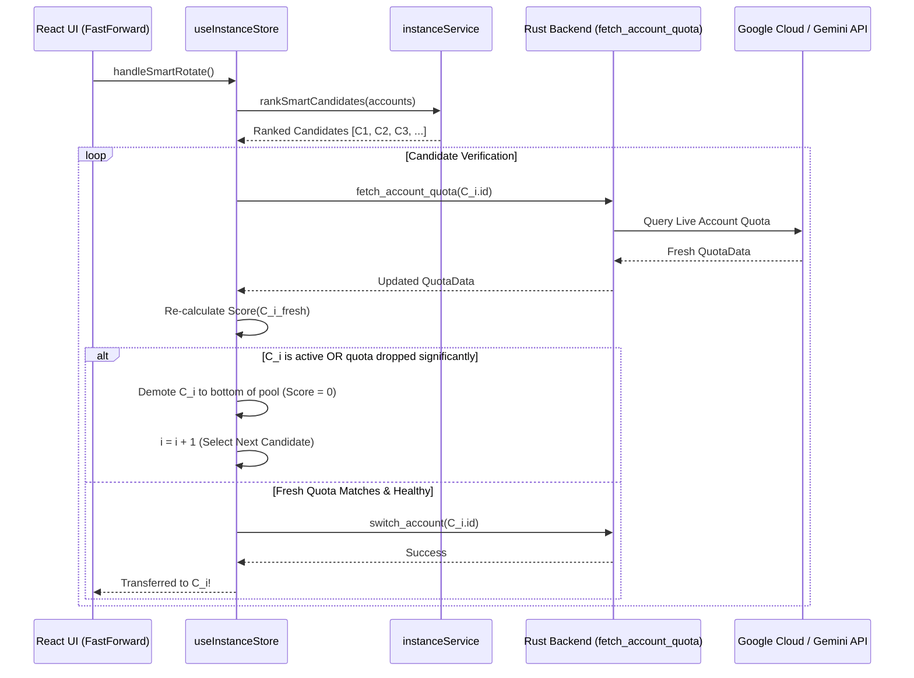

# Smart Multi-Factor Scoring, Pre-Activation Refresh Verification & UI Telemetry Hardening Specification

> **Specification Reference:** `02-spec/21-app/18-smart-multi-factor-scoring-pre-activation-refresh-and-ui-telemetry.md`
> **Target Subsystem:** Antigravity-Manager (`src/`, `src-tauri/`)
> **Status:** Active
> **Version:** `4.61.0`
> **Author:** Prompt Architect / Antigravity Agentic Team

---

## 1. System Overview & Context

This specification defines the architectural contracts, mathematical algorithms, and UI event tracking structures for:
1. **Multi-Factor Profile & Account Candidate Scoring ($S_{\text{candidate}}$):** A strictly normalized multiplicative scoring formula replacing legacy additive 100k heuristics.
2. **Pre-Activation Live Quota Refresh Probe & Demotion Loop:** A pre-flight verification gate that tests candidate quota freshness before transferring or launching instances, demoting degraded accounts to the bottom of the candidate pool.
3. **Window Controls ACL & Command Bridge:** Custom Tauri commands and capability ACL grants eliminating `plugin:window|minimize not allowed by ACL` and related window operation errors.
4. **Enhanced UI Event Telemetry & XPath Tracking:** Rich element inspection in global click tracking (`id`, accessible name, title, and exact XPath) ensuring interaction flows pinpoint specific UI controls.
5. **Full Stack Trace Capture & Display:** Guaranteeing non-empty frontend/backend stack traces in the global Error Modal across all error types.

---

## 2. User Request (Verbatim)

```text
https://prnt.sc/fls9KoTz6DTu
https://prnt.sc/A8JbkDtMIUce

https://prnt.sc/ftLjQICLOlWM

https://prnt.sc/ctGxdRgY8jca
https://prnt.sc/1CesUZvPJS0U
https://prnt.sc/CfwM3qpCq1CG

First emails slected: "rokixshohag1@gmail.com"
But should be right choice is "abidul.rasia@gmail.com"

Fast Forward or Smart Switch Logic Fix also other bugs instructions must follow and fix

Okay. I think there are several issues that you have. So, first of all, in the UI level, if you look into this, the UI has these buttons, which I have complained to you before. These buttons, if I click on it, this button basically has the error. Let me give you the error section. Click on these items. Yeah. Install the button and items. Try to have a name on top of them. And if the item in the UI does have only the, let's say, icon, then try to have an ID property and ID, and make sure this user interaction flow also contain the-- Additionally, it should contain the Xpath to find it. I think this is what was also missing. So I clicked on the, it's a minus or the maximize button. So in both cases, I do have error like this, which you need to fix. Okay, that's the first thing. The second issue is the finding the fast-forward button not helpful. That means it does not work as the algorithm goes. So I have given you lots of screenshot. So if you recall the algorithm, we designed the algorithm together, right? So it should have a fixed number to find the highest or highest value first, and then move to that, let's say, user. And all of the other factors these are read it. So in short, you should have your own SQLite database locally if you don't have the Supabase that actually contains all this information, and then it'll find the best one with these numbers. So usually, we should have, let's say the weekly and the four-hour. We will multiply this, right? We will multiply this, and we find the best match or the first number, which is not respected. So I've given you some examples. So in first case, when I double click on the fast-forward or click on the fast-forward, it selects the first email, which is this. I'm just sharing that email, the first email that's selected. In this case, you can run the code here, okay, in this machine locally to test it out, and you can create a local test that should not run in the CI/CD and do not save the emails to repository. Okay? Do not. So try not to save any email. Try to have voids in the email, but for testing, you could just test it locally and make sure this test does not contain the email. Remember that, but the idea should be how you're putting it, so you can test it locally, the running and checking why the algorithm is not working as expected, and mark this test avoid run on the server. Okay, so these are very, very important and crucial part that I want you to fix, which is still not fixed. Is it clear? I will give you the algorithms that actually helps to fix the stack trace in the error model. So the stack trace is not there. That is a crucial part. I think you need to include the stack trace, and these type of similar errors, which I have given in the screenshot, should be fixed in one shot. So find the code and fix it. You can run the code locally to make sure that things are fixed. Is it understood?

Previous Logic
https://prnt.sc/j4HyYcDGaMz_

Improvement logic for based on these discussions:

I think this factoring logic of finding the project that needs to be updated. Okay? So first of all, you have the list of project, yes. So whoever is not used, so they are in the same category. It's not they have 100k points. Don't do that, okay? So whoever is not active, they have one point. Okay? Whoever is already exist or let's say used, they have zero points. Do it like this, okay? Now, the next point is that would be multiplied by whoever has the Pro or Ultra. Okay, so if it has Pro, then it will be multiplied by three. If it has Ultra, it will be multiplied by five. Okay, so this is how the one calculation. There will be just one point so that we can just sort this out. That would be the easiest way. Okay, done. So two calculation is done. Next calculation is based on their weekly quota, weekly credits that is available, okay? So, an account which is weekly, let's say, 10% available only, so that would be multiplied by 10. If account is, let's say, 90% available for this week, that would be multiplied by 90. So this is how the multiplication will go, and this would make it a little bit higher in the calculation. So we already have a winner. Now, we have these numbers, we have these calculations, right? Now, the next step is to sort them by A to Z or Z to... We could do two types now. Let's say now what we have. We have the highest points number from how the order is going, right? The top numbers will be the top pick. Now, the next thing we will do is, let's say, if some of them have the same number criteria, then we will pick randomly either from A to Z manner or from Z to A manner. Basically, we are going to pick a random number if the items are very close, okay? But also at the same time, okay, when we are picking, let's say, we found the best candidate, which is the first email, based on these numbers. We found it. Once we found it, we do a refresh on it first. Okay? The refresh will tell us, is it worthy or not? Is it already losing some credit? Someone already has let's say, reduced some points. Oh, I think that is also important. Yeah. So if someone already let's say, used it, then that would be zero. So that would actually fall down. Other than that, they will have some points, right? So this is one way to do it. And then again, you can also check the weekly quota one more time. So refresh will tell us the refresh quota. So that calculation that we have done, it would again do it before activating it so that you would know that is it really worthy? The number that it has, the refresh number, does it match? If it does not match, it would go to the bottom. Okay? So the next best pick, it will again do the same thing, do a refresh again, and check the number that we have calculated, does this match? If it matches with the number that we calculated, that means this is a very good fit and we are going to pick that. So this is how the algorithm should work. Do you understand now? I want you to write the algorithm in the spec folder, very detailed manner. Assign based on the algorithm in the task so that you can do those tasks, improve the logic, okay? And then finally, you fix the CI/CD and make a bump in the minor version. Can you please do that for me? Do you understand the logic? Also, at the end, what I want from you to understand the algorithm that I have given and the algorithm that you have given. If I have to score between zero to 100 based on certain categories, is my one better or your one is better? Tell me that. Okay? Right after we just give you the prompt. So that is the first thing I think you should do. Is it clear?
```

---

## 3. Visual Evidence & Screenshot Manifest

All user screenshots have been fetched and permanently saved to `assets/screenshots/`:

| Screenshot Reference | Description | Image Asset Link |
|---|---|---|
| `prnt-fls9KoTz6DTu` | Accounts table (Weekly view) showing `rokixshohag1` with Gemini 21% quota while other accounts have up to 83% |  |
| `prnt-A8JbkDtMIUce` | Fast-Forward button selected `rokixshohag1` incorrectly due to legacy 100k bonus |  |
| `prnt-ftLjQICLOlWM` | Weekly view showing `abidul.rasia` with 100% Gemini & 100% Claude quota (the right choice) |  |
| `prnt-ctGxdRgY8jca` | 5H view showing accounts with 100% 5h quota, demonstrating why 5h view alone causes skew |  |
| `prnt-1CesUZvPJS0U` | Navbar titlebar buttons: Fast-Forward, minimize (-), maximize (+), close (X) |  |
| `prnt-CfwM3qpCq1CG` | Error modal displaying `Command plugin:window|minimize not allowed by ACL` and uninformative click flow |  |
| `prnt-j4HyYcDGaMz_` | Legacy algorithm specification (+100k bonus for recency) that caused the selection defect |  |

---

## 4. Multi-Factor Scoring Mathematical Specification

### 4.1 Formula

$$\text{Score}(A) = S_{\text{active}}(A) \times M_{\text{tier}}(A) \times Q_{\text{weekly}}(A)$$

Where:
- $S_{\text{active}}(A) \in \{0, 1\}$:
  - $S_{\text{active}} = 0$ if account $A$ is currently active or bound to a running instance or leased by another node.
  - $S_{\text{active}} = 1$ if account $A$ is inactive / unused and available for assignment.
- $M_{\text{tier}}(A) \in \{1, 3, 5\}$:
  - $M_{\text{tier}} = 5$ for `ULTRA` tier accounts.
  - $M_{\text{tier}} = 3$ for `PRO` tier accounts.
  - $M_{\text{tier}} = 1$ for `FREE`, Standard, or unspecified tiers.
- $Q_{\text{weekly}}(A) \in [0, 100]$:
  - Extracted from `quota_groups` weekly buckets:
    $$\text{Bucket}_{\text{weekly}} = \{ b \in \text{group.buckets} \mid b.\text{window} = \text{"weekly"} \lor b.\text{bucket\_id} \text{ contains "week"} \}$$
  - $Q_{\text{weekly}} = \min_{b \in \text{WeeklyBuckets}} (\text{remaining\_fraction} \times 100)$, or the weekly quota of the target model group (Gemini / Claude).
  - If `quota_groups` is absent, falls back to the minimum available model percentage in `quota.models`.

### 4.2 Concrete Example Comparison

| Account | State | Tier ($M$) | Weekly Quota ($Q$) | Legacy Score | Refined Score | Result |
|---|---|:---:|:---:|:---:|:---:|---|
| `rokixshohag1` | Inactive ($S=1$) | Pro ($3$) | Gemini: 21% ($Q=21$) | ~104,200 (100k idle bonus) | $1 \times 3 \times 21 = \mathbf{63}$ | Demoted |
| `abidul.rasia` | Inactive ($S=1$) | Pro ($3$) | Gemini: 100% ($Q=100$) | ~120,000 | $1 \times 3 \times 100 = \mathbf{300}$ | 🏆 **Top Pick** |
| Current Active Account | Active ($S=0$) | Ultra ($5$) | 100% ($Q=100$) | ~20,000 | $0 \times 5 \times 100 = \mathbf{0}$ | Deprioritized |

### 4.3 Randomized Directional Tie-Breaking

When two or more candidates produce identical or near-identical scores ($|\text{Score}(A) - \text{Score}(B)| = 0$):
- Direction flag $D \in \{\text{Ascending}, \text{Descending}\}$ is determined pseudo-randomly with 50/50 probability (`Math.random() < 0.5` or `rand::random()`).
- In Ascending mode: sorted alphabetically $A \rightarrow Z$ by identifier / email.
- In Descending mode: sorted reverse-alphabetically $Z \rightarrow A$ by identifier / email.
- This ensures balanced load distribution across twin-quota accounts without hot-spotting the first row.

---

## 5. Pre-Activation Live Refresh Verification & Demotion Loop

### 5.1 Protocol Sequence



---

## 6. Window Controls ACL & Custom Command Architecture

### 6.1 Capability Definition (`src-tauri/capabilities/default.json`)

Tauri v2 requires explicit declaration of window management permissions in the capabilities manifest:

```json
{
  "$schema": "../gen/schemas/desktop-schema.json",
  "identifier": "default",
  "description": "Default capability for Antigravity-Manager main window",
  "windows": ["main", "*"],
  "permissions": [
    "core:default",
    "core:window:default",
    "core:window:allow-minimize",
    "core:window:allow-maximize",
    "core:window:allow-toggle-maximize",
    "core:window:allow-close",
    "core:window:allow-is-maximized",
    "core:window:allow-is-minimized",
    "core:window:allow-unminimize",
    "core:window:allow-show",
    "core:window:allow-hide",
    "core:window:allow-set-focus"
  ]
}
```

### 6.2 Custom Tauri Commands (`src-tauri/src/commands/mod.rs`)

To guarantee operation across platforms without ACL denial, dedicated Rust commands are exported:
- `minimize_window(window: tauri::Window) -> Result<(), String>`
- `maximize_window(window: tauri::Window) -> Result<(), String>`
- `toggle_maximize_window(window: tauri::Window) -> Result<bool, String>`
- `close_window(window: tauri::Window) -> Result<(), String>`
- `is_window_maximized(window: tauri::Window) -> Result<bool, String>`

---

## 7. UI Element Identification & XPath Interaction Flow

1. Every window control button and toolbar action receives:
   - Unique HTML `id` attribute (e.g. `id="btn-window-minimize"`, `id="btn-window-maximize"`, `id="btn-window-close"`, `id="btn-fast-forward"`).
   - Descriptive `aria-label` and `title`.
   - `data-xpath` attribute or runtime XPath derivation.
2. In `src/lib/error-listener.ts`:
   - Click capture resolves nearest interactive element (`target.closest('button, a, input, select, textarea, [role="button"], [id]')`).
   - Generates exact XPath (`//*[@id="..."]` or `/html/body/div[...]`).
   - Appends structured representation to interaction flow:
     `button#btn-window-minimize "Minimize" [xpath: //*[@id="btn-window-minimize"]]`

---

## 8. Stack Trace Capture & Display

1. In `src/stores/error-store.ts`:
   - When `rawError` is a string or plain object without a native `stack`, generates a synthetic `new Error().stack`, trimming internal framework frames.
   - Ensures `CapturedError.stackTrace` is guaranteed non-empty.
2. In `src/components/errors/error-modal.tsx`:
   - Stack trace card rendered directly in the Overview tab with 1-click copy button.
   - Formatted frames table and raw stack view rendered with full copy support.
