# Specification: Unified Account Switch & Prompt Lifecycle Architecture

**Spec ID:** `02-spec/21-app/39-unified-switch-and-prompt-lifecycle.md`  
**Status:** `Active / Implemented`  
**Author:** Antigravity AI Orchestrator  
**Date:** 2026-09-28  

---

## 1. Executive Overview

This specification formalizes the end-to-end architecture of Antigravity Manager's account switching, candidate discovery, scoring algorithm, remote lease staleness governance, and prompt preservation lifecycle.

Account rotation is a multi-system transaction involving:
1. **Intelligent Profile Discovery & Scoring**: Determining the best candidate account using normalized multiplicative scoring and strict 100% 4-hour window quota enforcement.
2. **Distributed Remote Lease Management**: Preventing cross-node duplicate account collisions via Supabase with automatic staleness eviction (6h default, configurable 6h–10h) when an account has no ping or credit activity.
3. **The 5-Step Non-Destructive Switch Sequence**: Preserving running agent prompts across workspaces before terminating IDE processes, injecting credentials, relaunching the IDE, and re-injecting prompts.
4. **Distinct Multi-Role Telemetry**: Ensuring `previous_email`, `selected_email`, and `predicted_email` always represent three distinct semantic entities in Telegram and email notifications.

---

## 2. User Request (Verbatim)

```text
is it done properly have you fix it?? Where is the diagram and rlease minor and checking gitmap pe?

Good. So I am seeing the diagram that you have crafted for the switch and pass forward. Okay. So instance, first you pick the instance. Okay, all right. Then you do the algorithm to find who has the high score. Why you do plus 1,000, I don't understand. Probably I ask you to divide by 100 or 1,000. Why you are doing a plus 1,000, I don't know. So to have a minimal number, why we should have big number, right? I don't understand. Okay, anyone who has less than 100% quota, that would be zero. So in future, when we have the super base, then if something is already selected right now and not unchanged, that would be selected and have no credits, then it will be considered as not working. So when we include the super base, one thing we have to consider that even though we are selected on this machine or instance by another machine, let's say if a long time is passed, let's say five, six hours, and let's say it's not activated, then it would actually be marked as inactive automatically. If there is no ping or no credit loss, then in six hours, if this one even is selected, it will be considered as inactive by that workstation, and it will be removed. So timing is another factor that we have to consider. Or probably it should be configurable. It could be for 10 hours, let's say. Now coming to the logic, while the candidate pool not empty, we found it, we fetch the account quota API. Okay, good. We check finally again quota API. If it is the same, okay, then we proceed. Again, correct. So far, the first iteration is correct. This is where you have the mistake. I have asked you several times. So call use account store switch. Okay? Okay, fine. Here is the part two. What is part two? While you are switching, where is your backup of the prompts running? Where is that? Where is that flow? Okay? And then you messed up. Your switch button does not work. You should delegate that to switch button, right? Now, your switch button does not work because you do not close the Antigravity. So first you have to take the backup of the running prompts using AZM. So make sure that that happens. That is a very delicate situation. You have to take a backup. That is missed. That means nothing will work. Right? So then you close the IDE, and then you switch the account, and then rerun the IDE, okay? And then you re-inject the prompt that you have taken the backup. That is the step. You did a very stupid stuff. Very stupid stuff. That's what I said. You do stupidity, and you do not even acknowledge the stupidity. I really hate it, how you do this stupidity. Okay? And also all the time, the switch button or switch, how the switching happening. This needs to be in this step. You need to write it down. You need to write in your spec, correction, root cause analysis everywhere...
```

---

## 3. High-Level Architecture & Lifecycle Flowchart

The following diagram illustrates the complete, unified decision and execution pipeline:

```mermaid
flowchart TD
    subgraph STAGE_1["Stage 1: Target Instance & Pool Discovery"]
        A["1. User Triggers Switch<br/>(Button 1: Smart Play / Button 2: Switch / Button 3: Fast-Forward / CLI)"] --> B["Select Target Sandbox Instance<br/>(e.g., 'default', 'ide-2', 'sandbox-work')"]
        B --> C["Filter Candidate Account Pool<br/>- Exclude Current Bound Account<br/>- Exclude Active In-Use on Other Instances<br/>- Exclude Accounts Leased by Remote Nodes"]
        C --> D{"Supabase Remote Lease Check<br/>Leased by another node?"}
        D -- "Yes, Active & Fresh" --> D1["Exclude from Candidate Pool"]
        D -- "Yes, but Inactive > 6h–10h<br/>(No ping / No credit loss)" --> D2["Mark Remote Lease Stale & Evict<br/>Allow as Candidate"]
        D -- "No Remote Lease" --> E["Candidate In Pool"]
    end

    subgraph STAGE_2["Stage 2: Strict Quota Gate & Score Normalization"]
        E --> F{"4-Hour Window Quota >= 100%<br/>OR Reset Time Elapsed?"}
        F -- "No (< 100% & Not Reset)" --> G["Score = 0.0000<br/>(Strict Rejection — Never Selected)"]
        F -- "Yes (100% Fresh Quota)" --> H["Compute Normalized Multiplicative Score<br/>Score = (S_active * M_tier * Q_weekly) / 1000.0<br/>Result Range: 0.0000 – 0.5000"]
        H --> I["Sort Ranked Candidates<br/>1. Score Descending (Divided by 1000)<br/>2. 4h Quota Descending<br/>3. Weekly Quota Descending<br/>4. Email Deterministic Order"]
        I --> J["Probe Top Candidate with Live Quota API<br/>Verify 100% 4h quota still holds"]
        J --> K{"Live Quota Verified 100%?"}
        K -- "No (Consumed Elsewhere)" --> L["Drop Candidate & Advance to Next Best"]
        L --> I
        K -- "Yes (Confirmed 100%)" --> M["Candidate Selected:<br/>Target Candidate C1"]
        M --> M2["Compute Predicted Next Candidate C2<br/>(Next highest score excluding C1 and Previous)"]
    end

    subgraph STAGE_3["Stage 3: The Unified 5-Step Switch & Prompt Lifecycle"]
        M2 --> STEP1["Step 1: Backup Running Prompts via AGM<br/>- Read running prompts from SQLite split db (repodb/pipeline.db)<br/>- Backup active .antigravity_resume_task.json<br/>- Snapshot image payloads & command args"]
        STEP1 --> STEP2["Step 2: Gracefully Close Antigravity IDE<br/>- Kill IDE processes ('Kill First -> Write Second -> Start Third')<br/>- Wait for process termination & memory state flush<br/>- Release stale OS locks"]
        STEP2 --> STEP3["Step 3: Switch Credentials in Storage<br/>- Write new account tokens to state.vscdb<br/>- Update storage.json and device profile<br/>- Update OS keyring for default instance<br/>- Bind account to instance in registry.json"]
        STEP3 --> STEP4["Step 4: Relaunch Antigravity IDE<br/>- Start IDE preserving exact executable path & workspace arguments<br/>- Wait for editor window initialization"]
        STEP4 --> STEP5["Step 5: Re-Inject & Auto-Resume Prompts<br/>- Dispatch backed-up prompts from SQLite back into workspace<br/>- Restore .antigravity_resume_task.json<br/>- Re-focus editor window"]
    end

    subgraph STAGE_4["Stage 4: Unified Multi-Channel Telemetry"]
        STEP5 --> NOTIF["Dispatch Notifications (Telegram & Email Hub)<br/>- Previous Account: A (Before switch)<br/>- Selected Account: C1 (Active now)<br/>- Predicted Next: C2 (Distinct next in pool / '(none / pool exhausted)')<br/>- Prompt Restoration Stats: captured vs re-injected"]
    end
```



---

## 4. Key Architectural Standards & Invariants

### 4.1. Normalized Multiplicative Score Formula
- **Strict Elimination of Arbitrary Big Numbers:** Under no circumstances should an arbitrary bonus like `+ 1000` be added to scores.
- **Division by 1000:** The raw multiplicative product is divided by 1000.0 to produce a clean, human-readable decimal in the range `0.0000` to `0.5000`:
  $$\text{RawScore} = S_{\text{active}} \times M_{\text{tier}} \times Q_{\text{weekly}}$$
  $$\text{NormalizedScore} = \frac{\text{RawScore}}{1000.0}$$
  Where:
  - $S_{\text{active}} \in \{0, 1\}$ (0 if account is currently active, bound, or leased; 1 if available)
  - $M_{\text{tier}}$: Ultra = 5.0, Pro = 3.0, Free = 1.0
  - $Q_{\text{weekly}} \in [0.0, 100.0]$ (percentage of weekly quota remaining)
- **Strict 100% 4-Hour Quota Gate:** If an account's 4-hour window quota is $< 100\%$ and its reset timestamp has not passed, its score is strictly evaluated to `0.0000`. It is never returned as an eligible candidate.

### 4.2. Supabase Remote Lease Staleness & Auto-Eviction
- In a multi-machine fleet, accounts are leased via Supabase table `workspace_leases` to avoid concurrency collisions.
- **Staleness Timeout:** If an account is leased by another machine but more than $T_{\text{stale}}$ (default 6 hours, configurable up to 10 hours in `app_config.json`: `stale_binding_timeout_hours`) has elapsed without any ping or credit loss activity, the lease is automatically declared inactive and evicted from the local candidate exclusion set.
- This prevents orphaned leases from deadlocking accounts when a remote worker terminates uncleanly.

### 4.3. The 5-Step Non-Destructive Prompt Lifecycle
1. **Step 1 (Backup Prompts):** Snapshot all prompts with status `running`, `backed_up`, or `dispatched` in `repodb/pipeline.db` and active `.antigravity_resume_task.json` files before any process is killed.
2. **Step 2 (Close IDE):** Gracefully terminate the running IDE process using the "Kill First" rule. This guarantees the exiting IDE process does not overwrite newly injected credentials upon flushing memory to disk.
3. **Step 3 (Inject Credentials):** Update `state.vscdb`, `storage.json`, and OS keyring with the new account's tokens. Bind the instance in `registry.json`.
4. **Step 4 (Relaunch IDE):** Relaunch the Antigravity IDE preserving workspace arguments and folder flags.
5. **Step 5 (Re-Inject Prompts):** Read backed-up prompts from SQLite, re-inject into the target workspace, and restore `.antigravity_resume_task.json` to auto-resume ongoing AI coding sessions.

### 4.4. Distinct Multi-Role Telemetry Guarantee
In all notification payloads (Telegram, JSON telemetry, HTML email):
- `previous_email`: The email of the account that was active before the switch (or `(none / standby)`).
- `selected_email`: The email of the account chosen and activated by this switch transaction.
- `predicted_email`: The email of the *next* candidate that will be selected when `selected_email` is depleted, strictly excluding both `previous_email` and `selected_email`. If no eligible candidates remain in the pool, it outputs `(none / pool exhausted)`. Under no circumstances is `predicted_email` defaulted to `selected_email`.

---

## 5. Verification Checklist

- [x] Quota < 100% strictly yields Score = 0 in both frontend (`instanceService.ts`) and backend (`auto_switcher.rs`).
- [x] Multiplicative score is divided by 1000.0, outputting values between 0.0000 and 0.5000.
- [x] Remote lease staleness timeout is enforced (default 6 hours, configurable).
- [x] Prompt backup occurs strictly before IDE termination.
- [x] IDE process termination occurs strictly before credential injection.
- [x] Prompt re-injection occurs strictly after IDE relaunch.
- [x] `previous_email`, `selected_email`, and `predicted_email` are verified distinct across all notification and CLI outputs.
