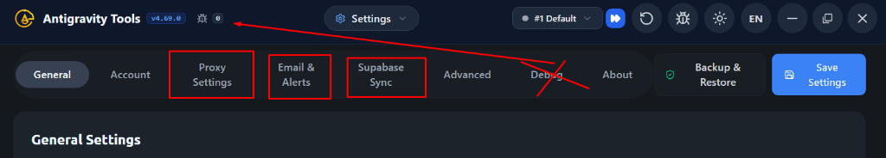
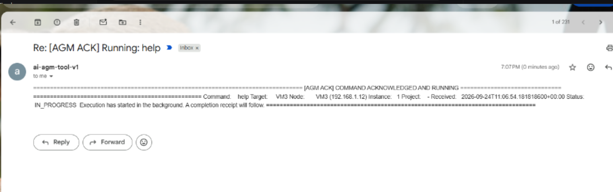
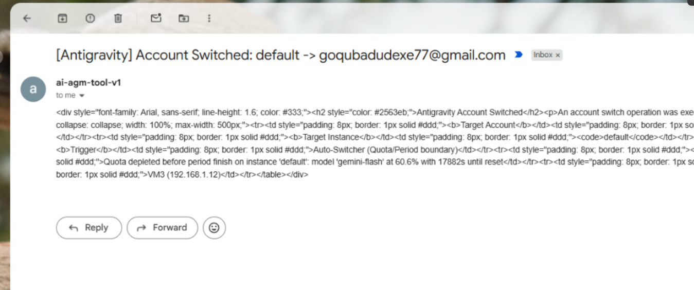
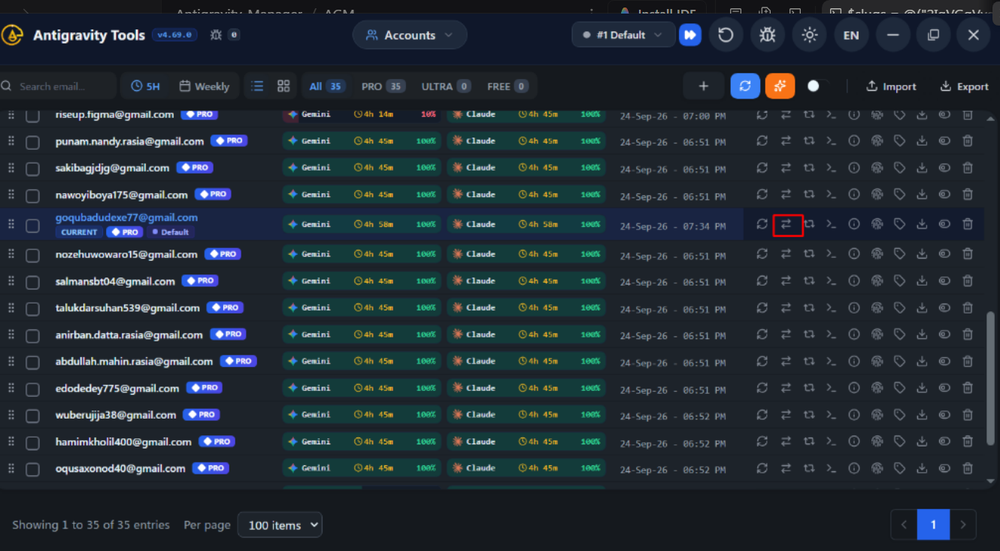

# Spec 44: Settings Hamburger UI (Crossed Debug), Email Base64 HTML E2E, Smart Rotator & Training REST API

## User Request (Verbatim)

```text
is it done??

https://prnt.sc/09vjEsXSj-9X

Can you please confirm that if you have the email that is working fine, the command you can run, you can check, receive back. Can you please test it and confirm? Also confirm that the auto-switching is working. I don't think that you made it correctly. I still am in doubt. So make sure that you fix it properly. Another thing. Make sure that you can create, let's say, a REST API endpoint. I'm not sure if this feature is there, but you can actually, and also there will be a training API endpoint that anyone can seek into and read, and then based on that, it can send and learn and create a response and modify the machines. So can you please do that? That's another thing. Also, these can be switched on and off from the settings, and also the settings menu is very dirty. You don't have any UI/UX concept in the settings menu. I think you need to fix it. The Save button just say, "Save," and Backup just say, "Backup." You don't have to write the whole thing. Why you are writing Supabase Sync? Write Supabase, okay? Here, write Email-Alerts. Here, write Proxy, okay? So minimize this stuff. And also the Advance and Debug, just put it as a hamburger icon, a drop-down icon. If someone clicks, they'll see Advance and Debug option. And I said before, the debug should be crossed because you are adding the debug to the top level where our debug option is there. Put everything related to debug on that place. Do you understand?

Swap muiltiple agents to do it after?? clear???
```






## Extracted Actionable Task List

1. **Task-01 (Email E2E & Base64 HTML Receipt)**: Confirm inbound/outbound email command execution (`help`, `status`, `switch`) with RFC 2045 Base64 HTML card rendering and `[<VM_ALIAS> | <LOCAL_IP>]` subject prefix.
2. **Task-02 (Auto-Switcher & Smart Rotator `⇄` Parity)**: Confirm `trigger_manual_rotation_for_instance`, `switch_account_to_instance`, and `check_and_auto_switch_quota` use `select_best_candidate_account` and execute `Kill-First -> Write-Second -> Start-With-Args-Third`.
3. **Task-03 (REST & Training API + Settings Toggles)**: Confirm `/v1/remote/control`, `/v1/training/telemetry`, `/api/v1/training`, `/api/v1/training/learn`, and `/api/v1/training/modify` endpoints and `remote_control_api_enabled` / `training_api_enabled` toggles in `Settings.tsx`.
4. **Task-04 (Settings Hamburger Dropdown with Crossed-Out `Debug`)**: Ensure `Settings.tsx` top bar displays `General`, `Account`, `Proxy`, `Email-Alerts`, `Supabase`, plus a Hamburger Dropdown (`Menu`) showing `Advance`, `Debug` (**crossed out** via `line-through` with a `Top Bar ↗` indicator because Debug lives in the top-level titlebar Bug icon), and `About`, alongside `Save` and `Backup` buttons.
