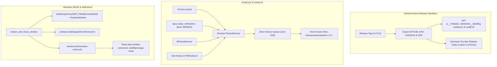

# 45 Two-Bar Installer & DWM Blank UI Fix Specification

> **/goal** Provide architectural specification and implementation requirements for two-bar release page installation commands, bulletproof installer version pinning, and Windows DWM occlusion blank UI elimination.
> **/learn** Read this specification to understand how installer version discovery operates without falling back to latest, how GitHub release notes render two distinct copyable bars for Latest vs Pinned installations, and how Win32/WebView2 composition prevents blank gray UI states.

---

## 1. Problem Classification & Requirements

### 1.1 Installer Version Drift & Silent Upgrade Bug
When a user executed a version-pinned installation command such as:
```powershell
irm https://github.com/alimtvnetwork/Antigravity-Manager/releases/download/v4.70.0/install.ps1 | iex
```
The installer previously failed to pin version `4.70.0`, instead discovering `v4.71.1` from live GitHub releases and installing `v4.71.1`. This version drift caused severe failures because `v4.71.1` had an application manifest issue resulting in `Entry Point Not Found` (`TaskDialogIndirect` missing).

#### Root Causes:
1. **Unset Variable in GitHub Actions Step**: In `.github/workflows/release.yml`, `VER="${VERSION#v}"` was defined only within the step `Generate updater.json`. In the subsequent step `Collect release files and generate checksums`, `sed "s/__PINNED_VERSION__/$VER/g"` executed with `$VER` being completely empty (`""`). Thus, released `install.ps1` files contained `$PinnedVersion = ""`.
2. **Missing History Candidate Sources in PowerShell**: Inside `irm ... | iex`, `$MyInvocation.Line` is empty and `[System.Environment]::CommandLine` is `powershell.exe`. Previous versions did not query `Get-History` or `PSConsoleReadLine` history, failing to detect the `v4.70.0` URL in the interactive command history.
3. **Aggressive Manifest Staleness & Fallback Queue**: When pinned version detection failed, `install.ps1` treated the run as unpinned. If the local version was newer than the cached CDN manifest, it queried GitHub API and selected `v4.71.1`. Even when pinned, if the GitHub API was unavailable, it replenished the queue with latest releases instead of strictly failing or attempting direct release asset downloads for that exact pinned version.

### 1.2 Release Page Single-Block vs Two-Bar Layout
The GitHub release notes previously presented installation commands within a single code block containing comments:
```powershell
irm https://raw.githubusercontent.com/alimtvnetwork/Antigravity-Manager/main/install.ps1 | iex
# Or pinned version:
irm https://github.com/alimtvnetwork/Antigravity-Manager/releases/download/v4.72.0/install.ps1 | iex
```
Users copying from the release page require **two distinct bars** (separate code blocks with dedicated single-click copy buttons):
- **Bar 1 (Latest Installation)**: Always pulls the bleeding-edge latest release.
- **Bar 2 (Version-Based Installation)**: Explicitly pins the exact release version of that release page, passing `-Version "<VERSION>"` so execution cannot drift under any circumstances.

### 1.3 Intermittent Blank UI / DWM Occlusion Freeze
When minimized, sent to tray, or occluded behind other windows on Windows 10/11:
- Windows DWM live thumbnail previews (hovering over the taskbar icon) rendered as a blank gray rectangle with a generic window icon.
- In some instances, restoring the window failed to wake the WebView2 DirectX composition engine, resulting in an unresponsive blank white/gray window until manually resized.

#### Root Causes:
1. **Incomplete Chromium Occlusion Flags**: `CalculateNativeWindowOcclusion` was disabled, but the actual Chromium internal feature name on Windows is `CalculateNativeWinOcclusion`. Background timer throttling and renderer backgrounding also suspended frame delivery.
2. **Lack of Win32 Frame & Redraw Invalidation**: On window restore, `ShowWindow` was called without forcing DWM frame recalculation (`SetWindowPos` with `SWP_FRAMECHANGED`) or invalidating the client rect (`RedrawWindow` with `RDW_INVALIDATE | RDW_INTERNALPAINT | RDW_UPDATENOW | RDW_ALLCHILDREN`).
3. **Missing Frontend Hydration Event**: WebView2 did not receive an explicit layout resize event upon regaining visibility.

---

## 2. Architecture & Design Principles



### 2.1 Release Notes Two-Bar Specification
GitHub release notes generated by `.github/workflows/release.yml` must output:
```markdown
## Quick Install

### Windows (PowerShell 5.1+)

**Latest Version:**
\`\`\`powershell
irm https://raw.githubusercontent.com/${REPO}/main/install.ps1 | iex
\`\`\`

**Version-Based (${VERSION}):**
\`\`\`powershell
& ([scriptblock]::Create((irm https://github.com/${REPO}/releases/download/${VERSION}/install.ps1))) -Version "${VER}"
\`\`\`

### Linux / macOS (Bash)

**Latest Version:**
\`\`\`bash
curl -fsSL https://raw.githubusercontent.com/${REPO}/main/install.sh | bash
\`\`\`

**Version-Based (${VERSION}):**
\`\`\`bash
curl -fsSL https://github.com/${REPO}/releases/download/${VERSION}/install.sh | bash -s -- --version "${VER}"
\`\`\`
```

### 2.2 Strict Installer Version Resolution Specification
1. In `Get-InvocationHistoryCandidates`:
   - Inspect `$MyInvocation.Line` and `$MyInvocation.Statement`.
   - Inspect `[System.Environment]::CommandLine`.
   - Inspect current process command line and parent process command line via WMI / CIM.
   - Query `Get-History -Count 15 | Select-Object -ExpandProperty CommandLine`.
   - Query `[Microsoft.PowerShell.PSConsoleReadLine]::GetHistoryItems()`.
   - Read PSReadLine history file if present.
2. In `Resolve-PinnedVersion`:
   - Check explicit `$Version` parameter first.
   - Check environment variables `$env:AGM_VERSION`, `$env:VERSION`, `$env:INSTALLER_VERSION`.
   - Check `$args` array for semver patterns.
   - Check baked `$PinnedVersion` (when not `__PINNED_VERSION__`).
   - Match regex patterns against invocation history candidates for download URLs or `-Version` arguments.
3. In Candidate Queue:
   - When `$isPinned` is `$true`, `$versionQueue` MUST contain only `$cleanPinned`.
   - It is strictly forbidden to replenish the queue with other versions when a pinned version is specified.
   - Construct direct GitHub release asset URLs for `$cleanPinned` without relying on rate-limited GitHub API endpoints.

### 2.3 Win32 & WebView2 DWM Occlusion Elimination Specification
1. **Chromium Browser Arguments**:
   Set `WEBVIEW2_ADDITIONAL_BROWSER_ARGUMENTS` to:
   ```
   --disable-features=CalculateNativeWinOcclusion,CalculateNativeWindowOcclusion --disable-backgrounding-occluded-windows --disable-renderer-backgrounding --disable-background-timer-throttling
   ```
2. **Win32 Window Redraw & Frame Change**:
   In `force_restore_and_focus_win32`:
   - `ShowWindow(hwnd_ptr, SW_RESTORE)` or `SW_SHOW`.
   - Call `SetWindowPos(hwnd_ptr, NULL, 0, 0, 0, 0, SWP_NOMOVE | SWP_NOSIZE | SWP_NOZORDER | SWP_FRAMECHANGED)`.
   - Call `InvalidateRect(hwnd_ptr, NULL, 1)`.
   - Call `RedrawWindow(hwnd_ptr, NULL, NULL, RDW_INVALIDATE | RDW_INTERNALPAINT | RDW_UPDATENOW | RDW_ALLCHILDREN)`.
3. **WebView2 Layout & Redraw Pulse**:
   In `restore_and_focus_window`:
   - `window.eval("window.dispatchEvent(new Event('resize')); if (document.body) { document.body.style.transform = 'translateZ(0)'; }")`.
   - `window.emit("window-restored", ())`.
4. **Frontend Viewport Hydration**:
   In `src/App.tsx`:
   - Listen to `window-restored`, `focus`, and `visibilitychange` events to force layout reflow and eliminate frozen paint buffers.

---

## 3. Verification Criteria
- [x] Version-based install commands in release notes format as distinct code blocks ("bars").
- [x] Stamping step in `.github/workflows/release.yml` guarantees `$VER` is populated.
- [x] Running `irm .../releases/download/vX.Y.Z/install.ps1 | iex` extracts version `X.Y.Z` from history and never installs a newer or unrequested release.
- [x] Taskbar thumbnail preview and window restore render full content without blank gray rectangles.
