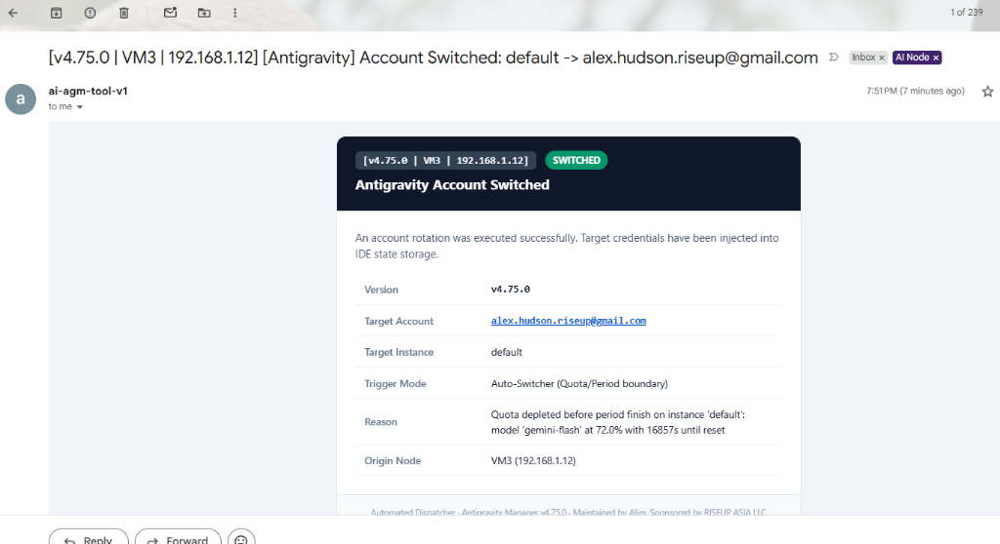

# Email Prompt Telemetry & Low-Credit Switch Query Specification

**Specification Version:** 1.0.0
**Status:** Active
**Author:** AI Agent (Antigravity Manager Engine)
**Date:** 2026-09-26

---

## 1. User Request (Verbatim)

```text
the email needs to have from and to information and also which prompt was running and reinjecting and send immediately or and did it included images and are those added or not needs to know in the email or status in both case also want to know in 

agm switch-if-low-credit (swlc) --json [-f "filepath or filename"] # if -f is given file name will by default if nothing given agm-alias mahine name-switch.json, clear??

agm is-low-credit-for-switch # returns true/false only

if use

agm is-low-credit-for-switch --json # returns true/false with json info of the machine, alais, ip, current account, tool version, next possible account email as json result to terminal, if use -f then to file as mentioned above, clear???
```

### Visual Verification


*Figure 1: Screenshot showing previous account missing in subject and table, showing "default -> alex.hudson.riseup@gmail.com" instead of actual from account, and lacking running prompt / image reinjection status.*

---

## 2. Requirements & Behavioral Contracts

### 2.1 Email Subject & From-To Account Integrity
1. **Subject Format:**
   `[Antigravity | v{VERSION} | {VM} | {IP}] [Antigravity] [JSON] Account Switched: {from_email} -> {to_email}`
   - The `{from_email}` placeholder MUST resolve to the previous active account's actual email address (or `(none)` if switching into an initial/empty instance). It MUST NOT show the instance identifier (e.g. `default`).
   - The `{to_email}` placeholder MUST resolve to the target account email.
2. **HTML Table & JSON Payload:**
   - The email HTML table must include:
     - `Previous Account`: from email
     - `Target Account`: to email
     - `Running Prompt`: prompt snippet/title for the active project
     - `Re-injecting Task`: `Yes (Auto-Resuming)` or `No`
     - `Attached Images`: `Yes (N images)` or `None`
   - The `[JSON]` block must contain:
     - `old_email`: from email
     - `new_email`: to email
     - `running_prompt_id`: ID or null
     - `running_prompt_snippet`: text snippet or null
     - `is_reinjecting`: boolean
     - `has_images`: boolean
     - `images_attached`: boolean

### 2.2 CLI `agm switch-if-low-credit` (`swlc` / `sfc`) File Export
1. Supports `--json` flag to emit the switch evaluation payload to stdout.
2. Supports `-f [filepath]` / `--file [filepath]`:
   - If no filepath is provided or empty, defaults to `agm-<node_alias>-switch.json` (e.g. `agm-VM3-switch.json`).
   - Writes the full JSON state payload to the destination file.

### 2.3 CLI `agm is-low-credit-for-switch` (`ilc`)
1. **Plain Text Mode (Default):**
   - Outputs strictly `true` or `false` to stdout and exits with code 0.
2. **JSON Mode (`--json`):**
   - Outputs a structured JSON payload:
     - `is_low_credit`: boolean
     - `machine_name`: machine hostname
     - `node_alias`: configured VM alias
     - `local_ip`: IPv4 address
     - `current_account`: active email
     - `current_quota_percent`: f64
     - `threshold_percent`: configured low quota threshold
     - `target_model`: model evaluated
     - `tool_version`: `v{VERSION}`
     - `next_possible_account`: best standby account email or null
     - `next_possible_quota_percent`: best standby quota or null
     - `running_prompt`: active prompt snippet or null
     - `has_images`: boolean
3. **File Output (`-f [filepath]`):**
   - If specified, writes the JSON output to the specified path or `agm-<node_alias>-switch.json` by default.
