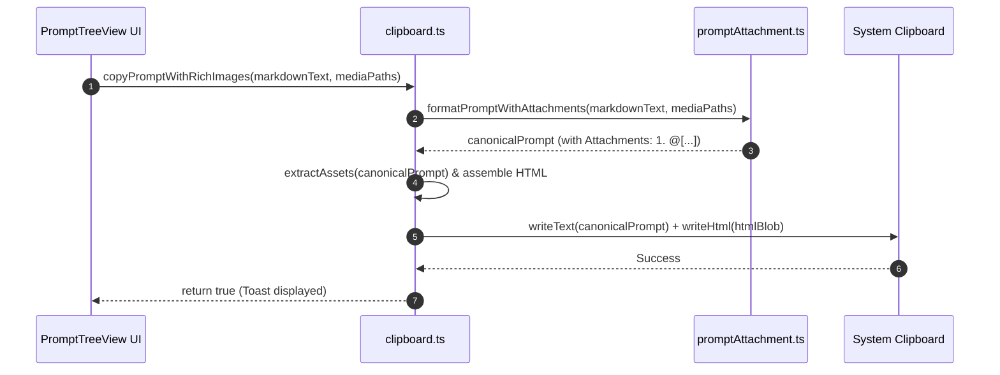

# Migration, Backend & Verification Specification: Image Attachment Format and Rerun Enqueue

**Specification ID:** `02-spec/21-app/49-image-attachment-format-and-rerun-enqueue/03-migration-and-verification-spec.md`  
**Task:** 49-image-attachment-format-and-rerun-enqueue  
**Scope:** Backend Token & Media Extraction, Clipboard Integration, Rerun Enqueue Invariant, Test Suite Upgrades, and Verification Gates  
**Status:** Canonical Engineering Specification  

---

## 1. Executive Summary & Architectural Objectives

This specification defines the migration protocols, backend extraction enhancements, clipboard integration contracts, test suite updates, and formal verification gates for standardizing image attachment representations and enforcing the **Rerun Enqueue Invariant** across Antigravity Manager (`agm`).

### 1.1 Core Problems Addressed
1. **Legacy Markdown Image Formatting**: Previously, image attachments were represented across prompt copy, rerun, and enqueue flows as legacy Markdown image links (e.g. ``), causing raw URI bloat and inconsistent parsing between IDE and agent engines.
2. **Missing Token Trimming in Rust Backend**: The Rust backend token parser in `extract_image_uris_or_paths` (`src-tauri/src/modules/repo_db/detection.rs`) trimmed quotes and brackets, but omitted the `@` symbol and bracketed list delimiters, preventing bracketed file path tokens (e.g. `@[path/to/image.png]`) from being extracted into `found_paths`.
3. **Rich Clipboard Overwrite in Direct Runs**: In `src-tauri/src/modules/repo_db/agy.rs`, the `has_rich_media` guard inspected legacy markers (`![`, `]`.
4. URI schemes (such as `file:///` or `file://`) and percent-encoded characters are decoded and normalized to native disk paths.

---

## 3. Backend Token & Image Extraction Enhancements

### 3.1 Rust Token Extraction (`src-tauri/src/modules/repo_db/detection.rs`)

The `extract_image_uris_or_paths` function scans prompt content for Base64 `data:image/` URIs and whitespace-delimited file path tokens ending with image extensions (`.png`, `.jpg`, `.jpeg`, `.webp`, `.gif`, `.svg`, `.bmp`).

#### 3.1.1 Architectural Flow

```mermaid
flowchart TD
    RawInput["Prompt Content String"] --> SplitTokens["Tokenize: split_whitespace()"]
    SplitTokens --> TrimChars["Trim Boundary Characters:<br/>' \" ( ) [ ] < > @"]
    TrimChars --> ExtensionCheck{"Ends with image extension?<br/>(.png, .jpg, .webp...)"}
    ExtensionCheck -- Yes --> StripScheme["Strip 'file:///' or 'file://' Scheme"]
    StripScheme --> Deduplicate["Deduplicate against found_paths"]
    Deduplicate --> Collect["Add to found_paths: Vec<String>"]
    ExtensionCheck -- No --> Ignore["Ignore non-image token"]
    RawInput --> ScanBase64["Scan for 'data:image/' Data URIs"]
    ScanBase64 --> CollectDataURIs["Add to data_uris: Vec<String>"]
    CollectDataURIs --> ResultTuple["Return (data_uris, found_paths)"]
    Collect --> ResultTuple
```

#### 3.1.2 Algorithmic Specification

In `src-tauri/src/modules/repo_db/detection.rs`:

```rust
let img_exts = [".png", ".jpg", ".jpeg", ".webp", ".gif", ".svg", ".bmp"];
for token in content.split_whitespace() {
    let clean = token.trim_matches(|c| {
        c == '"'
            || c == '\''
            || c == '('
            || c == ')'
            || c == '['
            || c == ']'
            || c == '<'
            || c == '>'
            || c == '@'
    });
    let lower = clean.to_lowercase();
    if img_exts.iter().any(|ext| lower.ends_with(ext)) {
        let p_str = clean
            .strip_prefix("file:///")
            .unwrap_or_else(|| clean.strip_prefix("file://").unwrap_or(clean));
        if !found_paths.contains(&p_str.to_string()) {
            found_paths.push(p_str.to_string());
        }
    }
}
```

*Key Behavioral Guarantee*: When input contains `1. @[path/to/media.png]`, whitespace splitting yields `1.` and `@[path/to/media.png]`. The second token trimmed of `@` and `[` and `]` resolves cleanly to `path/to/media.png`, successfully matching `.png` and populating `found_paths`.

### 3.2 Rich Media Preservation Guard (`src-tauri/src/modules/repo_db/agy.rs`)

When prompts are launched or re-queued via `run_active_prompt_with_details` or `requeue_prompt_with_details`, the backend guards against overwriting rich HTML/image clipboards already primed by the frontend.

#### 3.2.1 Guard Specification
In `src-tauri/src/modules/repo_db/agy.rs` (locations around lines 826-834 and 1028-1036):

```rust
// Guard: Do not overwrite rich HTML/image clipboard primed by frontend when prompt has attached media or rich content
let has_rich_media = initial_img.is_some()
    || !img_paths.is_empty()
    || prompt_content.contains("![")
    || prompt_content.contains("<img")
    || prompt_content.contains("data:image/")
    || prompt_content.contains("Attached Image")
    || prompt_content.contains("Attachments:")
    || prompt_content.contains("@[");

if !has_rich_media {
    copy_to_system_clipboard(prompt_content);
}
```

*Invariant*: Prompts formatted with the canonical `Attachments:` block or `@[` tokens evaluate `has_rich_media == true`, guaranteeing zero destructive system clipboard clobbering.

---

## 4. Clipboard Utilities Integration Contracts

The frontend clipboard helpers reside in `src/components/instances/PromptTreeView/clipboard.ts` and interface with the canonical pure helper `formatPromptWithAttachments` from `src/utils/promptAttachment.ts`.

### 4.1 Integration Mapping

| Helper Function | Target File | Formatter Function Used | Output Guarantees |
|---|---|---|---|
| `copyPromptWithRichImages` | `src/components/instances/PromptTreeView/clipboard.ts` | `formatPromptWithAttachments(markdownText, mediaPaths)` | Formats effective markdown before generating plain-text blob and HTML payload. |
| `copyPromptAiPayload` | `src/components/instances/PromptTreeView/usePromptTreePromptActions.ts` | `formatPromptWithAttachments(promptBody, conv.media_paths)` | All text and markdown AI payload copies output canonical bracketed attachment format. |
| `copyFullPrompt` | `src/components/instances/PromptTreeView/clipboard.ts` | `formatPromptWithAttachments(promptText, mediaPaths)` | Full prompt copy contains sanitized prompt body plus `Attachments:\n1. @[...]`. |

### 4.2 Sequence of Operations for Rich Clipboard Copy


```mermaid
sequenceDiagram
    autonumber
    participant UI as PromptTreeView UI
    participant Clip as clipboard.ts
    participant Norm as promptAttachment.ts
    participant Sys as System Clipboard

    UI->>Clip: copyPromptWithRichImages(markdownText, mediaPaths)
    Clip->>Norm: formatPromptWithAttachments(markdownText, mediaPaths)
    Norm-->>Clip: canonicalPrompt (with Attachments: 1. @[...])
    Clip->>Clip: extractAssets(canonicalPrompt) & assemble HTML
    Clip->>Sys: writeText(canonicalPrompt) + writeHtml(htmlBlob)
    Sys-->>Clip: Success
    Clip-->>UI: return true (Toast displayed)
```

---

## 5. Rerun Enqueue Invariant & Unit Test Verification

### 5.1 The Rerun Enqueue Invariant

```
INVARIANT [RERUN_ALWAYS_ENQUEUE]:
When dispatching rerun messages (whether single-round or multi-round 1..N):
- Dispatches must NEVER call sendPromptNow / 'send_prompt_now'.
- 100% of rounds must dispatch via enqueuePrompt / 'enqueue_prompt'.
- Active running prompt execution must NOT be terminated or preempted.
```

### 5.2 Unit Test Upgrades (`src/components/instances/PromptTreeView/__tests__/rerunActions.test.ts`)

The test suite in `src/components/instances/PromptTreeView/__tests__/rerunActions.test.ts` validates `dispatchRerunMessages`. Existing tests around lines 280-457 must be refactored to enforce the updated invariant:

#### 5.2.1 Multi-Round Rerun Test (Lines 280-321)
- **Previous Behavior**: Asserted `promptCalls[0].cmd === 'send_prompt_now'` and `promptCalls[1..2].cmd === 'enqueue_prompt'`.
- **Target Invariant**:
  - Assert `mockInvokeCalls.filter(c => c.cmd === 'send_prompt_now').length === 0`.
  - Assert `mockInvokeCalls.filter(c => c.cmd === 'enqueue_prompt').length === 3`.
  - Assert that all 3 rounds are dispatched to `enqueue_prompt` with matching `instanceId`, `conversationId`, and distinct randomized messages.

#### 5.2.2 Graceful Error Handling Test (Lines 323-343)
- **Previous Behavior**: Simulated failure by setting `mockInvokeFailCmd = 'enqueue_prompt'` which only affected Round 2.
- **Target Invariant**:
  - Since Round 1 now calls `enqueue_prompt`, mock failure on `enqueue_prompt` tests failure resilience.
  - To test partial failure with multiple rounds, configure the mock invoker or fail on second dispatch:
    - Round 1 succeeds (`enqueue_prompt`).
    - Round 2 fails (`enqueue_prompt` throws error).
    - Assert `result.dispatched === 1`, `result.failed === 1`, and no unhandled exceptions are raised.

#### 5.2.3 Anti-Repeat History Consecutive Runs Test (Lines 403-458)
- **Previous Behavior**: Asserted `run1Calls[0].cmd === 'send_prompt_now'` and `run2Calls[0].cmd === 'send_prompt_now'`.
- **Target Invariant**:
  - For Run 1 (3 messages): all 3 calls must be `enqueue_prompt`.
  - For Run 2 (2 messages): both calls must be `enqueue_prompt`.
  - Assert `mockInvokeCalls.filter(c => c.cmd === 'send_prompt_now').length === 0`.
  - Total `enqueue_prompt` calls equal 5.
  - All 5 messages remain unique and anti-repeat history rules remain 100% satisfied.

---

## 6. Migration & Backward Compatibility Protocol

### 6.1 Database State Compatibility
- Existing SQLite databases (`active_prompts`, `prompt_backups`, `repo_prompts.db`) store prompt content with either legacy markdown syntax (``) or raw paths.
- The enhanced backend `extract_image_uris_or_paths` parser seamlessly parses:
  1. Pure `data:image/` Base64 strings.
  2. Legacy Markdown image tags: ``.
  3. Raw path tokens: `path/to/image.png`.
  4. New canonical bracketed tokens: `@[path/to/image.png]`.
  5. Numbered attachment lists: `1. @[path/to/image.png]`.
- No database schema migrations or table rewrites are required; backward compatibility is 100% preserved.

### 6.2 Frontend State Compatibility
- Existing conversation nodes loaded from disk or API that contain legacy image syntax will display correctly in the tree view.
- When copied, re-run, or re-enqueued, the prompt text passes through `formatPromptWithAttachments`, automatically upgrading legacy structures to the canonical bracketed format.

---

## 7. Verification Evidence Contracts

To declare Subtask 03 and Task 49 complete, the following verification gates must pass cleanly:

### 7.1 Automated Quality Gates Matrix

| Gate | Execution Command | Target Evidence | Mandatory Pass Criteria |
|---|---|---|---|
| Frontend Test Suite | `npx tsx src/components/instances/PromptTreeView/__tests__/rerunActions.test.ts` | Terminal test summary | `14 passed, 0 failed` (0 calls to `send_prompt_now`) |
| Rust Unit Tests | `cd src-tauri && cargo test --lib extract_image_uris_or_paths` | Cargo test output | All assertions pass for bracketed tokens and media guards |
| Rust Code Formatting | `cd src-tauri && cargo fmt -- --check` | Formatting gate | Clean exit (code 0), zero formatting drift |
| Rust Compilation Gate | `cd src-tauri && cargo check --lib` | Cargo check output | Clean compilation, zero errors |
| Frontend Build Gate | `npm run build` | Vite build output | Successful production bundle build |

### 7.2 Strict Repository Rules Checklist
- [x] **Strictly Relative Git Paths**: All paths cited in code, specs, and plans are strictly repository-relative (`src/...`, `src-tauri/...`, `02-spec/...`, `.ai-memory/...`).
- [x] **Positive Booleans**: Use `has_rich_media`, `is_enqueued`, `is_valid` (no double negatives like `is_not_empty` or `non_empty`).
- [x] **Zero `any` Violations**: All TypeScript signatures and parameters use concrete interfaces or unknown type narrowing.
- [x] **No Silent Errors**: All fallible Rust operations propagate via `AppError` or record tracked warnings; all frontend fallbacks log to `useErrorStore`.
