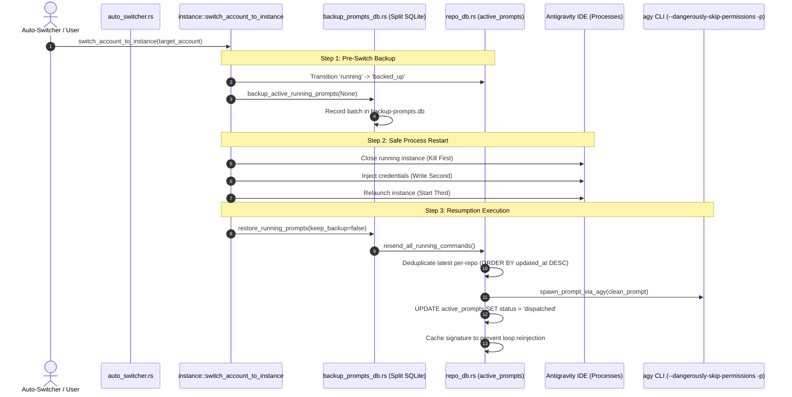

# 51 Auto-Switch Prompt Backup, Resumption, and De-Duplication Specification

> **Specification ID:** `02-spec/21-app/51-auto-switch-prompt-backup-resumption-and-deduplication.md`  
> **Status:** Active  
> **Traceability:** User Request: Auto-switch prompt backup before switch, guaranteed resumption execution, and permanent prevention of repetitive prompt reinjection loops.  
> **Version:** 1.0.0  

---

## 1. Executive Summary & Problem Classification

During automated profile rotation or manual account switching in Antigravity-Manager, user prompts currently running in the Antigravity IDE must be cleanly backed up before the IDE processes are terminated. After switching accounts and relaunching the IDE, the latest prompt for each workspace must resume running immediately in the background via the Antigravity CLI (`agy`), and must never get stuck or be reinjected repeatedly in successive auto-switch ticks.

### Root Causes of Previous Failures
1. **In-Flight State Ignored**: In-flight prompts had `status = 'running'` in `active_prompts`. Resend routines queried only `WHERE status IN ('backed_up', 'queued', 'pending')`, leaving running prompts permanently stuck upon restart.
2. **Stale Historical Prompts Ingestion**: `backup_active_running_prompts` pulled all prompts across `active_prompts` regardless of age or dispatched status, contaminating backup batches with ancient test records.
3. **In-Memory Cache Lockout**: The in-memory `DISPATCHED_PROMPTS_CACHE` retained signatures from the pre-switch session. Upon post-switch restore, `resend_all_running_commands` flagged the restored prompt as `already_dispatched = true` and dropped execution.
4. **Duplicate Double-Switch Invocation**: Both `auto_switcher.rs` and `instance.rs` called backup and restore independently, causing race conditions and multiple conflicting dispatch attempts.

---

## 2. Architectural Blueprint

---

## 3. Data Contracts & State Transitions

### Active Prompt Status State Machine
- `running`: Actively executing when switch is requested.
- `backed_up`: Interrupted prompt saved to SQLite (`repo_prompts.db` and `backup-prompts.db`).
- `dispatched`: Successfully spawned via `agy -p` or resolved as older duplicate for the repo.
- `failed`: Terminal failure on dispatch (workspace does not exist or empty content).

### De-Duplication Invariants
1. **Latest-Per-Workspace**: If multiple prompts exist for `repo_path`, only the newest (`ORDER BY updated_at DESC`) is dispatched. Older entries are set to `status = 'dispatched'` without execution.
2. **Signature Memory Cache**: `{repo_path}:{prompt_content}` is tracked in `DISPATCHED_PROMPTS_CACHE` upon dispatch. Subsequent monitor ticks ignore already dispatched signatures.
3. **Restoration Exemption**: When `restore_running_prompts` triggers, the target prompt is intentionally cleared from cache or bypassed once so it can re-run post-switch.

---

## 4. Verification Gates & Acceptance Criteria

- **AC-SW-001 (Pre-Switch Backup)**: All running and active prompts are captured into `active_prompts` and `backup-prompts.db` with status `'backed_up'` before IDE termination.
- **AC-SW-002 (Post-Switch Resumption)**: The latest backed-up prompt per workspace is dispatched via `spawn_prompt_via_agy` immediately after instance launch.
- **AC-SW-003 (Re-injection Prevention)**: No prompt is dispatched more than once per switch event. Subsequent monitor ticks do not re-execute already dispatched prompts.
- **AC-SW-004 (Clean User Prompt Extraction)**: Wrappers (`<USER_REQUEST>`, `<ADDITIONAL_METADATA>`) are stripped before passing to `agy -p`.
