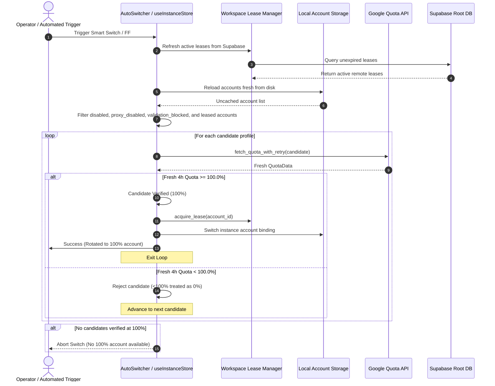

# Specification 56: Smart Switch Live Refresh, Strict 100% Quota Gate & Multi-Channel Cluster Leasing

## Metadata
- **Version:** 1.0.0
- **Updated:** 2026-09-27
- **AI Confidence:** High (Production Invariant)
- **Ambiguity:** None (Strict Grounded Rules)

---

## 1. Problem Statement & Background
In prior versions of Antigravity Manager:
1. **Fallback to Low Quotas:** When candidate selection routines did not find an account with 100% quota, relaxed fallback passes allowed accounts with only 11%–25% quota to be chosen. The user explicitly mandated: *"If the 4-hour credits is less than 100%, it is completely zero. We don't touch it. Even if it is 20%, you cannot pick it."*
2. **Disabled Account Re-Selection:** Disabling an account in the UI sets `proxy_disabled = true`. However, the candidate selection logic in `auto_switcher.rs` and `useInstanceStore.ts` only checked `acc.disabled`, completely ignoring `acc.proxy_disabled`. As a result, disabled accounts were continually re-selected.
3. **Stale Cache & Speculative CLI:** Several entry points (CLI `ff` / `smart-switch`) performed speculative selection without verifying fresh quotas against the Google API.
4. **Cluster Collision Risk:** Distributed leases in Supabase (`workspace_leases`) and cross-node email switch broadcasts were not systematically queried prior to candidate selection.

---

## 2. Architectural Invariants

### 2.1 Strict 100% 4-Hour Quota Gate
- **Zero Fallback Rule:** Any candidate account whose fresh 4-hour window quota is `< 100.0%` MUST be rejected immediately and considered exhausted (`0.0%`).
- **Complete Elimination of Relaxed Fallbacks:**
  - Remove all secondary passes in `auto_switcher.rs` that lower the threshold to 15.0%.
  - Remove `verified_fallback` buffers in `select_and_verify_next_best_profile`.
  - Remove `bestFallbackCandidate` and `eligibleAccounts[0]` fallbacks in `useInstanceStore.ts`.
- **Fail-Safe Abort:** If no candidate passes the 100.0% live quota check, the switcher must cleanly abort and return `Ok(None)` or a user-facing error (`"No alternative profile with 100% quota available"`). Under NO circumstance may the switcher bind a profile with <100% credit.

### 2.2 Pre-Switch Live Refresh Verification Loop
- **Google API Direct Probe:** For each candidate in priority order:
  1. Load account record fresh from disk.
  2. Confirm usability: `!acc.disabled && !acc.proxy_disabled && !acc.validation_blocked && acc.is_active`.
  3. Execute `account::fetch_quota_with_retry(&mut cand_acc).await`.
  4. Calculate fresh 4-hour rolling quota (`calculate_4h_window_quota`).
  5. If `fresh_4h_quota >= 100.0`: Candidate is accepted for rotation.
  6. If `fresh_4h_quota < 100.0`: Log rejection and immediately advance to the next candidate.
  7. Loop continues until a candidate verifies at 100% or candidate list is exhausted.

### 2.3 Universal Disabled Account Immunity
- Both Rust and TypeScript candidate evaluators MUST strictly check:
  ```rust
  if acc.disabled || acc.proxy_disabled || acc.validation_blocked || !acc.is_active {
      continue;
  }
  ```
- In `src-tauri/src/commands/mod.rs:toggle_proxy_status`, atomic synchronization MUST update both `{account_id}.json` and `index.json` to prevent index drift.
- In `src/stores/useInstanceStore.ts`, candidate evaluation must always execute `await useAccountStore.getState().fetchAccounts()` to guarantee fresh account states.

### 2.4 Multi-Channel Distributed Cluster Leasing
- Candidate exclusion pool (`effective_exclusions`) MUST integrate:
  1. **Local Running Instances:** Any account currently bound to active instances or the current workspace.
  2. **Supabase Distributed Leases:** Call `workspace_lease_manager::list_active_leases().await` to refresh remote leases; exclude all accounts with unexpired leases owned by other nodes (`lease.node_id != local_node_id`).
  3. **Email Inbound Broadcasts:** Call `email_inbound::fetch_recent_cross_vm_switched_accounts(3600)` to exclude accounts recently switched by peer nodes.
  4. **Immediate Post-Switch Lease Acquisition:** Acquire an exclusive lease in Supabase Root DB immediately upon successful profile rotation.

---

## 3. Data Flow & Execution Sequence



---

## 4. Conformance & Verification Checklist
- [ ] **TC-SS-001:** Account with `proxy_disabled = true` is never returned as a candidate.
- [ ] **TC-SS-002:** Account with cached 100% quota whose live refresh returns 20% is rejected and not selected.
- [ ] **TC-SS-003:** In a pool where all accounts have <100% quota, `select_and_verify_next_best_profile` returns `None`.
- [ ] **TC-SS-004:** Leased account in Supabase Root DB owned by another node ID is excluded from candidate list.
- [ ] **TC-SS-005:** Frontend `smartRotateProfileAccount` re-fetches accounts and displays error toast when zero 100% accounts exist.
