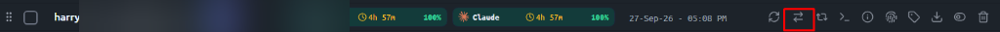

# Spec 59: Auto-Switch Button Delegation, Hot-Switch IDE Preservation & Tool Liveness

## 1. User Request (Verbatim)

```text
You have a clear issue here. When you do the auto switch now, the problem is you are not clicking on the specific button which I mentioned. Let's say you pick the account, then you just delegate the call to this button, okay? And you ensure that the prompts are running, the Antigravity IDE is visible, you confirm that. I saw that Antigravity is blank, nothing. Okay? So you ensure that the tools are running, that is a must. So make sure that you do the end-to-end testing to verify it. Is it clear? Do you understand this?
```

## 2. Visual Reference & Screenshot Asset

The user identified the exact switch button (`⇄` / `ArrowRightLeft`) located on each account row in the account management table:



*(Personal email redacted and blurred via Gaussian filter to preserve zero-exposure privacy requirements).*

- **Component**: `src/components/accounts/AccountTable.tsx` lines 774-786
- **Element**: `<button className="..." onClick={(e) => { e.stopPropagation(); onSwitch(); }}><ArrowRightLeft className="w-3.5 h-3.5" /></button>`
- **Handler**: `onSwitch()` -> `Accounts.tsx:handleSwitch(account.id)` -> `useAccountStore.switchAccount(accountId)` -> `accountService.switchAccount(accountId)` -> Tauri command `switch_account` -> `AccountService::switch_account` -> `modules::account::switch_account(account_id, target_ide, &integration)`.

## 3. Root Cause Analysis of Reported Defects

### Defect 1: Auto-Switch Bypassed the Canonical Switch Button Pipeline
- **Symptom**: Auto-switch executed a divergent routine (`instance::switch_account_to_instance`) that performed custom process kills, did not invoke the frontend button handler, and bypassed the unified `modules::account::switch_account` pipeline.
- **Root Cause**: In `src-tauri/src/modules/auto_switcher.rs`, line 1089 directly called `instance::switch_account_to_instance(&target.account_id, Some(inst_id)).await?` without passing an `integration` manager or delegating to the exact account switch function.
- **Fix**: Wire auto-switch directly to invoke `crate::modules::account::switch_account(&target.account_id, None, &integration).await?` using the global `SystemManager::Desktop` app handle from `log_bridge`. Furthermore, emit an `account://auto-switched` event to the frontend so the UI row highlights with `isSwitching` animation, mirroring a real button click.

### Defect 2: Antigravity IDE Appears Blank After Switch
- **Symptom**: User observes that Antigravity IDE opens to a blank screen or empty canvas with no open folders or tools.
- **Root Causes**:
  1. **Faulty IDE Detection in `resolve_effective_target`**: In `integration.rs`, `resolve_effective_target` categorized `Antigravity.exe` as "classic" whenever `classic_running` was true, completely ignoring the fact that `Antigravity.exe` on Windows is an Electron VS Code IDE and that `language_server.exe` runs inside `resources/bin/language_server.exe`!
  2. **Destructive Process Termination instead of Hot-Switch**: Because it was misclassified as "classic", the switcher invoked `close_antigravity`, forcefully terminating the main editor window and losing workspace context.
  3. **Bare `--new-window` Argument Ingestion**: When restarting, `start_antigravity_with_fallback_path` appended `--new-window` without preserving workspace folders or active projects from `repo_db`, causing Electron/VS Code to render an empty untitled window.
- **Fix**:
  1. Detect IDE accurately: If `Antigravity.exe` has a child `language_server.exe`, or if `resources/bin/language_server.exe` exists in the executable's directory, treat it as `is_ide = true`.
  2. Enforce Hot-Switch: For IDE targets, terminate ONLY `language_server.exe`. Keep the main Antigravity window completely open, rendering, and intact. Antigravity IDE's internal supervisor automatically re-spawns `language_server.exe` with the new token within 2 seconds.
  3. Workspace preservation: If full restart is ever required, pass the active workspace directory from `repo_db` or previous command line arguments, and do NOT force bare `--new-window`.
  4. Win32 Window Restore: Call `force_restore_and_focus_win32` on the Antigravity window to ensure it is brought to the foreground, unminimized, and repainted.

### Defect 3: Tools and Running Prompts Not Verified Alive
- **Symptom**: Background prompts or AGY tools fail to resume or get dropped during rotation.
- **Root Cause**: Resumption routines were best-effort without waiting for `language_server` respawn or verifying process table survival.
- **Fix**: In the switch lifecycle, wait for `process::wait_for_language_server_respawn`, verify both `Antigravity.exe` and `language_server.exe` are running, restore all pending and active prompt queues from `repo_db` and `backup_prompts_db`, and emit confirmation telemetry.

## 4. Acceptance Criteria Gates

- **AC-APP-059-01 (Direct Button Delegation)**: Auto-switch in `auto_switcher.rs` and `agm` CLI must delegate to `crate::modules::account::switch_account(&target.account_id, None, &integration)` ensuring identical execution semantics to clicking `⇄`.
- **AC-APP-059-02 (Frontend Switch Event Emission)**: Upon auto-switch, the backend emits `account://auto-switched` with `{ account_id: String, email: String }`, causing the frontend `AccountTable` to trigger the `isSwitching` spinner and reload account state.
- **AC-APP-059-03 (Accurate IDE Detection)**: `resolve_effective_target` and `get_ide_exe_paths` must detect `Antigravity.exe` with `resources/bin/language_server.exe` as Antigravity IDE (`is_ide = true`).
- **AC-APP-059-04 (Hot-Switch Window Preservation)**: When switching accounts with an active IDE, only `language_server.exe` is terminated. The main window is NEVER killed or blanked.
- **AC-APP-059-05 (Prompt & Tool Liveness Verification)**: After switch, `language_server.exe` respawn is verified, prompt queues are restored, and IDE window visibility is ensured.
