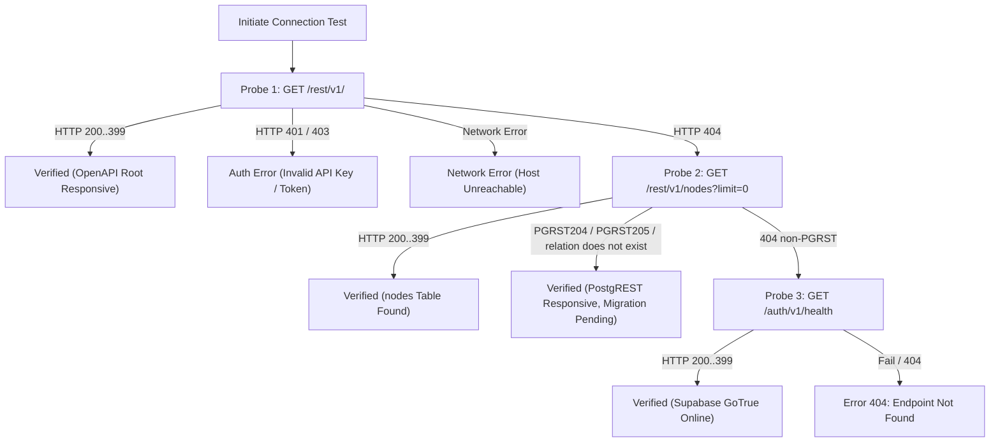

# 60. Supabase Connection Probe, URL Normalization & Resilient Diagnostics

## 1. Overview & Context
Antigravity-Manager integrates with Supabase PostgreSQL instances to support multi-node cluster synchronization, workspace profile leases, command queues, and remote prompt execution. In earlier implementations, connection testing directly requested `GET /rest/v1/` on unnormalized URLs. When users input URLs ending with `/rest/v1` or when Supabase projects disabled OpenAPI spec inspection for public `anon` API keys, requests failed with HTTP 404, triggering intrusive application error modals.

This specification formalizes the canonical multi-stage probe ladder, universal URL normalization, and structured diagnostic result envelopes.

---

## 2. Technical Architecture & Protocols

### 2.1 Universal Supabase URL Normalization
All Supabase project URLs entered via UI, CLI, or configuration import must be normalized before persistence and before HTTP dispatch:
```rust
pub fn normalize_supabase_url(raw: &str) -> String {
    let mut trimmed = raw.trim();
    while trimmed.ends_with('/') {
        trimmed = &trimmed[..trimmed.len() - 1];
    }
    if let Some(stripped) = trimmed.strip_suffix("/rest/v1") {
        trimmed = stripped;
        while trimmed.ends_with('/') {
            trimmed = &trimmed[..trimmed.len() - 1];
        }
    }
    trimmed.to_string()
}
```

#### Normalization Invariants:
1. `https://xyz.supabase.co/rest/v1/` -> `https://xyz.supabase.co`
2. `https://xyz.supabase.co/` -> `https://xyz.supabase.co`
3. `http://localhost:54321/rest/v1` -> `http://localhost:54321`
4. Base URL is strictly guaranteed not to end in `/` or `/rest/v1`.
5. PostgREST table paths always format as `{base_url}/rest/v1/{table}`.
6. PostgREST RPC paths always format as `{base_url}/rest/v1/rpc/{function}`.

---

### 2.2 Resilient Multi-Stage Probe Ladder

When testing endpoint connectivity (`test_supabase_endpoint`), the client must evaluate a 3-tier probe sequence:



---

### 2.3 IPC & Frontend Result Envelopes

#### Backend IPC Contract:
```rust
#[derive(Debug, Clone, Serialize, Deserialize)]
pub struct EndpointTestResult {
    pub is_success: bool,
    pub message: String,
    pub status_code: Option<u16>,
}
```

#### Invariant:
`test_supabase_endpoint` must NEVER return `Err(...)` for standard connectivity rejection. It must return `Ok(EndpointTestResult)` with actionable guidance (`is_success: false`), preventing unhandled promise rejections in frontend stores.

---

## 3. Conformance Checklist

- [x] URL normalization handles bare host, trailing slashes, and redundant `/rest/v1` paths.
- [x] PostgREST root, table queries, and RPC URLs never duplicate `/rest/v1/rest/v1`.
- [x] `test_connection` handles 404 by detecting PostgREST error bodies (`PGRST204`, `PGRST205`) and `/auth/v1/health`.
- [x] UI displays inline status badges (`CheckCircle2` / `AlertCircle`) and concise toasts.
- [x] Zero calls to `useErrorStore.captureError` during deliberate user testing.
