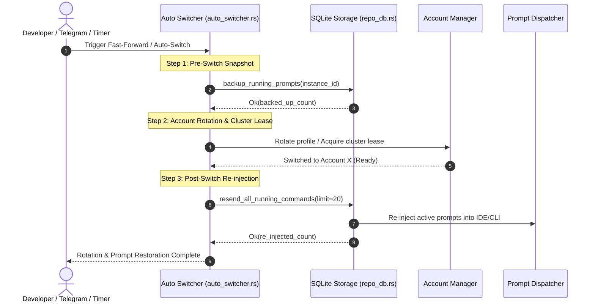

# Spec 63: Fast-Forward Prompt Backup, Post-Switch Re-Injection & 12% Quota Threshold

> **/goal** Guarantee zero prompt loss during fast-forward and account rotation by enforcing pre-switch running/queued prompt snapshots and automatic post-switch re-injection across all workspaces; align the default low quota threshold to 12%; provide CLI and Telegram command parity (`agm backup`, `agm restore`, `/ff`, `/prompt`, `/help`).
> **/learn** Previously, auto-switching and fast-forwarding (`/ff` or auto-rotation) rotated accounts without backing up active prompts into `repo_db::backup_running_prompts`. When new profiles loaded, in-flight work was orphaned. By embedding pre-switch snapshotting and post-lease re-injection directly into the rotation lifecycle, prompts persist seamlessly.

**Version:** 1.0.0
**Updated:** 2026-09-27
**Author:** AI Agent Pair Programmer (Sponsored by RISEUP ASIA LLC / Maintainer: @alimtvnetwork)
**Status:** Approved & Grounded

---

## 1. Context & Problem Statement

Users running complex multi-turn LLM agent sessions via Antigravity-Manager encounter prompt loss and workflow interruption when an account reaches quota exhaustion or triggers a fast-forward profile switch:
1. **Quota Threshold Default Alignment**:
   - Default threshold was previously set to `25%` or `10%` in different places, creating inconsistency. The user requirement explicitly standardizes the default threshold to **12%** (`low_quota_threshold_percent: 12.0` and `quota_protection.threshold_percentage: 12`).
2. **Fast-Forward Prompt Discard / Loss**:
   - In `auto_switcher.rs`, `execute_profile_rotation_with_context` only wrote a minimal task state JSON (`{instance_id, account_id, timestamp}`) without invoking `repo_db::backup_running_prompts`.
   - Post-switch resumption (`auto_resume_recent_prompts`) failed to find running prompts because they were not backed up in SQLite.
   - In Telegram bot, `/ff` immediately called `check_and_rotate_if_needed()` without taking a prompt backup snapshot.
3. **CLI Command Gaps**:
   - Users lacked convenient terminal commands to trigger prompt backup and restoration on demand (`agm backup`, `agm restore`, `agm prompt backup`, `agm prompt restore`).
4. **Telegram Prompt Control & Help Visibility**:
   - Telegram bot `/prompt <project> <text>` and `/prompt <node> <proj> <text>` needed full validation.
   - The `/help` manual catalog required a comprehensive display of all capabilities, fleet nodes, project targets, and backup/restore controls with safe message chunking.

---

## 2. Architecture & Control Flow

---

## 3. Detailed Technical Requirements

### 3.1 Default Quota Threshold to 12%
- In `src-tauri/src/models/config.rs`:
  - `low_quota_threshold_percent`: change default from `25.0` to `12.0`.
  - `quota_protection.threshold_percentage`: change default from `10` to `12`.
  - Keep `critical_threshold_percent` aligned at `12.0`.
- In `src/types/config.ts`:
  - Update any default constants for `low_quota_threshold_percent` and `threshold_percentage` to `12`.
- In `src/pages/Settings.tsx`:
  - Default input values or fallback sliders reflect `12%`.

### 3.2 Pre-Switch Prompt Backup in `auto_switcher.rs`
- Before executing account rotation or switching profile:
  - Call `repo_db::backup_running_prompts(inst_id)`.
  - Ensure any running or in-flight prompts are serialized and marked for restoration.
  - Log: `"[AutoSwitcher] Pre-switch backup created for {} running prompts"`.

### 3.3 Post-Switch Prompt Re-injection in `auto_switcher.rs`
- After profile rotation succeeds and the new account is verified:
  - Call `repo_db::resend_all_running_commands(20)`.
  - Call `repo_db::dispatch_running_prompts(inst_id)`.
  - Log: `"[AutoSwitcher] Post-switch re-injection triggered for running prompts"`.

### 3.4 Telegram `/ff` Command Enhancement in `telegram_inbound.rs`
- In `/ff` handler:
  1. Trigger pre-switch `repo_db::backup_running_prompts("default")`.
  2. Invoke `check_and_rotate_if_needed()`.
  3. Trigger post-switch `repo_db::resend_all_running_commands(20)`.
  4. Format and return an informative status card showing backup and re-injection counts.

### 3.5 CLI Command Parity in `agm.rs`
- Ensure the following CLI commands are supported:
  - `agm backup`, `agm backpack`, `agm backup-running-prompts`, `agm brp`
  - `agm restore`, `agm restore-running-prompts`, `agm rrp`, `agm resend-running`
  - `agm prompt backup`, `agm prompt restore`
  - `agm prompt <project> <text>` and `agm prompt <node> <project> <text>`

### 3.6 Telegram `/help` and Message Chunking
- Ensure `/help` manual catalog documents all commands:
  - Basic & Navigation: `/help`, `/status`, `/version`, `/ping`
  - Profile & Rotation: `/ff`, `/switch`, `/accounts`, `/quota`
  - Fleet & Projects: `/projects`, `/nodes`, `/prompts`, `/prompt <proj> <text>`, `/prompt <node> <proj> <text>`
  - Backup & Recovery: `/backup`, `/restore`
- Enforce strict chunking via `send_telegram_message_chunked` (slice at `\n` <= 3800 chars) to prevent Telegram API 400 Bad Request errors.

---

## 4. Acceptance Criteria & Test Matrix

- **AC-63-001 (Quota Threshold Defaults)**:
  - Running without custom config initializes with `12.0%` quota threshold.
- **AC-63-002 (Pre-Switch Prompt Backup)**:
  - Calling rotation snapshots all active running prompts into SQLite.
- **AC-63-003 (Post-Switch Re-injection)**:
  - Backed-up prompts are automatically re-sent and re-injected after rotation.
- **AC-63-004 (CLI Parity)**:
  - `agm backup` and `agm restore` execute cleanly and output structured summaries.
- **AC-63-005 (Telegram Parity)**:
  - `/ff` performs backup, rotation, and re-injection.
  - `/prompt` injects prompts to local or remote cluster nodes.
  - `/help` displays the full command list within Telegram length limits.
