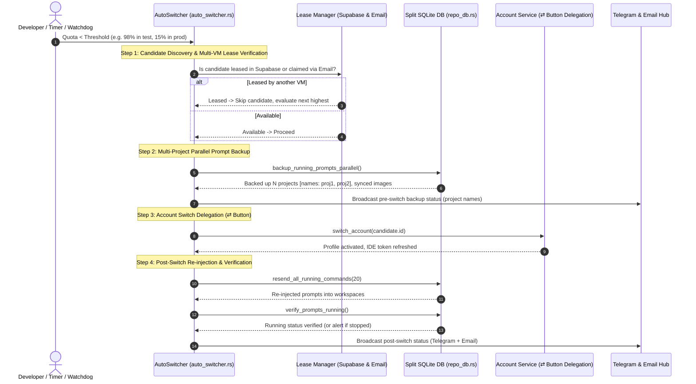

# Spec 64: Account Switch End-to-End Verification, Parallel Prompt Backup, Multi-VM Collision Prevention & 15% Threshold Release

> **/goal** Provide end-to-end automated verification of the account switch and fast-forward pipeline: multi-project parallel prompt backup to SQLite, image path synchronization, Supabase & email multi-VM lease collision avoidance, Telegram & email stage telemetry with project names, CLI syntax examples polish, simulated 98% rotation validation in default and sandbox instance modes, followed by final 15% threshold alignment and minor release orchestration.
> **/learn** When rotating profiles during high-load multi-workspace tasks, prompt backup must occur concurrently across all active projects without blocking I/O, preserving friendly project names (not raw hashes). Checking active Supabase leases and email telemetry guarantees that another node in the cluster hasn't claimed the candidate profile, ensuring conflict-free rotation.

**Version:** 1.0.0
**Updated:** 2026-09-28
**Author:** AI Agent Pair Programmer (Sponsored by RISEUP ASIA LLC / Maintainer: @alimtvnetwork)
**Status:** Approved & Grounded

---

## 1. User Request (Verbatim)

```text
I think for testing purpose, you need to test it, end-to-end test, and confirm that it is working, and also make sure that all the commands that we have crafted for the CLI tool, that has nice help text, okay, with examples. Okay. So let's discuss about the account switch. Okay, you have done the account switch before. But then again, we are trying to do the re-verification one more time, okay? So what I want you to do is... Okay, the way that this is going to work is that first you're going to put the threshold for the account switch at 98%. Okay? And then you use some token or use some credits, add some test prompts to somewhere, okay, so that it starts running. Okay. So once the credit goes less than 98%, it switches. Okay? But before it switches, you know the algorithm. The algorithm is just, once we found the right fit, the top one, we check the refresh. We do a refresh on the account, and if the refresh says the same credit remains, same number follows, then we select that. Okay? But again, we do not do anything yet. The first thing we should do is take a backup of that instance to SQLite database using the AGM. Take the prompts backup, the running prompts, actually. Running prompts only. So you took a backup, let's say. And then, so you need to probably add a running prompts command, like running prompts export or backup and restore, something like this. So it does the restoring, I mean, backuping first. So it should be very small, one to one prompts that will be saved to the database, parallely. So you should try to do it parallely if multiple projects are running. Multiple projects, that single prompt will be saved to the database along with the picture information, picture path, and most of the things that these are attached, it needs to be there, synced. And then when we found the account we want to switch, we do the fast-forward button click. That means dedicate that to fast-forward button. Fast-forward button usually just switches the account, right? So it will go to that account, click on the appropriate button to delegate the call to that appropriate button to refresh the IDE with the new account. Up to this part should be very clear. We have discussed this before. Now, it should restore the running prompt and reinject and see like it's running even using another AGM command, it will see commands are running or not. If not, it will notify in the Telegram. Telegram also should let us know the steps that we mentioned. It should also reveal that. That means it's going to take a backup. The backup means we mentioned like taking a backup of running prompts. So it would show like five projects or six projects, whatever the number is. Projects are getting into backup. Projects name can be there listed. No IDs, but the names of the projects. So once it's saved into the backup using the command, it will again restore the running prompts, and it would reinject, and this status also needs to be in the Telegram, also in the email altogether. Do you understand? Okay, write into the spec so that you never forget And also at the end, once all this testing is done. So first you code, because if you switch it, then the code running would be stopped. Okay? Make sure that you have a process that makes sure that the prompts are running. Okay? That is very, very important. Now, at the end, you would have some count that would give you all this information and finalize the process. So at the end, what you do after the testing and everything is done, you reduce the threshold to, let's say, 15%. Okay? Keep it under 15%, and then you make a minor bump and release, and check the CI/CD using GitLab EE licenT. That is all green. So that's it. That's what I'm expecting for. So you need to have this testing. Now, the same thing, you want to test it, end-to-end test in the instance mode. Or you could try to create a new instance and try to test this, that does this work on instance mode or not. And then finally you remove that instance. Okay? So you do the end-to-end testing here, no problem in the machine. You can try to do anything that you like. If anything goes wrong, I can revert this back. I have a snapshot. So you don't have to worry about this. Do you understand? Can you please follow through all this and then finally make a release? That means before you release, you also change the default threshold to 15%. Okay? And make sure that you have the proper email sending and also email checking. You need to check the email. If the email is connected, you need to check in the email if this user profile or the account is already selected by some other DM. If it is, then you need to skip and move to the next one. Remember that, that's a very crucial step I forgot to remind you. Also, if we have the super base, then it is very easy. Every one of the system will check who is not using the account and has the highest value by the algorithm you have to specify. Then it will just switch to this account. That is the standard process. Is it clear? Do you have any question and confusion?
```

Visual Reference:


---

## 2. Architecture & Control Flow



---

## 3. Detailed Technical Requirements

### 3.1 CLI Help Text & Syntax Examples Polish
In `src-tauri/src/bin/agm.rs`:
- Every major command must print clearly formatted help with syntax, option flags, and real-world examples:
  - `agm running-prompts ls`: show limits, word count flags, examples.
  - `agm backup` / `agm restore`: show file overrides, clean flags, examples.
  - `agm switch-if-low-credit`: show threshold flags `-t 98` / `-t 15`, json exports, examples.
  - `agm auto-switch`: show configuration, interval settings, examples.
  - `agm instances`: show sequence, id, alias, examples.

### 3.2 Multi-Project Parallel Running Prompts Backup & Restoration
- In `repo_db.rs` / `backup_prompts_db.rs`:
  - When scanning for running prompts across workspaces, capture prompts in parallel.
  - Record the human-readable project directory / repo name (`repo_name`), not just raw UUIDs.
  - Capture attached image paths and base64 payloads to ensure zero asset drift during restoration.
  - Expose verification helper `verify_prompts_running(instance_id)` to verify prompts are actively running post-rotation.

### 3.3 Multi-VM Account Lease & Collision Prevention
- In `auto_switcher.rs`:
  - During candidate selection (`evaluate_candidate_for_rotation`), inspect:
    1. **Supabase Lease Manager**: Ensure `is_account_leased(candidate.id)` returns false or expired.
    2. **Email Telemetry**: Check recent inbound switch telemetry to ensure another VM node hasn't selected this account within its cooldown window.
  - If busy, skip and select the next highest quota candidate.

### 3.4 Telegram & Email Stage Telemetry
- In `telegram_inbound.rs` and `notification_hub.rs`:
  - Format status cards showing:
    - Pre-switch backup count and friendly project names (e.g. `• Projects: Antigravity-Manager, my-web-app`).
    - Account switched (From -> To with credits).
    - Post-switch re-injection count and running confirmation.

### 3.5 End-to-End Simulation & Threshold Alignment
- Step 1: Temporarily configure threshold to `98.0%` in test.
- Step 2: Trigger switch evaluation, verify prompt snapshot, rotation, reinjection, and running verification in default mode and sandbox instance mode.
- Step 3: Remove test instance.
- Step 4: Align default low quota threshold to `15.0%` (`low_quota_threshold_percent: 15.0`, `threshold_percentage: 15`).

### 3.6 Minor Version Bump & Release Ceremony
- Synchronize manifests via `npm run bump minor`.
- Verify formatting (`cargo fmt`) and clippy (`cargo clippy`).
- Commit atomically and push via GitMap (`gitmap cpr` / `gitmap cpf`).
- Monitor pipeline with `gitmap pe -t` to 100% green.

---

## 4. Acceptance Criteria & Test Matrix

- **AC-64-001 (CLI Help Polish)**: `agm --help` and subcommands output clean usage and copy-pasteable examples.
- **AC-64-002 (Parallel Multi-Project Backup)**: Running prompts across all active workspaces are saved with project names and image metadata.
- **AC-64-003 (Collision Prevention)**: Leased accounts in Supabase or Email signals are skipped in favor of the next available profile.
- **AC-64-004 (Stage Telemetry)**: Telegram and Email receive pre-switch and post-switch reports detailing project names.
- **AC-64-005 (15% Default Threshold)**: Default low quota threshold is set to `15.0%` in backend config and frontend settings.
- **AC-64-006 (Minor Release & Green CI)**: Minor version bump passes `gitmap pe` with 0 failures.
