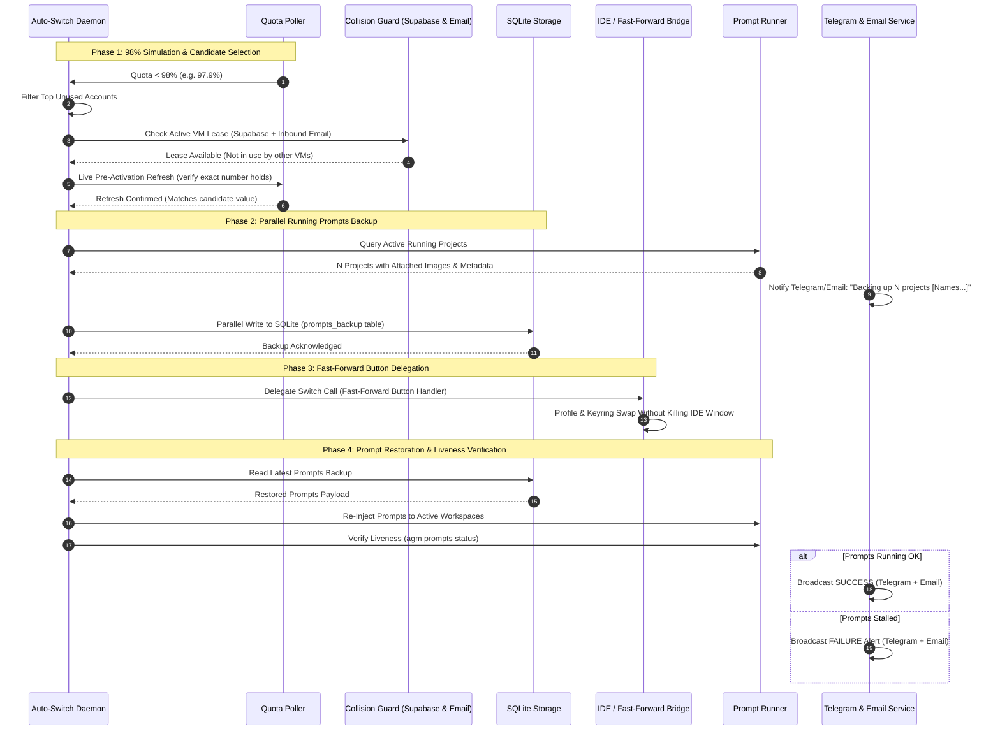

# SPEC-APP-68: Account Switch 98% Simulation E2E, Parallel Prompt Backup/Restore, Multi-VM Collision Shielding & Sandbox Instance Lifecycle

## 1. Metadata & Authority
- **Specification ID**: `SPEC-APP-68`
- **Component**: Account Auto-Switcher, Prompt Recovery Engine, Multi-Channel Cluster Leasing, Multi-Instance Manager, AGM CLI
- **Status**: `Active`
- **Version**: `1.0.0`
- **Parent Index**: [02-spec/21-app/01-index.md](01-index.md)

---

## 2. User Request (Verbatim)

```text
I think for testing purpose, you need to test it, end-to-end test, and confirm that it is working, and also make sure that all the commands that we have crafted for the CLI tool, that has nice help text, okay, with examples. Okay. So let's discuss about the account switch. Okay, you have done the account switch before. But then again, we are trying to do the re-verification one more time, okay? So what I want you to do is... Okay, the way that this is going to work is that first you're going to put the threshold for the account switch at 98%. Okay? And then you use some token or use some credits, add some test prompts to somewhere, okay, so that it starts running. Okay. So once the credit goes less than 98%, it switches. Okay? But before it switches, you know the algorithm. The algorithm is just, once we found the right fit, the top one, we check the refresh. We do a refresh on the account, and if the refresh says the same credit remains, same number follows, then we select that. Okay? But again, we do not do anything yet. The first thing we should do is take a backup of that instance to SQLite database using the AGM. Take the prompts backup, the running prompts, actually. Running prompts only. So you took a backup, let's say. And then, so you need to probably add a running prompts command, like running prompts export or backup and restore, something like this. So it does the restoring, I mean, backuping first. So it should be very small, one to one prompts that will be saved to the database, parallely. So you should try to do it parallely if multiple projects are running. Multiple projects, that single prompt will be saved to the database along with the picture information, picture path, and most of the things that these are attached, it needs to be there, synced. And then when we found the account we want to switch, we do the fast-forward button click. That means dedicate that to fast-forward button. Fast-forward button usually just switches the account, right? So it will go to that account, click on the appropriate button to delegate the call to that appropriate button to refresh the IDE with the new account. Up to this part should be very clear. We have discussed this before. Now, it should restore the running prompt and reinject and see like it's running even using another AGM command, it will see commands are running or not. If not, it will notify in the Telegram. Telegram also should let us know the steps that we mentioned. It should also reveal that. That means it's going to take a backup. The backup means we mentioned like taking a backup of running prompts. So it would show like five projects or six projects, whatever the number is. Projects are getting into backup. Projects name can be there listed. No IDs, but the names of the projects. So once it's saved into the backup using the command, it will again restore the running prompts, and it would reinject, and this status also needs to be in the Telegram, also in the email altogether. Do you understand? Okay, write into the spec so that you never forget And also at the end, once all this testing is done. So first you code, because if you switch it, then the code running would be stopped. Okay? Make sure that you have a process that makes sure that the prompts are running. Okay? That is very, very important. Now, at the end, you would have some count that would give you all this information and finalize the process. So at the end, what you do after the testing and everything is done, you reduce the threshold to, let's say, 15%. Okay? Keep it under 15%, and then you make a minor bump and release, and check the CI/CD using GitLab EE licenT. That is all green. So that's it. That's what I'm expecting for. So you need to have this testing. Now, the same thing, you want to test it, end-to-end test in the instance mode. Or you could try to create a new instance and try to test this, that does this work on instance mode or not. And then finally you remove that instance. Okay? So you do the end-to-end testing here, no problem in the machine. You can try to do anything that you like. If anything goes wrong, I can revert this back. I have a snapshot. So you don't have to worry about this. Do you understand? Can you please follow through all this and then finally make a release? That means before you release, you also change the default threshold to 15%. Okay? And make sure that you have the proper email sending and also email checking. You need to check the email. If the email is connected, you need to check in the email if this user profile or the account is already selected by some other DM. If it is, then you need to skip and move to the next one. Remember that, that's a very crucial step I forgot to remind you. Also, if we have the super base, then it is very easy. Every one of the system will check who is not using the account and has the highest value by the algorithm you have to specify. Then it will just switch to this account. That is the standard process. Is it clear? Do you have any question and confusion?
```

---

## 3. Architectural Decomposition & System Flow



### UI Delegation Reference: Fast-Forward Profile Switch Button (⇄)


---

## 4. Technical Deliverables & Acceptance Criteria

### Task-01: Canonical Specification & Verbatim Requirements
- Fully records user intent, constraints, sequence flow, and test boundaries.
- Linked in `02-spec/21-app/01-index.md` and referenced across plans.

### Task-02: 98% Threshold Simulation & Selection Invariants
- Dynamic threshold adjustment (`98%` during simulation; `15%` production default).
- Pre-switch refresh verification: candidate account must undergo live refresh before activation; if balance drifts or decreases, re-evaluate ranking.
- Collision avoidance: candidate account checked against Supabase active cluster leases AND email status logs. Skip any account locked by another VM.

### Task-03: Parallel Running Prompts Backup & Restore to SQLite
- CLI commands: `agm prompts backup` and `agm prompts restore`.
- Parallel persistence across all running workspaces.
- Captures prompt text, image paths, model, and project name (never exposing raw internal IDs).

### Task-04: Liveness Verification & Multi-Channel Telemetry
- Telegram and Email notifications formatted with human-readable project names.
- Notifies at key checkpoints: (1) Pre-switch backup start, (2) Fast-Forward account rotation, (3) Re-injection status, (4) Process liveness verification.
- Emergency alert sent if prompts fail to resume.

### Task-05: Sandbox Instance Mode Lifecycle Test
- Creation of temporary instance sandbox.
- Verification of account switch, prompt serialization, and restore within instance context.
- Safe teardown and cleanup of sandbox instance.

### Task-06: CLI Help Text Polish
- Every AGM command includes descriptive banners, syntax, flags, and concrete examples.

### Task-07: Default Threshold Reversion (15%), Minor Release & GitMap PE Verification
- Revert default auto-switch threshold to `15%`.
- Perform SemVer minor bump release ceremony.
- Check CI/CD status with `gitmap pe` confirming 100% green pipelines.
