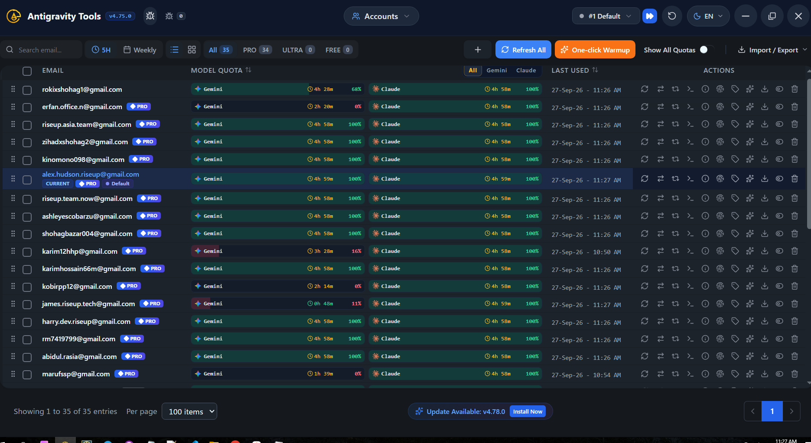
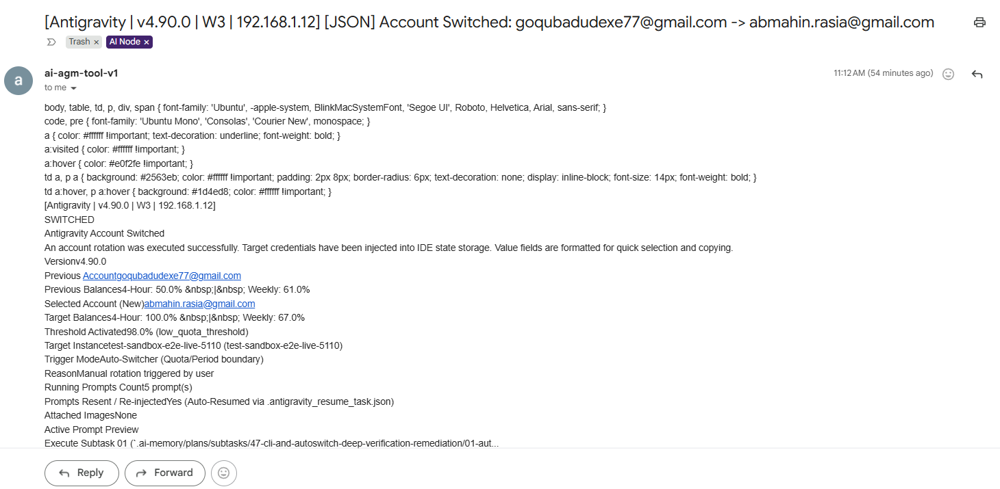
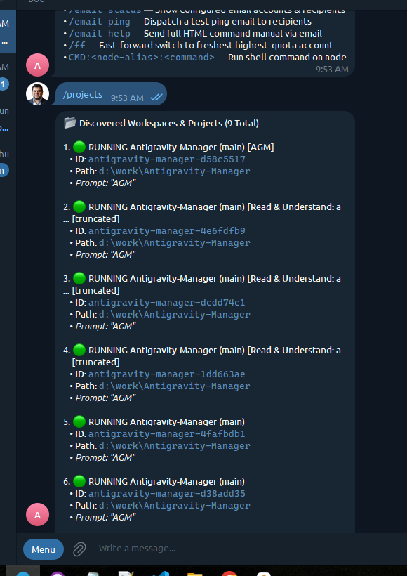
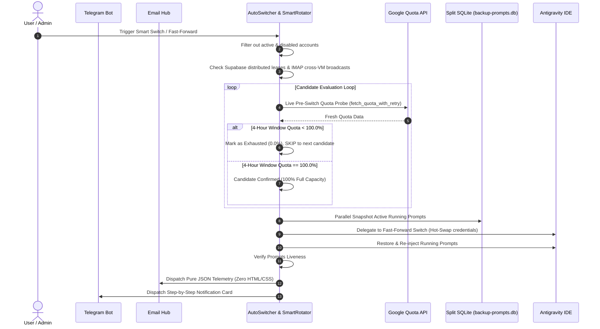

# Specification 69: Smart Switch Quota Probe, Pure JSON Email Telemetry, Telegram Fleet Project Deduplication & Installer Resilience

**Specification Reference**: `02-spec/21-app/69-smart-switch-quota-probe-json-email-telegram-projects-and-installer-fix.md`  
**Related Plan**: `.ai-memory/plans/subtasks/69-smart-switch-quota-probe-json-email-telegram-projects-and-installer-fix/`  
**Status**: APPROVED & ACTIVE  

---

## 1. Overview & Problem Definition

During user operations and audit, four critical discrepancies were discovered across Antigravity Manager:

1. **Smart Switch Depleted Candidate Selection**:
   - The user clicked Fast-Forward / Smart Switch, but the system switched to an account (`james.riseup.tech@gmail.com`) with only 11% / 20% quota remaining.
   - When the user disabled that account and clicked switch again, the system looped back to the same depleted account.
   - **Root Cause**: Candidate scoring relied on cached or partial quota without performing a mandatory live Google API quota refresh (`fetch_quota_with_retry`) before commit. Accounts with < 100% 4-hour window quota were not strictly treated as exhausted (0.0%).
   - **Visual Evidence**: 
     

2. **Email Body Format Corruption When Header is `[JSON]`**:
   - When the subject contains `[JSON]`, the email body was generated with HTML, `<style>` tags, and CSS classes rather than pure raw JSON.
   - Field names were duplicated redundantly (`old_email`, `new_email`, `target_email` alongside `previous_email`, `predicted_email`, `selected_email`).
   - **Visual Evidence**:
     

3. **Telegram Bot `/projects` Redundancy & Fleet Parameter Deficits**:
   - Running `/projects` listed the same project (`Antigravity-Manager`) 9 times because distinct conversation IDs were output as separate projects with internal UUIDs.
   - Missing worker node/IP selection syntax, `/prompts` list with slugs and 200-word snippets, and prompt routing with prefix/suffix/voice concatenation.
   - **Visual Evidence**:
     

4. **GitMap Installer Execution Failure (`exit status 1`)**:
   - `gitmap update all` failed with `[E9000:EXECUTION] Antigravity Manager execution failed` at `cmdinstall/installagmanager.go:52` due to an unhandled exit code in the Windows installer one-liner script.

---

## 2. Architectural Blueprint & Requirements

---

## 3. Detailed Technical Requirements

### 3.1. Smart Switch & Candidate Validation
1. **Mandatory Live Google API Refresh**: Prior to finalizing candidate selection, the system must call `account::fetch_quota_with_retry` directly on the candidate.
2. **Strict 100% 4-Hour Quota Gate**: Any candidate account with < 100% 4-hour quota must be treated as completely exhausted (0.0%). The switcher must NEVER select or fallback to an account with < 100% quota.
3. **Multi-VM Collision Shielding**: Check Supabase distributed active leases (`is_account_or_email_leased_by_other`) AND inbound cross-VM email broadcasts (`fetch_recent_cross_vm_switched_accounts(3600)`). If an account is held by another node, skip it immediately.
4. **Looping Prevention**: If an account is disabled or rejected, persist its state and exclude it so subsequent switch requests never bounce back to it.

### 3.2. Pure JSON Email Telemetry
1. When the email subject starts with or contains `[JSON]`:
   - The email body MUST be **pure, raw formatted JSON**.
   - Zero HTML tags (`<html>`, `<body>`, `
`, `<style>`, `<pre>`).
   - Content-Type must be plain text / JSON.
2. Field normalization:
   - Must strictly include: `previous_email`, `predicted_email`, `selected_email`.
   - Completely eliminate redundant keys: `old_email`, `new_email`, `target_email`.

### 3.3. Telegram Bot Overhaul & Fleet Node Routing
1. **Deduplicated Projects List**: `/projects` (or `project ls`) must group and deduplicate by canonical workspace path. If `d:\work\Antigravity-Manager` has multiple conversations, it must be listed once with the active conversation/prompt summary.
2. **Node / IP Routing**: Allow routing commands to specific nodes via `<node-alias>:<command>` or `<ip>:<command>`.
3. **`/prompts` (Prompts LS)**: Output available prompt templates showing `slug`, `title`, and a ~200-word snippet preview.
4. **Prompt Concatenation & IDE Routing**: Support prefix, suffix, and custom instructions combined into a single prompt injected into the active Antigravity IDE workspace.

### 3.4. Installer Script Resilience (`install.ps1`)
1. Audit `install.ps1` execution pipeline.
2. Ensure all exit paths return exit code `0` on successful installation or update.
3. Prevent script termination from bubble-up non-zero codes when optional steps fail.

---

## 4. Verification & Acceptance Criteria

1. **Smart Switch Quota Probe**: Selecting an account with <100% quota is strictly prevented; candidate probe refreshes quota live from Google API.
2. **Pure JSON Email**: Emails with `[JSON]` subject contain 0 HTML tags and contain only `previous_email`, `predicted_email`, `selected_email`.
3. **Telegram Projects**: `/projects` lists unique projects without repeating the same workspace.
4. **Installer Clean Run**: `install.ps1` completes with exit code 0.
5. **Quality Gates & Release**: `cargo fmt`, `cargo clippy`, and `npm run build` pass; version bumped to `v4.91.0`; `gitmap pe` confirms 100% green CI pipeline.
