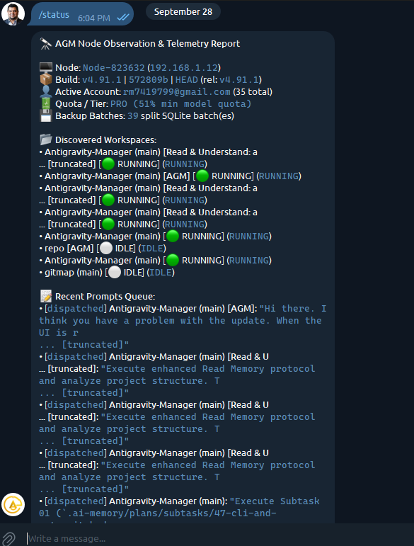

# 71 Status Telemetry UI & Email Header Overhaul

## Status
`active`

## User Request (Verbatim)

```text
Okay. Your message that actually shows up on the status, that is not that good, actually. So I really like the green symbol. It says it's running. So rather than running, you can just put the green symbol. That's enough. You could just save some space. And white thing is nice, but I don't appreciate the blue in blue color because I cannot read. That's really not readable. So whatever the dispatch is are, you could just mention the short form of the project, AGM. There is no need to have too many naming. Okay? And there is no need to put into the code. You just put new lines and just put it in white text. Okay? And only which are idle, just put it to the idle node and separate from a spacing. Okay? And also in the status, we need to know a few things. Which is the alias machine? What is the machine name? Windows machine name, we need to have that. What is the aliasing which is missing from here? IP is there, and why there is this node hyphen, something like this? We don't want to know that. Okay? IP is fine. Aliasing is fine. Okay. The version, you should put the version. Version is fine, which you have given. You can also put the version on the header as well, like AGM space the V, whatever the version is. You can just put it there. That would be nice. That should also be for email. Email, do not need to write Antigravity. Write AGM space the version number V something. Do not put a pipe in between. Correct that as well. So a few things we wanted to know. Who are running? And you can do it all together, actually. You can just put the workspace name, short form, and then behind, below, you can just put whatever is running and put a green symbol in the behind if it is a running one. If it's not running one, then just put white. Okay, that's just enough. I think saves space. Backup batch contains 39 split single line batches. This information is not useful at all. Okay, quota and tier has 51%. That's correct. That's nice to know. But also you need to have what is the threshold to auto switch. I need to know that. And also how long the prompts are running. If you can attach this to the, let's say, status, that would be lovely. Alias, machine name, IP is there. That's correct. So you need to order the visualization, which is not accurate how you're doing it. You need to have everything white, put indenting, and then put this stuff so that I can understand. Also, you need to have below a command which I could use to expand this prompt if I wanted to, so that it's user-friendly. Okay? So you can use bullet points if possible for you to put bullet points under the header. You should do it. There's no need to add the dispatch header. You can say running or something like this. Why truncated and then something I don't understand why that is like this. The overall message and the UI is pretty terrible. I cannot comprehend what you have. Is it understood?
```

## Visual Context & Ingested Telemetry Screenshot



## Root Causes of Poor Status Telemetry UX

1. **Telegram Code Blocks Rendering Blue-on-Blue:** Monospace `<code>...</code>` and `<pre>` tags in Telegram are rendered with a blue background/text on mobile and desktop clients, severely degrading legibility for prompts and status strings.
2. **Broken Truncation Artifacts (`... [truncated]`):** `clean_for_telegram_html` hardcoded a newline and `\n... [truncated]` when strings exceeded `max_chars`, breaking workspace names, conversation titles, and prompt snippets across lines.
3. **Redundant Status Badges:** Workspaces displayed `[🟢 RUNNING] (RUNNING)` and `[⚪ IDLE] (IDLE)` creating clutter and wasted horizontal screen space.
4. **Obscure Machine Names:** The status report displayed `Node-XXXXXX` from default Supabase config rather than the actual Windows machine hostname (`COMPUTERNAME`) and configured operator alias.
5. **Noisy and Missing Metrics:**
   - Displayed `Backup Batches: 39 split SQLite batch(es)` which is noise for operators.
   - Omitted the auto-switch threshold percentage (e.g. 15%) from the Quota & Tier line.
   - Omitted the execution duration (elapsed running time) for active prompts.
6. **Email Telemetry Header Branding:** Email subjects used `[Antigravity | v4.71.4 | ...]` with pipes between application name and version, conflicting with the operator's standardized prefix `[AGM vX.Y.Z | ...]`.

## Concrete Architecture & Design Changes

### 1. Header & Bullet Points
- **Title:** `🔭 <b>AGM v{} Observation &amp; Telemetry Report</b>`
- **Machine Identification:**
  - `• <b>Machine:</b> <COMPUTERNAME>`
  - `• <b>Alias:</b> <node_alias_or_None>`
  - `• <b>IP:</b> <local_ip>`
- **Build:** `• <b>Build:</b> v{} (commit {})`
- **Active Account:** `• <b>Active Account:</b> {} ({} total)`
- **Quota & Auto-Switch:** `• <b>Quota / Tier:</b> {} (switch threshold: {}%)`
- **Purge:** Completely remove `Backup Batches: ...` line.

### 2. Discovered Workspaces & Running State
- Group running workspaces first with `🟢` and idle workspaces with `⚪`.
- Shorten workspace names (e.g., `Antigravity-Manager` -> `AGM`).
- Clean separation with spacing between running and idle nodes.
- Remove redundant `(RUNNING)` or `(IDLE)` badges.

### 3. Running Prompts Visualization
- Header: `⚡ <b>Running Prompts:</b>` (no `[dispatched]` prefix).
- White text with indentation (no `<code>` wrapping on prompt content).
- Show elapsed runtime: `(running for 2m 15s)`.
- Strip `\n... [truncated]` from `clean_for_telegram_html` and use clean inline ellipsis `...`.

### 4. Interactive Expand Command
- Add `/expand <id>` command in Telegram router to print full prompt text for any active/recent prompt.
- Append footer instruction:
  `💡 Send <code>/expand &lt;id&gt;</code> to view full prompt text, or <code>/active</code> for live table.`

### 5. Email Subject & Header Telemetry Parity
- Change email telemetry prefix in `src-tauri/src/modules/email_sender.rs` and `email_inbound.rs`:
  From `[Antigravity | v{} | {} | {}]` to `[AGM v{} | {} | {}]` (no pipe between AGM and version).

## Verification Gates
- `cargo fmt --check` in `src-tauri`
- `cargo clippy --all-targets --all-features` in `src-tauri` with zero errors
- Unit tests for email subject telemetry formatting and status generation
