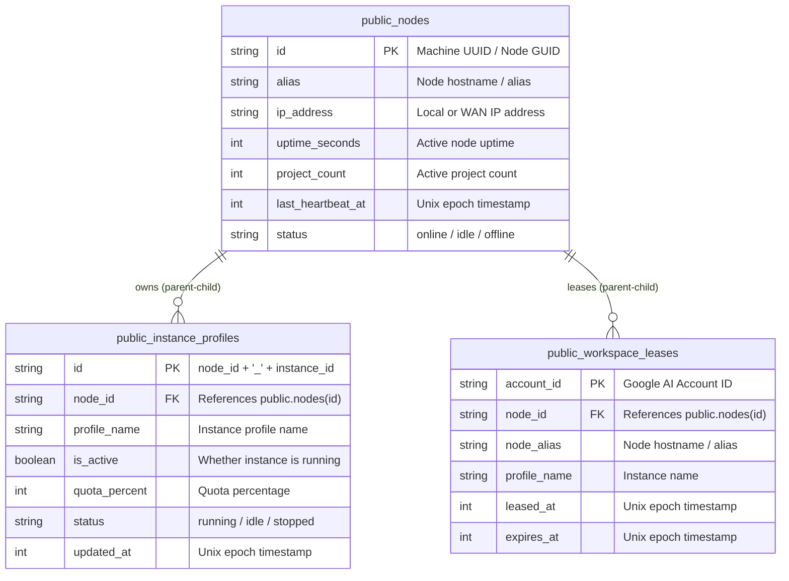

# 71. Supabase Multi-Machine Relational Hierarchy, CLI Management, and E2E Sync Specification

## User Request (Verbatim)

```text
is it done properly??

```

secondary


https://ikwmurmjynhxdpmhzekt.supabase.co/rest/v1/

sb_publishable_barsshQom3VcUw1l5soE_A_R1FwQz8o

Root by Lovable

https://pezjuuddecbyfmqxytrv.supabase.co/rest/v1/

sb_publishable_cJdJyIEeXc8bpym9TIOU7w_vVU0_Y69

```

Okay. So here I have given you two Supabases. First is for the root account, another is the secondary. Secondary is kept on top, unfortunately. Sorry for this. So the first thing you should do is you go to the repo secrets folder, and you keep a repo secret and commit and push. The secret should be kept inside the Antigravity. Manager first do a pull in the repo secrets and then do that. Inside the repo secrets, when you go inside, you should actually keep this account information. That's the first account you can say. And for the Lovable account, put Lovable as a tag or something like notes, so that in future we will give more Lovable Supabase. Now your job is to make sure there's a command line, let's say, help, that also tell us where you should put what, what looks like what. Okay. And then you try to set it from the command line, you try to set it in the UI also, and try to create your database and test the functionalities like if account is open, this identification alias IP is found or not, whenever we switch, it is there or not, it is saving in there. Are we knowing that what is the, let's say, selected or in use accounts across the machines? So all kinds of things I want to have. So every time there is, let's say, something, you should have a parent-child relationship in the tables so that we understand which table or which machine, which instance is doing what. Okay? So all kinds of things we want to have in the Supabase. So you try this out, you do end-to-end testing so that nothing missed. So you take your time, you spend some time to make sure that everything is accurate. Okay? So at the end, also create a small PowerShell file that will actually run one-liner to add these things to the system, and also keep a JSON. And also we should be able to read from JSON using one-liner via PowerShell. Try to execute those, make sure that this is created. Okay? And make sure the end-to-end test, after everything is testing correct, working, then you do make a minor release. And you make sure the minor release is working absolutely fine. And you check it by using the gitmap PE. Okay? And every time you try to make a change, make sure you do the git pull, and also you do the git pull, and then push. Make sure you conflict resolve every time. Yes, at the end, you do the minor release, and make sure that gitmap PE has no error. Okay? You check until it is finalized
```

---

## Architecture & System Context

Antigravity-Manager (AGM) provides multi-machine distributed coordination across developer workstations, build servers, and headless cluster nodes via Supabase. To ensure complete fleet visibility, collision prevention, and account quota sharing, the system defines a two-tier database topology:

1. **Root Supabase DB**: Holds the distributed node registry, child instance profiles, and cross-machine workspace account leases.
2. **Secondary Supabase DB**: Handles inbound remote command queues, telemetry logs, and endpoint health metrics.

### Parent-Child Relational Schema



---

## Data Contracts & Configuration Structure

### `supabase_config.json` Schema

Stored in `%APPDATA%\antigravity-manager\supabase_config.json` (Windows) or `~/.config/antigravity-manager/supabase_config.json` (Linux/macOS):

```json
{
  "endpoints": [
    {
      "id": "ep-root-lovable-01",
      "name": "Root Supabase (Lovable)",
      "url": "https://pezjuuddecbyfmqxytrv.supabase.co/rest/v1/",
      "api_key": "sb_publishable_cJdJyIEeXc8bpym9TIOU7w_vVU0_Y69",
      "role": "root",
      "is_enabled": true,
      "prune_threshold_mb": 400,
      "priority": 1,
      "notes": "Root account by Lovable",
      "tags": ["lovable", "root"]
    },
    {
      "id": "ep-secondary-01",
      "name": "Secondary Supabase",
      "url": "https://ikwmurmjynhxdpmhzekt.supabase.co/rest/v1/",
      "api_key": "sb_publishable_barsshQom3VcUw1l5soE_A_R1FwQz8o",
      "role": "secondary",
      "is_enabled": true,
      "prune_threshold_mb": 200,
      "priority": 2,
      "notes": "Secondary command queue and telemetry fallback",
      "tags": ["secondary"]
    }
  ],
  "node_alias": "Node-823632",
  "is_sync_enabled": true,
  "auto_prune_root_mb": 400,
  "auto_prune_secondary_mb": 200,
  "heartbeat_interval_secs": 30
}
```

---

## CLI Capabilities & Help Specification

Command `agm supabase` provides full terminal lifecycle management:

1. `agm supabase help`: Comprehensive guide with file paths, payload shapes, and endpoint definitions.
2. `agm supabase status`: Shows current configuration, node alias, IP address, uptime, configured endpoints, and remote active leases.
3. `agm supabase set-endpoint <id> <name> <url> <key> <role> [prune_mb] [priority] [notes] [tags]`: Add or update endpoint.
4. `agm supabase test [endpoint_id]`: Execute HTTP connectivity ladder with table probe.
5. `agm supabase list-leases`: Display table of active leases across all nodes.
6. `agm supabase schema [root|secondary]`: Output DDL SQL for creation in Supabase SQL Editor.
7. `agm supabase load-json <file>`: Ingest endpoints and configuration directly from JSON file.

---

## Acceptance Criteria

1. **Repo Secrets Synchronized**: `d:\work\repo-secrets` pulled, updated with Root (Lovable tagged) and Secondary Supabase credentials, committed, and pushed.
2. **CLI Help & Guidance**: `agm supabase help` renders detailed location information, JSON examples, and syntax instructions.
3. **Database Schema & Parent-Child Relational Integrity**: `nodes` (parent) and `instance_profiles` (child) tables reflect machine alias, IP, and instance status.
4. **Account Switch Synchronization**: Manual switch, instance switch, and auto-switch update `workspace_leases` with local machine node_id, node_alias, and IP.
5. **PowerShell One-Liner Suite**: `scripts/setup-supabase.ps1` and `scripts/supabase-endpoints.json` provide one-liner adding and JSON parsing.
6. **E2E Testing Verified**: Full connection tests pass, table probes authenticate properly, and one-liners execute successfully.
7. **Minor Release Verified**: Minor release executed, tags pushed, and GitMap PE (`gitmap pe`) verified without errors.
