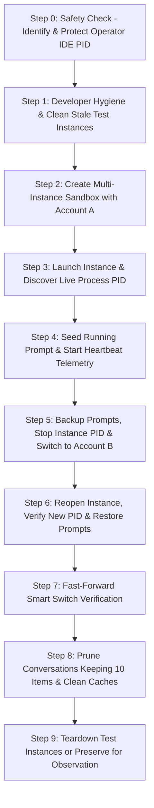

# Specification 93: Antigravity Multi-Instance CLI Operations, Account Switching, Prompt Continuity & Hygiene Manual

> **Specification Metadata:**
> - Specification ID: `93`
> - Status: `APPROVED / READY FOR EXTERNAL AI EXECUTION`
> - Category: Application CLI, Multi-Instance Management, E2E Operational Workflow
> - Target Binary: `agm` / `antigravity-manager` / `adm` / `.\run.ps1`
> - Shell Environment: Windows PowerShell 5.1+ / PowerShell Core 7+ / Bash CLI
> - Execution Directive: **Strictly use existing CLI commands and utility scripts. Zero code writing.**

---

## 1. Executive Summary & Objective

This specification provides a complete, standalone, anti-hallucination operational manual and generic AI instruction prompt for executing multi-instance lifecycle testing, profile isolation, account switching, running prompt backup/restoration, conversation history retention pruning, and developer tool cache hygiene in Antigravity-Manager (AGM).

An external AI agent or human operator can consume this document to execute all verification scenarios from terminal environments without writing custom test harness code, while strictly protecting active operator IDE sessions.

---

## 2. Inviolable Safety Invariants & Rules

1. **Zero New Code Implementation**:
   - Do NOT write new Rust code, TypeScript code, or test runner frameworks.
   - Execute all verification and lifecycle actions purely via the existing CLI commands, helper scripts, and PowerShell one-liners.

2. **Operator Primary IDE Process Protection**:
   - Before executing any instance stop, kill, or profile swap, the executor MUST discover and record the operator's primary Antigravity IDE PID.
   - Any process whose command line references the default `%APPDATA%\Antigravity` directory or lacks an explicit `--user-data-dir` flag is classified as **PROTECTED**.
   - Under no circumstances may a protected PID be terminated.

3. **Multi-Instance Storage Isolation**:
   - Every created profile must maintain an isolated `--user-data-dir` and independent `state.vscdb`.
   - Credentials must never bleed between instances.

4. **Running Prompt Continuity**:
   - Active and queued prompts in running workspaces must be snapshotted (`backup-running-prompts`) prior to closing an IDE window.
   - On relaunch with a new account, prompt continuity must be verified.

5. **Retention Respecting Prune Safety**:
   - Conversation pruning must default to retaining the latest 10 conversations (`--keep 10` or `-k 10`).
   - Conversations tied to active running or queued prompts must NEVER be purged regardless of retention limit.

---

## 3. Comprehensive CLI Command Reference Catalog

### 3.1 Multi-Instance & Profile Management

Primary Command: `antigravity-manager instance <subcommand> [options]`
Binary Aliases: `agm`, `adm`, `.\run.ps1`
Subcommand Aliases: `instance`, `instances`, `intrance`, `intrances`, `profile`, `profiles`, `ls`

#### A. List Registered Profiles
- **Command:** `agm instances list` (Aliases: `agm instances ls`, `agm ls`, `agm profile list`, `agm lp`)
- **Machine-Readable Flag:** `--json` / `-j`
- **Output Columns:** `#` (sequence), `ID`, `NAME`, `STATUS` (`Running (PID: N)` or `Idle`), `BOUND EMAIL`, `DATA DIR`
- **Examples:**
  ```powershell
  # Human-readable table
  agm instances list

  # Machine JSON output
  agm instances list --json
  ```

#### B. Create Isolated Sandbox Profile
- **Command:** `agm instance create <name> [options]`
- **Aliases:** `agm instances create`, `agm create`, `agm cp`, `agm create-instance`
- **Parameters & Options:**
  - `<name>`: Identifier or display name for the instance (e.g. `"Worker-Alpha"`).
  - `--account, -a <email|id>`: Bind specific account (email, email prefix, or ID). Defaults to next available unbound account.
  - `--from, -f <source_id>`: Clone settings, state, and extensions from an existing instance.
  - `--launch, -l`: Immediately launch the Antigravity IDE window upon creation.
  - `--data-only, --do`: Create isolated data directory only without cloning executable binary.
  - `--json, -j`: Output created instance configuration in structured JSON format.
- **Examples:**
  ```powershell
  # Create profile bound to email and launch window immediately
  agm instance create "Worker-Alpha" -a "alex.dev@gmail.com" --launch

  # Create profile cloning settings from an existing profile
  agm instance create "Worker-Beta" --from "Worker-Alpha" -a "erfan.office@gmail.com"

  # Create lightweight data-only instance
  agm instance create "Sandbox-01" --data-only --json
  ```

#### C. Launch Instance Window
- **Command:** `agm instance launch <instance_id>`
- **Aliases:** `agm instance start`, `agm instance run`, `agm run-profile <instance_id>`
- **Parameters:**
  - `<instance_id>`: Profile ID, friendly name, or sequence index (`#1`, `#2`).
- **Examples:**
  ```powershell
  agm instance launch "Worker-Alpha"
  agm instance launch #2
  ```

#### D. Stop / Close Instance Window
- **Command:** `agm instance stop <instance_id>`
- **Aliases:** `agm instance close`, `agm instance kill`
- **Parameters:**
  - `<instance_id>`: Profile ID, friendly name, or sequence index (`#1`, `#2`).
- **Safety Guarantee:** Terminates only the process matching the instance's unique `--user-data-dir`. Does NOT touch operator's primary IDE.
- **Examples:**
  ```powershell
  agm instance stop "Worker-Alpha"
  agm instance stop #2
  ```

#### E. Delete Instance & Wipe Storage
- **Command:** `agm instance delete <instance_id> [--force]`
- **Aliases:** `agm instances rm`, `agm instance remove`, `agm delete-profile <instance_id>`
- **Parameters:**
  - `<instance_id>`: Profile ID, friendly name, or sequence index (`#1`, `#2`).
  - `--force, -f`: Bypass interactive confirmation prompt.
- **Examples:**
  ```powershell
  agm instance delete "Worker-Alpha" --force
  agm instances rm #2
  ```

#### F. Copy / Duplicate Instance Profile
- **Command:** `agm instance copy <source_id> <new_name>`
- **Aliases:** `agm instance clone`, `agm copy-profile <source_id> <new_name>`, `agm dp`
- **Examples:**
  ```powershell
  agm instance copy "Worker-Alpha" "Worker-Backup"
  ```

#### G. Live Process & Directory Observation
- **Command:** `agm instances observe <instance_id> [--json]`
- **Description:** Inspects Windows process table and reports live active PIDs, command-line arguments, and directory bindings.
- **Examples:**
  ```powershell
  agm instances observe "Worker-Alpha" --json
  ```

---

### 3.2 Account Switching & Fast-Forward Rotation

Primary Command: `antigravity-manager switch <account> [options]`
Aliases: `switch`, `switch-account`, `switch_account`, `account-switch`, `swtich`

#### A. Manual Account Switching
- **Syntax Variations:**
  1. `agm switch <account> --instance <id>`
  2. `agm switch <instance> <account>`
  3. `agm instance switch <instance> <account>`
  4. `agm switch account <account>` (switches active profile)
  5. `agm switch <#seq>` (switches active profile to account index #seq)
- **Parameters & Options:**
  - `<account>`: Email (`user@gmail.com`), email prefix (`user`), internal ID, or index (`#1`, `#2`).
  - `<instance>`: Target instance ID, name, sequence index (`#1`, `#2`), or `default`.
  - `--instance, -i <id>`: Explicit target instance specification.
  - `--json, -j`: Structured JSON output.
- **Automated Workflow Under the Hood:**
  - Snapshots active prompts via `repo_db::backup_running_prompts`.
  - Stops target instance process gracefully.
  - Injects new auth tokens into `state.vscdb` across User, instance AppData, and home storage.
  - Restores prompts on subsequent launch.
- **Examples:**
  ```powershell
  # Switch instance to account by email
  agm switch "alex.dev@gmail.com" --instance "Worker-Alpha"

  # Switch using positional syntax with JSON response
  agm switch "Worker-Alpha" "alex.dev@gmail.com" --json

  # Switch instance using sequence index
  agm instance switch #2 "shohagbazar004@gmail.com"

  # Switch active profile to account #3
  agm switch #3
  ```

#### B. Fast-Forward Smart Account Rotation
- **Command:** `agm ff [instance_id] [--json]`
- **Aliases:** `agm fast-forward`, `agm instance ff`, `agm instance rotate`
- **Description:** Evaluates rolling 4-hour quota windows across all accounts, selects the healthiest account (highest remaining quota, zero 429 limits), and rotates credentials.
- **Examples:**
  ```powershell
  # Fast-forward rotate specific instance
  agm ff "Worker-Alpha" --json

  # Fast-forward rotate instance #2
  agm ff #2

  # Fast-forward active profile
  agm ff
  ```

---

### 3.3 Running Prompt Continuity, Heartbeat & Restoration

#### A. Pre-Switch Prompt Snapshot Command
- **Command:** `agm backup-running-prompts --instance <instance_id>`
- **Description:** Directly forces an atomic snapshot of active running and queued prompts in the specified instance workspace, creating `.antigravity_resume_task.json`.
- **Example:**
  ```powershell
  agm backup-running-prompts --instance "Worker-Alpha"
  ```

#### B. Real-Time Prompt Heartbeat Telemetry Utility
- **Script Path:** `scripts/prompt_heartbeat_runner.py`
- **Subcommands:**
  - `start "<prompt_id>" "<instance_id>" "<log_path>" <interval_seconds>`
  - `check "<log_path>"`
  - `stop "<log_path>"`
- **Examples:**
  ```powershell
  # Start 5-second interval heartbeat telemetry
  python scripts/prompt_heartbeat_runner.py start "prompt-101" "Worker-Alpha" "D:/work/project/.antigravity_goal_prompt.log" 5

  # Check telemetry status
  python scripts/prompt_heartbeat_runner.py check "D:/work/project/.antigravity_goal_prompt.log"

  # Stop heartbeat runner
  python scripts/prompt_heartbeat_runner.py stop "D:/work/project/.antigravity_goal_prompt.log"
  ```

#### C. SQLite Active Prompt Seeding & Inspection
- **Script Path:** `scripts/test_prompt_helper.py`
- **Subcommands:**
  - `seed "<prompt_id>" "<instance_id>" "<workspace_dir>" "<prompt_text>"`
  - `check "<prompt_id>"`
- **Examples:**
  ```powershell
  # Seed active prompt into SQLite active_prompts table
  python scripts/test_prompt_helper.py seed "prompt-101" "Worker-Alpha" "D:/work/project" "Run e2e verification"

  # Query status (returns dispatched / backed_up / completed)
  python scripts/test_prompt_helper.py check "prompt-101"
  ```

---

### 3.4 Conversation Retention, Pruning & Cache Hygiene Suite

Primary Command: `antigravity-manager agy <subcommand> [options]`
Aliases: `agm cache-clear`, `agm clear-agy`, `adm clear`, `agm agy`

#### A. Prune Conversations with Custom Retention
- **Command:** `agm agy cache-clear [options]`
- **Aliases:** `agm cache-clear -k <N> -y`, `adm clear k <N>`, `agm agy clear`
- **Parameters & Options:**
  - `--keep <N>, -k <N>`: Number of latest conversations to retain intact (default: 10).
  - `-y, --yes`: Non-interactive bypass for headless execution.
  - `--preflight, --pre`: Dry-run simulation displaying projected disk space freed without deleting files.
- **Shorthand Commands:**
  - `agm agy cache-clear-keep-one` (Alias: `agm agy ccko`) — keeps only the single latest conversation.
  - `agm agy cache-clear-keep-five` (Alias: `agm agy cckf`) — keeps only the 5 latest conversations.
- **Safety Policy:**
  - Pruned conversations are staged in OS temporary storage under an atomic transaction ID.
  - Active running and queued prompts from active projects are strictly protected and never purged.
- **Examples:**
  ```powershell
  # Prune keeping default 10 conversations non-interactively
  agm agy cache-clear --keep 10 -y

  # Prune keeping 5 conversations
  agm agy cache-clear -k 5 -y

  # Shorthand alias
  adm clear k 5

  # Run pre-flight dry-run check
  agm agy cache-clear --preflight
  ```

#### B. Revert / Undo Pruning Transaction
- **Command:** `agm agy undo [tx_id]`
- **Description:** Reverses the last (or specified) conversation pruning transaction and restores files from staging storage.
- **Example:**
  ```powershell
  agm agy undo
  ```

---

### 3.5 Developer Tooling, Cargo/Rust & Build Cache Clearing Suite

Script Path: `scripts/dev-tool-clear.ps1`

#### A. Full Cross-Platform Clean
- **Command:** `powershell -ExecutionPolicy Bypass -File scripts/dev-tool-clear.ps1 [options]`
- **What It Cleans:**
  1. Cargo and Rust compiler caches, incremental build artifacts, target/demo directories (`build-demo`, `target-demo`, `src-tauri/target`).
  2. Temporary test files, OS temp artifacts, pycache (`__pycache__`, `*.pyc`).
  3. Prunes conversations across candidate directories keeping top 10 (or user-specified `k <N>`).
- **Parameters & Options:**
  - `-CargoOnly`: Cleans only Cargo, Rust compiler caches, and build-demo folders.
  - `-CleanInstances`: Cleans registered test instances.
  - `-InstancesOnly`: Cleans instances only.
  - `-Arg1 k -Arg2 <N>` or `<N>`: Specify number of conversations to keep.
- **Examples:**
  ```powershell
  # Full developer cleanup (Cargo + temp + pycache + prune 10 conversations)
  powershell -ExecutionPolicy Bypass -File scripts/dev-tool-clear.ps1

  # Clean Cargo / Rust compiler caches only
  powershell -ExecutionPolicy Bypass -File scripts/dev-tool-clear.ps1 -CargoOnly

  # Clean with custom retention of 5 conversations
  powershell -ExecutionPolicy Bypass -File scripts/dev-tool-clear.ps1 -Arg1 k -Arg2 5

  # Clean including test instances
  powershell -ExecutionPolicy Bypass -File scripts/dev-tool-clear.ps1 -CleanInstances
  ```

#### B. Direct Python Artifact Remover
- **Command:** `python 03-ai-scripts/19-artifact-remover.py [options]`
- **Examples:**
  ```powershell
  # Clean Cargo and Rust compiler caches
  python 03-ai-scripts/19-artifact-remover.py --clean-cargo --force

  # Clean temp files and pycache
  python 03-ai-scripts/19-artifact-remover.py --clean-temp --clean-pycache --force
  ```

---

### 3.6 Auto-Profile Switcher Daemon Suite

Primary Command: `antigravity-manager auto-switch <action> [options]`
Aliases: `auto-switch`, `autoswitch`, `auto`, `switcher`

#### A. Query Daemon Status
- **Command:** `agm auto-switch status [--json]`
- **Examples:**
  ```powershell
  agm auto-switch status
  agm auto-switch status --json
  ```

#### B. Daemon Control
- **Commands:**
  - Enable: `agm auto-switch enable` (Aliases: `on`, `start`)
  - Disable: `agm auto-switch disable` (Aliases: `off`, `stop`)
  - Toggle: `agm auto-switch toggle`
- **Examples:**
  ```powershell
  agm auto-switch enable
  agm auto-switch disable
  agm auto-switch toggle
  ```

#### C. Configure Threshold, Interval & Target Model
- **Threshold (%):** `agm auto-switch threshold <number>` (e.g. `20`)
- **Interval (s):** `agm auto-switch interval <seconds>` (e.g. `60`)
- **Target Model:** `agm auto-switch model <model_name>` (e.g. `gemini-2.5-pro`)
- **Examples:**
  ```powershell
  agm auto-switch threshold 15
  agm auto-switch interval 300
  agm auto-switch model gemini-2.5-pro
  ```

#### D. Immediate Quota Check & Simulation
- **Trigger Rotation:** `agm auto-switch run` (Aliases: `trigger`, `eval`, `rotate`)
- **Simulate Rotation:** `agm auto-switch test <percentage>`
- **Examples:**
  ```powershell
  agm auto-switch run
  agm auto-switch test 90
  ```

---

### 3.7 Supabase Integration & Cloud Vault Commands

#### A. PowerShell Setup & Sync One-Liners
- **Setup Script:** `powershell -ExecutionPolicy Bypass -File scripts/setup-supabase.ps1`
- **Alternate Script:** `powershell -ExecutionPolicy Bypass -File scripts/supabase-setup.ps1`
- **One-Liner Connection Test:**
  ```powershell
  powershell -ExecutionPolicy Bypass -Command "& { . ./scripts/setup-supabase.ps1; Test-SupabaseConnection }"
  ```

---

### 3.8 Telegram Bot Daemon & Remote Management

#### A. Bot Daemon Scripts
- **Start Telegram Daemon:** `powershell -ExecutionPolicy Bypass -File scripts/telegram-agent-daemon.ps1`
- **Setup Bot Credentials:** `powershell -ExecutionPolicy Bypass -File scripts/setup-telegram-bot.ps1`

#### B. Telegram Remote Bot Commands
- `/status` — View running instances, bound accounts, and live quota telemetry.
- `/switch <instance> <email>` — Trigger account switch for an instance remotely.
- `/prune [k]` — Trigger conversation pruning keeping `k` items.
- `/update` — Run AGM update and refresh status.

---

### 3.9 Verification, Process & SQLite Inspection Commands

#### A. Query Account Email Directly from SQLite `state.vscdb`
- **Command:** `python scripts/query_vscdb_email.py "<path_to_state.vscdb>"`
- **Target Paths in Instance Directory:**
  1. `<instance_dir>\User\globalStorage\state.vscdb`
  2. `<instance_dir>\AppData\Roaming\Antigravity\User\globalStorage\state.vscdb`
  3. `<instance_parent>\home\AppData\Roaming\Antigravity\User\globalStorage\state.vscdb`
- **Example:**
  ```powershell
  python scripts/query_vscdb_email.py "D:/instances/Worker-Alpha/User/globalStorage/state.vscdb"
  ```

#### B. Query Verified Live PID and Command Line
- **Command:**
  ```powershell
  Get-CimInstance Win32_Process | Where-Object { $_.ProcessId -eq <PID> } | Select-Object ProcessId, Name, CommandLine
  ```

#### C. Generate Verification Screenshot with Date/Time & PID
- **Command:**
  ```powershell
  python assets/screenshots/generate_instance_screenshot.py `
      --email "<email>" `
      --username "<display_name>" `
      --instance "<instance_id>" `
      --pid "<real_pid>" `
      --folder "<instance_dir>" `
      --stage "<stage_name>" `
      --datetime "$([DateTimeOffset]::UtcNow.ToString('yyyy-MM-dd HH:mm:ss UTC'))" `
      --out "assets/screenshots/<filename>.png"
  ```

---

### 3.10 Pre-Flight & Release Gates

#### A. Rust Pre-Flight Checks
```powershell
cd src-tauri
cargo fmt -- --check
cargo clippy --all-targets --all-features
cd ..
```

#### B. Frontend Build Check
```powershell
npm run build
```

#### C. Atomic Version Bump (When Commanded by User)
```powershell
# Bump minor release
npm run bump minor

# Bump beta / preview release
npm run bump beta
```

---

## 4. End-to-End Operational Execution Playbook

Execute the following sequential workflow when performing complete verification:



### Step 0: Identify Protected Process IDs
```powershell
$defaultDataDir = "$env:APPDATA\Antigravity"
$mainProcs = Get-CimInstance Win32_Process -ErrorAction SilentlyContinue | Where-Object { 
    $_.Name -match 'Antigravity' -and ($_.CommandLine -match [regex]::Escape($defaultDataDir) -or $_.CommandLine -notmatch '--user-data-dir')
}
$protectedPids = @($mainProcs.ProcessId) | Where-Object { $_ } | Select-Object -Unique
Write-Host "Protected Operator IDE PIDs: $($protectedPids -join ', ')"
```

### Step 1: Pre-Test Hygiene & Developer Tool Cleaning
```powershell
# Clean build caches, temp files, and ensure 10 conversations kept
powershell -ExecutionPolicy Bypass -File scripts/dev-tool-clear.ps1 -Arg1 k -Arg2 10

# Remove any stale test instances
$list = (agm instances list --json | ConvertFrom-Json)
foreach ($inst in ($list | Where-Object { $_.config.id -like "test-*" })) {
    agm instances rm $inst.config.id --force
}
```

### Step 2: Create Two Isolated Instances
```powershell
# Instance Alpha with Account A
$instA = (agm instance create "test-worker-alpha" -a "account_a@gmail.com" --json | ConvertFrom-Json)

# Instance Beta with Account B
$instB = (agm instance create "test-worker-beta" -a "account_b@gmail.com" --json | ConvertFrom-Json)

# Verify database isolation across both instances
python scripts/query_vscdb_email.py "$($instA.data_dir)/User/globalStorage/state.vscdb"
python scripts/query_vscdb_email.py "$($instB.data_dir)/User/globalStorage/state.vscdb"
```

### Step 3: Launch Instance A & Verify PID
```powershell
agm instance launch $instA.id
Start-Sleep -Seconds 3

# Discover PID via AGM CLI observe
$obs = (agm instances observe $instA.id --json | ConvertFrom-Json)
$realPid = $obs.pids[0]

# Ensure it is NOT a protected PID
if ($protectedPids -contains $realPid) { throw "SAFETY ERROR: Touched operator IDE!" }
Write-Host "Verified Live PID for Instance A: $realPid"
```

### Step 4: Seed Running Prompt & Start Heartbeat
```powershell
$promptId = "test-prompt-$((Get-Date).Ticks)"
$wsDir = "D:/work/Antigravity-Manager/build-demo/test-ws"
New-Item -ItemType Directory -Path $wsDir -Force | Out-Null

python scripts/test_prompt_helper.py seed $promptId $instA.id $wsDir "Verify E2E continuous switch"
python scripts/prompt_heartbeat_runner.py start $promptId $instA.id "$wsDir/.antigravity_goal_prompt.log" 5
```

### Step 5: Backup Prompts, Close Instance & Switch Account
```powershell
# Backup running prompts before stopping
agm backup-running-prompts --instance $instA.id

# Stop prompt heartbeat and stop instance IDE
python scripts/prompt_heartbeat_runner.py stop "$wsDir/.antigravity_goal_prompt.log"
agm instance stop $instA.id

# Switch credentials to Account Switch
agm switch $instA.id "account_switch@gmail.com" --json

# Verify database updated
python scripts/query_vscdb_email.py "$($instA.data_dir)/User/globalStorage/state.vscdb"
```

### Step 6: Relaunch, Verify New PID & Restore Prompt
```powershell
agm instance launch $instA.id
Start-Sleep -Seconds 3

$obsNew = (agm instances observe $instA.id --json | ConvertFrom-Json)
$newPid = $obsNew.pids[0]
Write-Host "New Post-Switch PID: $newPid"

# Check prompt status in SQLite and resume telemetry
python scripts/test_prompt_helper.py check $promptId
python scripts/prompt_heartbeat_runner.py start $promptId $instA.id "$wsDir/.antigravity_goal_prompt.log" 5
```

### Step 7: Fast-Forward Smart Switch
```powershell
# Trigger fast-forward rotation to next healthiest account
agm ff $instA.id --json

# Verify new account email is active in state.vscdb
python scripts/query_vscdb_email.py "$($instA.data_dir)/User/globalStorage/state.vscdb"
```

### Step 8: Clean Cache & Prune Conversations (Keeping 10)
```powershell
# Prune conversations keeping top 10 intact
agm agy cache-clear --keep 10 -y

# Clean Cargo, Rust, and build demo caches
powershell -ExecutionPolicy Bypass -File scripts/dev-tool-clear.ps1 -CargoOnly
```

### Step 9: Teardown or Preserve Instance
```powershell
# If cleaning up:
agm instance stop $instA.id
agm instance stop $instB.id
agm instance delete $instA.id --force
agm instance delete $instB.id --force

# If preserving for operator inspection:
Write-Host "Instance $($instA.id) preserved alive at PID $newPid in $($instA.data_dir)."
```

---

## 5. Master Summary Reference Card

| Operational Area | Primary Command | Key Flags / Parameters | Default Behavior |
| :--- | :--- | :--- | :--- |
| **List Profiles** | `agm instances list` | `--json, -j` | Displays sequence, ID, name, status, PID, email, directory |
| **Create Profile** | `agm instance create <name>` | `-a <email>`, `--from <src>`, `--launch`, `--data-only`, `--json` | Creates isolated sandbox folder & config |
| **Launch Profile** | `agm instance launch <id>` | `<id>`, `#seq`, `<name>` | Spawns Antigravity IDE with isolated `--user-data-dir` |
| **Stop Profile** | `agm instance stop <id>` | `<id>`, `#seq`, `<name>` | Safely terminates specific instance PID only |
| **Delete Profile** | `agm instance delete <id>` | `--force, -f` | Deletes directory and removes profile registry entry |
| **Switch Account** | `agm switch <id> <email>` | `--instance <id>`, `--json` | Injects credentials to `state.vscdb`, backs up prompts |
| **Fast-Forward** | `agm ff [id]` | `[id]`, `--json` | Rotates profile to healthiest rolling quota account |
| **Backup Prompts** | `agm backup-running-prompts` | `--instance <id>` | Snapshots running & queued prompts to resume file |
| **Prune History** | `agm agy cache-clear` | `--keep <N>, -k <N>`, `-y`, `--preflight` | Prunes old conversations (keeps 10), protects active |
| **Undo Prune** | `agm agy undo` | `[tx_id]` | Reverts pruning from temporary staging storage |
| **Clean Dev Tools** | `scripts/dev-tool-clear.ps1` | `-CargoOnly`, `-CleanInstances`, `k <N>` | Purges Cargo caches, temp files, demo build folders |
| **Auto-Switch** | `agm auto-switch <action>` | `status`, `enable`, `disable`, `threshold`, `interval`, `run` | Background quota monitor & automatic profile switcher |
| **Supabase Setup** | `scripts/setup-supabase.ps1` | One-liner PowerShell | Verifies & provisions Supabase backend connection |
| **Telegram Daemon**| `scripts/telegram-agent-daemon.ps1` | Background daemon | Remote control via Telegram (`/status`, `/switch`, `/prune`) |
