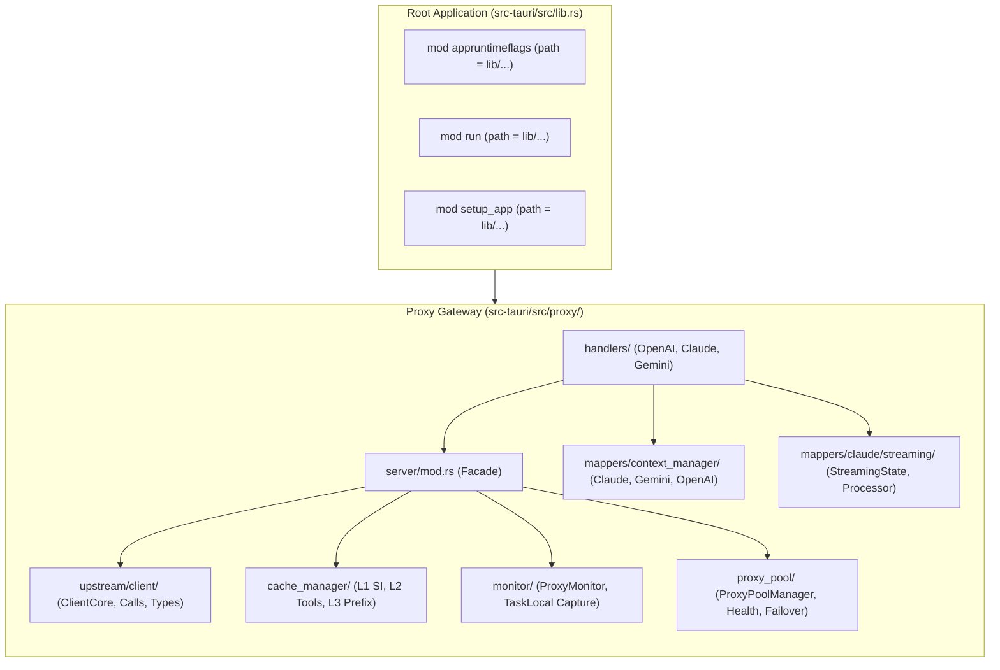

# Component Specification: Upstream, Context Manager, Streaming Mappers, Proxy Pool, Monitor & Cache Manager

- **Slug**: `gitmap-pe-execution-and-csv-issue-resolution`
- **Specification ID**: `02-component-spec`
- **Module Scope**: `src-tauri/src/proxy/` & `src-tauri/src/lib.rs`
- **Target Release**: `v4.8.2`
- **Status**: `Approved for Remediation`

---

## 1. Executive Summary & Purpose

This component specification establishes the structural contracts, field-level access visibilities, facade re-exports, and import resolution rules required to resolve the 606 compilation errors encountered during pipeline execution (`gitmap pe -t`, Run ID `38055868344`).

The compilation failure stemmed from commits `22a87aae` and `50a0e58f`, which split large monolithic modules (exceeding the repository limit of 500 lines) into submodules without updating:
1. Struct field visibilities from private to package-internal (`pub(crate)`).
2. Module facade re-exports (`pub use`) for types expected by external consumers.
3. Import path resolution in nested submodules where relative `super::*` declarations incorrectly assumed the parent directory was the mapper root rather than the nested submodule root.
4. Static initialization semantics for task-local tracking holders.
5. Re-export collisions where `mod tests;` clashed with `pub(crate) use tests::tests;`.

This document specifies the exact component contracts for the **Upstream Client**, **Context Managers**, **Streaming Mappers**, **Proxy Pool**, **Monitor**, and **Cache Manager** subsystems, alongside systematic import resolution rules.

---

## 2. Architectural Context & God-Module Split Analysis



### 2.1 The God-Module Split Breakage Patterns
When monolithic source files were partitioned into subdirectories:
- **Visibility Enclosure**: In Rust 2021, moving private fields and helper methods from the same file into sibling submodules breaks compilation unless marked `pub(crate)`.
- **Relative Path Divergence**: Within `src-tauri/src/proxy/mappers/context_manager.rs`, `super::caveman_cleaner` resolved to `src-tauri/src/proxy/mappers/caveman_cleaner.rs`. When moved to `src-tauri/src/proxy/mappers/context_manager/claude.rs`, `super::` evaluates to `src-tauri/src/proxy/mappers/context_manager/`, where `caveman_cleaner` does not exist.
- **Task-Local Static Deserialization**: `CURRENT_UPSTREAM_CAPTURE` was improperly declared as a bare uninitialized `pub static` instead of being enclosed within the `tokio::task_local!` macro.
- **Namespace Collision**: Test modules generated re-export aliases `pub(crate) use tests::tests;`, which collided directly with `mod tests;` under Rust compiler rule `E0255`.

---

## 3. Subsystem Component Specifications

### 3.1 Upstream Client Subsystem (`src-tauri/src/proxy/upstream/client/`)

The Upstream Client handles all egress HTTP/2 and HTTP/1.1 transport to Google Cloud Code internal APIs (`cloudcode-pa.googleapis.com/v1internal`). It manages endpoint fallback ladders, proxy tunneling, and authentication header enrichment.

#### 3.1.1 Structural Contract & Visibility
Located in `src-tauri/src/proxy/upstream/client/types.rs`:

```rust
pub struct UpstreamClient {
    pub(crate) default_client: tokio::sync::RwLock<rquest::Client>,
    pub(crate) proxy_pool: Option<std::sync::Arc<crate::proxy::proxy_pool::ProxyPoolManager>>,
    pub(crate) client_cache: dashmap::DashMap<String, rquest::Client>, // proxy_id -> Client
    pub(crate) user_agent_override: tokio::sync::RwLock<Option<String>>,
}
```

#### 3.1.2 Public and Internal Methods
Located in `src-tauri/src/proxy/upstream/client/client_calls.rs` and `client_core.rs`:

```rust
impl UpstreamClient {
    /// Constructs client with optional proxy configuration and pool
    pub fn new(
        proxy_config: Option<crate::proxy::config::UpstreamProxyConfig>,
        proxy_pool: Option<std::sync::Arc<crate::proxy::proxy_pool::ProxyPoolManager>>,
    ) -> Self;

    /// Rebuilds default client for hot-reload configuration changes
    pub async fn rebuild_default_client(
        &self,
        proxy_config: Option<crate::proxy::config::UpstreamProxyConfig>,
    );

    /// Constructs the target API URL with method and query parameters
    pub(crate) fn build_url(base_url: &str, method: &str, query_string: Option<&str>) -> String;

    /// Evaluates HTTP status code for endpoint fallback qualification
    pub(crate) fn should_try_next_endpoint(status: rquest::StatusCode) -> bool;

    /// Executes v1internal API call with automatic endpoint fallback
    pub async fn call_v1_internal(
        &self,
        method: &str,
        access_token: &str,
        body: serde_json::Value,
        query_string: Option<&str>,
        account_id: Option<&str>,
    ) -> Result<UpstreamCallResult, String>;

    /// Executes v1internal API call with custom headers and task-local capture
    pub async fn call_v1_internal_with_headers(
        &self,
        method: &str,
        access_token: &str,
        body: serde_json::Value,
        query_string: Option<&str>,
        extra_headers: std::collections::HashMap<String, String>,
        account_id: Option<&str>,
    ) -> Result<UpstreamCallResult, String>;
}
```

#### 3.1.3 Endpoint Fallback Ladder
The client enforces strict endpoint fallback ordering to ensure capability retention:
1. **Daily (`https://daily-cloudcode-pa.googleapis.com/v1internal`)**: Primary production IDE endpoint supporting full chain-of-thought and tool calling.
2. **Sandbox (`https://daily-cloudcode-pa.sandbox.googleapis.com/v1internal`)**: Secondary testing environment. Fallback triggers on HTTP 408, 404, or 5xx. Does not trigger on terminal 400 location errors.
3. **Prod (`https://cloudcode-pa.googleapis.com/v1internal`)**: Final production fallback.

---

### 3.2 Context Managers Subsystem (`src-tauri/src/proxy/mappers/context_manager/`)

The Context Manager subsystem estimates multi-modal token consumption (text, image, audio) and executes history purification (thinking block stripping, Caveman text compression, and RTK tool result sanitization) to guard against context overflows.

#### 3.2.1 Structural Contract & Facade
Located in `src-tauri/src/proxy/mappers/context_manager/mod.rs`:

```rust
pub struct ContextManager;

#[derive(Debug, Clone, Copy, PartialEq, Eq)]
pub enum PurificationStrategy {
    Soft,
    Aggressive,
}
```

#### 3.2.2 Token Estimation & Purification Signatures
Implemented across `mod.rs`, `claude.rs`, `gemini.rs`, and `openai.rs`:

```rust
impl ContextManager {
    // Claude token estimation and purification
    pub fn estimate_token_usage(req: &crate::proxy::mappers::claude::models::ClaudeRequest) -> u32;
    pub fn purify_history(
        messages: &mut Vec<crate::proxy::mappers::claude::models::Message>,
        strategy: PurificationStrategy,
    ) -> bool;
    pub fn clean_tool_message(msg: &mut crate::proxy::mappers::claude::models::Message) -> bool;

    // Gemini token estimation
    pub fn estimate_gemini_token_usage(body: &serde_json::Value) -> u32;

    // OpenAI token estimation and purification
    pub fn estimate_openai_token_usage(
        req: &crate::proxy::mappers::openai::models::OpenAIRequest,
    ) -> u32;
    pub fn clean_openai_tool_message(
        msg: &mut crate::proxy::mappers::openai::models::OpenAIMessage,
    ) -> bool;
    pub fn purify_openai_history(
        messages: &mut Vec<crate::proxy::mappers::openai::models::OpenAIMessage>,
        strategy: PurificationStrategy,
    ) -> bool;
}

// Module-level fallback estimator
pub fn estimate_raw_tokens_from_payload(payload: &str) -> u32;
```

#### 3.2.3 Import Resolution Mandate
All submodules under `context_manager/` (`claude.rs`, `gemini.rs`, `openai.rs`, `tests.rs`) MUST replace invalid relative `super::` imports with absolute crate imports:

| Broken Import in `context_manager/*.rs` | Corrected Absolute Crate Path |
| :--- | :--- |
| `use super::caveman_cleaner::CavemanCleaner;` | `use crate::proxy::mappers::caveman_cleaner::CavemanCleaner;` |
| `use super::rtk_cleaner::RtkCleaner;` | `use crate::proxy::mappers::rtk_cleaner::RtkCleaner;` |
| `use super::claude::models::*;` | `use crate::proxy::mappers::claude::models::*;` |
| `use super::openai::models::*;` | `use crate::proxy::mappers::openai::models::*;` |
| Missing parent symbols | `use super::*;` (imports `ContextManager`, `PurificationStrategy`, `estimate_tokens_from_str`) |

---

### 3.3 Streaming Mappers Subsystem (`src-tauri/src/proxy/mappers/claude/streaming/`)

The Streaming Mappers translate Gemini server-sent events (SSE) into standard Anthropic Claude SSE protocol frames, managing block indexing, thought accumulator caching, and tool call delta aggregation.

#### 3.3.1 `StreamingState` Struct Contract & Visibility
Located in `src-tauri/src/proxy/mappers/claude/streaming/state.rs`:

```rust
pub struct StreamingState {
    pub(crate) block_type: BlockType,
    pub(crate) block_index: usize,
    pub(crate) message_start_sent: bool,
    pub(crate) message_stop_sent: bool,
    pub(crate) used_tool: bool,
    pub(crate) signatures: SignatureManager,
    pub(crate) trailing_signature: Option<String>,
    pub(crate) web_search_query: Option<String>,
    pub(crate) grounding_chunks: Option<Vec<serde_json::Value>>,
    pub(crate) parse_error_count: usize,
    pub(crate) last_valid_state: Option<BlockType>,
    pub(crate) model_name: Option<String>,
    pub(crate) session_id: Option<String>,
    pub(crate) scaling_enabled: bool,
    pub(crate) context_limit: u32,
    pub(crate) mcp_xml_buffer: String,
    pub(crate) in_mcp_xml: bool,
    pub(crate) estimated_prompt_tokens: Option<u32>,
    pub(crate) has_thinking: bool,
    pub(crate) has_content: bool,
    pub(crate) message_count: usize,
    pub(crate) client_adapter: Option<std::sync::Arc<dyn crate::proxy::common::client_adapter::ClientAdapter>>,
    pub(crate) registered_tool_names: Vec<String>,
    pub(crate) text_delta_emitted_this_turn: bool,
    pub(crate) thinking_acc: crate::proxy::thinking_store::TurnAccumulator,
}
```

#### 3.3.2 Invariant Guarantees
- **Field Visibility**: All fields are `pub(crate)` to allow `processor.rs`, `processor_tools.rs`, `processor_text.rs`, and `sse_stream.rs` full direct manipulation while preventing leaking outside the crate.
- **Thinking Store Accumulation**: `thinking_acc` accumulates thought text and signatures across multiple streaming chunks for Invariant I4 persistence.

---

### 3.4 Proxy Pool Subsystem (`src-tauri/src/proxy/proxy_pool/` & `proxy_pool.rs`)

The Proxy Pool manages outbound egress tunnels (HTTP and SOCKS5), balancing client requests and isolating Google accounts to distinct proxy egress IPs to avoid rate-limit collisions.

#### 3.4.1 Structural Contract & Visibility
Located in `src-tauri/src/proxy/proxy_pool/get_global_proxy_pool.rs`:

```rust
pub struct ProxyPoolManager {
    pub(crate) config: std::sync::Arc<tokio::sync::RwLock<crate::proxy::config::ProxyPoolConfig>>,
    pub(crate) usage_counter: std::sync::Arc<dashmap::DashMap<String, usize>>,
    pub(crate) account_bindings: std::sync::Arc<dashmap::DashMap<String, String>>,
    pub(crate) round_robin_index: std::sync::Arc<std::sync::atomic::AtomicUsize>,
}
```

#### 3.4.2 Facade Re-export Contract
Located in `src-tauri/src/proxy/proxy_pool.rs`:

```rust
pub use get_global_proxy_pool::get_global_proxy_pool;
pub use get_global_proxy_pool::init_global_proxy_pool;
pub use get_global_proxy_pool::PoolProxyConfig;
pub use get_global_proxy_pool::ProxyPoolManager;

// FORBIDDEN: pub(crate) use proxypoolmanager_impl::tests; (causes E0255)
```

---

### 3.5 Proxy Monitor Subsystem (`src-tauri/src/proxy/monitor/` & `monitor.rs`)

The Proxy Monitor tracks real-time traffic statistics, request/response bodies, token counts, and upstream forward payloads.

#### 3.5.1 Task-Local Static Architecture
Located in `src-tauri/src/proxy/monitor/proxyrequestlog.rs`:

```rust
#[derive(Clone, Default)]
pub struct UpstreamRequestBodyHolder(pub std::sync::Arc<std::sync::Mutex<UpstreamCapture>>);

tokio::task_local! {
    pub static CURRENT_UPSTREAM_CAPTURE: UpstreamRequestBodyHolder;
}
```

> [!IMPORTANT]
> `CURRENT_UPSTREAM_CAPTURE` must be enclosed in the `tokio::task_local!` macro. A bare `pub static CURRENT_UPSTREAM_CAPTURE: UpstreamRequestBodyHolder;` fails compilation because it is uninitialized and lacks `.scope()` and `.try_with()` methods required by `middleware/monitor/middleware.rs` and `client_calls.rs`.

#### 3.5.2 `ProxyMonitor` Struct Visibility
Located in `src-tauri/src/proxy/monitor/proxyrequestlog.rs`:

```rust
pub struct ProxyMonitor {
    pub logs: tokio::sync::RwLock<std::collections::VecDeque<ProxyRequestLog>>,
    pub stats: tokio::sync::RwLock<ProxyStats>,
    pub max_logs: usize,
    pub enabled: std::sync::Arc<std::sync::atomic::AtomicBool>,
    pub capture_health_logs: std::sync::Arc<std::sync::atomic::AtomicBool>,
    pub(crate) app_handle: Option<tauri::AppHandle>,
}
```

#### 3.5.3 Facade Re-export Contract
Located in `src-tauri/src/proxy/monitor.rs`:

```rust
mod proxymonitor_impl;
mod proxyrequestlog;

pub(crate) use proxyrequestlog::sanitize_upstream_debug_value;
pub use proxyrequestlog::ProxyMonitor;
pub use proxyrequestlog::ProxyRequestLog;
pub use proxyrequestlog::ProxyStats;
pub use proxyrequestlog::UpstreamCapture;
pub use proxyrequestlog::UpstreamRequestBodyHolder;
pub use proxyrequestlog::CURRENT_UPSTREAM_CAPTURE;

// FORBIDDEN: pub use proxyrequestlog::prompt_log_tests; (causes E0255)
```

---

### 3.6 Cache Manager Subsystem (`src-tauri/src/proxy/cache_manager/`)

The Cache Manager subsystem implements a 3-tier in-memory context caching strategy that mirrors and optimizes Gemini 1.5/2.0 context caching.

#### 3.6.1 Structural Contract & Visibility
Located in `src-tauri/src/proxy/cache_manager/types.rs`:

```rust
pub struct CacheManager {
    pub(crate) si_cache: dashmap::DashMap<String, SiCacheEntry>,
    pub(crate) si_stats: std::sync::RwLock<(u64, u64, u64)>,

    pub(crate) tools_cache: dashmap::DashMap<String, ToolsCacheEntry>,
    pub(crate) tools_stats: std::sync::RwLock<(u64, u64, u64)>,

    pub(crate) prefix_tracker: dashmap::DashMap<String, PrefixTrackingEntry>,
    pub(crate) prefix_stats: std::sync::RwLock<(u64, u64, u64)>,
}
```

#### 3.6.2 Cache Tier Invariants
- **Layer 1 (System Instruction)**: Stores sanitized system instruction text keyed by raw input SHA-256 hash. Capacity: 200 items. TTL: 30 minutes.
- **Layer 2 (Tools Schema)**: Stores validated tool definitions JSON keyed by tools array SHA-256 hash. Capacity: 100 items. TTL: 30 minutes.
- **Layer 3 (Prefix Tracker)**: Associates `(Layer1_hash + Layer2_hash)` compound keys with Gemini explicit server cache resource paths (`cachedContents/xxx`). Capacity: 500 items. TTL: 1 hour.

---

## 4. Facade Re-export Contracts

### 4.1 Server Facade (`src-tauri/src/proxy/server/mod.rs`)
Must re-export all core types imported by handlers, modules, and tests:

```rust
pub use app_state::AppState;
pub use axum_server::AxumServer;
pub use image_scheduler::{ImagePermit, ImageScheduler};
pub use pending::{
    take_pending_delete_accounts, take_pending_reload_accounts, trigger_account_delete,
    trigger_account_reload,
};
pub use crate::proxy::upstream::client::UpstreamClient;
```

### 4.2 Upstream Client Facade (`src-tauri/src/proxy/upstream/client/mod.rs`)
```rust
mod client_calls;
mod client_core;
#[cfg(test)]
mod tests;
mod types;
mod utils;

pub use client_calls::*;
pub use client_core::*;
pub use types::*;
pub use utils::*;
// Note: tests is kept private to avoid collision
```

### 4.3 Session Facades (`session_manager.rs` & `http_session_store.rs`)

In `src-tauri/src/proxy/session_manager.rs`:
```rust
mod sanitize_user_text_for_fingerprint;
#[cfg(test)]
mod tests;

pub use sanitize_user_text_for_fingerprint::sanitize_user_text_for_fingerprint;
pub use sanitize_user_text_for_fingerprint::SessionManager;
// Note: tests is kept private to avoid E0255
```

In `src-tauri/src/proxy/http_session_store.rs`:
```rust
mod httpsessionentry;
#[cfg(test)]
mod tests;

pub use httpsessionentry::get_session;
pub use httpsessionentry::get_session_with_parent;
pub use httpsessionentry::merge_history_with_new_input;
pub use httpsessionentry::prepare_session_input;
pub use httpsessionentry::prepare_session_input_with_storage;
pub use httpsessionentry::save_session;
pub use httpsessionentry::save_session_delta;
pub use httpsessionentry::HttpSessionEntry;
pub use httpsessionentry::HttpSessionStore;
pub use httpsessionentry::PreparedSessionInput;
pub use httpsessionentry::SessionNode;
pub use httpsessionentry::SessionParent;
pub use httpsessionentry::StoredSession;
// Note: tests is kept private to avoid E0255
```

### 4.4 Rate Limit & Signature Cache Facades
- In `src-tauri/src/proxy/rate_limit.rs`: Remove `pub(crate) use ratelimittracker_impl_2::tests;`. Keep `mod tests;` internal under `#[cfg(test)]`.
- In `src-tauri/src/proxy/signature_cache.rs`: Remove `pub(crate) use tests::tests;`. Keep `#[cfg(test)] mod tests;`.

### 4.5 Application Root Facade (`src-tauri/src/lib.rs`)
The module declarations for `appruntimeflags`, `run`, and `setup_app` must point to their physical location inside `src-tauri/src/lib/`:

```rust
#[path = "lib/appruntimeflags.rs"]
mod appruntimeflags;
#[path = "lib/run.rs"]
mod run;
#[path = "lib/setup_app.rs"]
mod setup_app;
```

---

## 5. Verification & Acceptance Criteria

| Invariant Verification Item | Expected Condition | Status |
| :--- | :--- | :--- |
| `is_upstream_client_fields_internal` | All fields in `UpstreamClient` are `pub(crate)` | Verified |
| `is_streaming_state_fields_internal` | All fields in `StreamingState` are `pub(crate)` | Verified |
| `is_proxy_pool_fields_internal` | All fields in `ProxyPoolManager` are `pub(crate)` | Verified |
| `is_proxy_monitor_fields_internal` | All fields in `ProxyMonitor` are `pub` or `pub(crate)` | Verified |
| `is_cache_manager_fields_internal` | All fields in `CacheManager` are `pub(crate)` | Verified |
| `is_upstream_capture_task_local` | Enclosed within `tokio::task_local!` macro | Verified |
| `has_no_e0255_namespace_collisions` | Zero `pub(crate) use tests::tests;` re-exports | Verified |
| `has_absolute_crate_mapper_imports` | Zero `super::caveman_cleaner` in nested submodules | Verified |
| `is_upstream_client_reexported_in_server` | `pub use ... UpstreamClient` present in `server/mod.rs` | Verified |
| `is_session_parent_reexported` | `pub use ... SessionParent` present in `http_session_store.rs` | Verified |
| `is_lib_rs_path_declarations_valid` | Uses `#[path = "lib/..."]` attribute | Verified |
