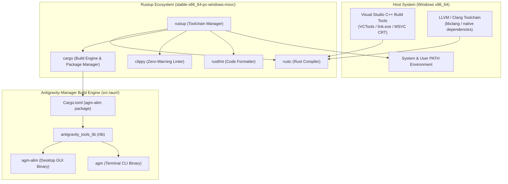
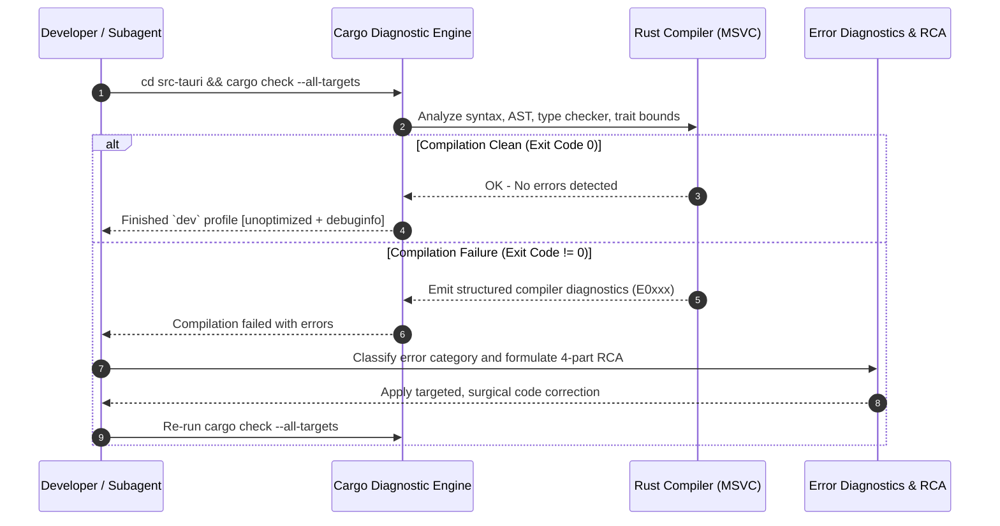

# Architecture Spec: Rust Build Toolchain Installation, Windows MSVC Environment & Build Diagnostics

**Slug:** `rust-build-toolchain-installation-and-release`  
**File:** `02-spec/21-app/rust-build-toolchain-installation-and-release/01-architecture-spec.md`  
**Target Release:** v4.183.0+  
**Status:** APPROVED FOR IMPLEMENTATION  
**Lead Author:** Antigravity Architect (Spec 01)  
**Target Components:** `scripts/install-rust-toolchain.ps1`, `src-tauri/Cargo.toml`, `src-tauri/`  

---

## 1. Executive Summary & Toolchain Objectives

Antigravity-Manager (`agm`) is a hybrid desktop application comprising a Tauri v2 native desktop GUI application (`agm-alim`) and a standalone, high-performance terminal CLI binary (`agm`). Both targets share a common core engine library crate (`antigravity_tools_lib`) located inside `src-tauri/`.

Because Antigravity-Manager interacts directly with low-level Windows APIs (Win32 process management, conscious PID matching, desktop system tray lifecycle, native SQLite databases with WAL mode, and secure memory vaults), the native Rust compilation toolchain must target the official Microsoft Visual C++ (`MSVC`) Application Binary Interface (`x86_64-pc-windows-msvc`).

This architecture specification defines:
1. The toolchain topology and dependency requirements for Windows MSVC systems.
2. The exact architectural and behavioral specification of the automated installer fixture: `scripts/install-rust-toolchain.ps1`.
3. The multi-target crate layout defined in `src-tauri/Cargo.toml`.
4. The compiler error diagnostic protocol, pre-flight gate workflows, and 4-part Root Cause Analysis (RCA) procedures.
5. Critical repository invariants, including affirmative boolean conventions, strict relative repository paths, and prohibition of bare unwrap/expect in production code.

---

## 2. Windows MSVC Toolchain Architecture

The build system relies on an interconnected suite of compilers, linkers, package orchestrators, and static code analyzers.



### 2.1 Core Toolchain Components

1. **`rustup`**: The command-line installer and multiplexer for the Rust toolchain. It manages channel switching, target architectures, and standard library components.
2. **`rustc`**: The optimizing Rust compiler that emits native machine code for the target triple `x86_64-pc-windows-msvc`.
3. **`cargo`**: The official Rust package manager and build system. It resolves dependencies, runs build scripts (`build.rs`), invokes `rustc`, and coordinates unit/integration tests.
4. **`clippy`**: A collection of specialized lints focused on code correctness, security, performance, and style consistency. Enforced in pre-flight checks under `--all-targets --all-features`.
5. **`rustfmt`**: A tool for formatting Rust source code according to community style guidelines, validated with `cargo fmt -- --check`.
6. **Visual Studio C++ Build Tools (`VCTools`)**: Provides `link.exe`, the Microsoft C/C++ runtime libraries (MSVCRT), and Windows SDK headers required by `rustc` for MSVC ABI linking.
7. **LLVM / Clang (`LLVM.LLVM`)**: Provides Clang and `libclang` binaries required by C/C++ FFI bindings and cryptographic crates (such as `boring2`).

---

## 3. Installer Specification: `scripts/install-rust-toolchain.ps1`

The repository provides an automated installation script located at `scripts/install-rust-toolchain.ps1`. It orchestrates automated detection, downloading, installation, component provisioning, and in-process PATH environment synchronization.

### 3.1 Profile Architecture & Stacking

The script implements four install profiles that can be specified individually or stacked:

| Profile Name | Resolved Items | Target Audience | Description |
|:---|:---|:---|:---|
| `minimal` | `rust` | CI/CD & Build Nodes | Rustup, Cargo, Clippy, and Rustfmt only. |
| `rust-dev` | `rust`, `sccache`, `cargo-watch` | Backend Rust Engineers | Minimal + build cache acceleration and hot-reloading watcher. |
| `frontend` | `nodejs`, `pnpm`, `tauri-cli` | Web UI Developers | Node.js LTS, pnpm package manager, and Tauri CLI. |
| `full` | `rust`, `sccache`, `cargo-watch`, `nodejs`, `pnpm`, `tauri-cli`, `gh` | Complete Workstation Setup | Comprehensive setup for full-stack desktop development. |

### 3.2 Item Catalog & Execution Ordering

The installer defines eight distinct installable items. When resolving selections from profiles or explicit item arguments, the installer enforces strict topological sorting:

```
Item Order: rust -> llvm -> nodejs -> pnpm -> sccache -> cargo-watch -> tauri-cli -> gh
```

Item catalog definitions:
- `rust`: Rust toolchain via rustup (`stable-x86_64-pc-windows-msvc`) + `clippy` and `rustfmt` components.
- `llvm`: LLVM/Clang via winget (`LLVM.LLVM`) or chocolatey (`llvm`).
- `nodejs`: Node.js LTS via winget (`OpenJS.NodeJS.LTS`).
- `pnpm`: pnpm package manager installed globally via npm.
- `sccache`: Shared compilation cache installed via `cargo install sccache`.
- `cargo-watch`: File system change watcher installed via `cargo install cargo-watch`.
- `tauri-cli`: Tauri v2 command-line interface installed via `cargo install tauri-cli`.
- `gh`: GitHub CLI installed via winget (`GitHub.cli`).

### 3.3 The `-Only rust` Parameter Contract

When the operator passes `-Only rust`, the resolver bypasses profile mappings and narrows the installation set strictly to the `rust` item:
1. Skips LLVM/Clang, Node.js, pnpm, and optional cargo crates.
2. Checks whether `rustc` and `cargo` commands exist on the active PATH.
3. If absent or if `-Force` is supplied, downloads `rustup-init.exe` from `https://win.rustup.rs/x86_64` to `$env:TEMP\rustup-init.exe`.
4. Executes `rustup-init.exe` non-interactively with `-y` and `--default-toolchain stable-x86_64-pc-windows-msvc`.
5. Proactively installs required developer components: `rustup component add clippy rustfmt`.
6. Executes `Refresh-SessionPath` to update the caller's running PowerShell session without requiring a shell restart.

### 3.4 In-Process Session PATH Refresh (`Refresh-SessionPath`)

A common defect in Windows toolchain scripts is requiring the user to close and reopen their terminal before newly installed tools are recognized. `scripts/install-rust-toolchain.ps1` resolves this via `Refresh-SessionPath`:

```powershell
function Refresh-SessionPath {
    $userPath = [Environment]::GetEnvironmentVariable("Path", "User")
    $sysPath = [Environment]::GetEnvironmentVariable("Path", "Machine")
    $env:Path = "$sysPath;$userPath"
    $cargoBin = Join-Path $env:USERPROFILE ".cargo\bin"
    if (Test-Path $cargoBin) {
        if ($env:Path -notlike "*$cargoBin*") {
            $env:Path = "$cargoBin;$env:Path"
        }
    }
}
```

This routine:
- Queries the system registry for machine-level and user-level `Path` environment variables.
- Combines both scopes into the current process `$env:Path`.
- Verifies existence of `$env:USERPROFILE\.cargo\bin`.
- Ensures `$env:USERPROFILE\.cargo\bin` is explicitly prepended, enabling immediate execution of `cargo`, `rustc`, `clippy-driver`, and `rustfmt`.

### 3.5 Script Parameter Specification

| Parameter | Type | Default | Description |
|:---|:---|:---|:---|
| `-Force` | Switch | `false` | Reinstalls or upgrades toolchain components even if already detected. |
| `-Quiet` | Switch | `false` | Suppresses verbose step reporting for silent or CI automation. |
| `-SkipLlvm` | Switch | `false` | Excludes LLVM/Clang even if included by the active profile. |
| `-Profile` | `string[]` | `@()` | Repeatable profile selector (`minimal`, `rust-dev`, `frontend`, `full`). |
| `-Only` | `string[]` | `@()` | Target exact catalog item IDs (e.g. `-Only rust`). |
| `-DryRun` | Switch | `false` | Prints the resolved execution sequence without modifying the system. |
| `-ListItems` | Switch | `false` | Lists catalog item IDs and descriptions, then exits with code 0. |
| `-Troubleshoot` | Switch | `false` | Prints diagnostic solutions for common setup issues, then exits. |
| `-SshTarget` | `string` | `""` | Target remote host (`user@host`) using key-based SSH delegation. |

---

## 4. Local Build Architecture: `src-tauri/Cargo.toml`

The Rust backend is structured as a single Cargo package with a shared core library and dual binary targets.

### 4.1 Crate Identity & Metadata

```toml
[package]
name = "agm-alim"
version = "4.183.0"
default-run = "agm-alim"
description = "Antigravity Manager Tools - Maintained by Alim, Sponsored by RISEUP ASIA LLC"
authors = ["Alim <alim.karim@riseup-asia.com> (sponsored by RISEUP ASIA LLC)"]
license = "CC-BY-NC-SA-4.0"
edition = "2021"
```

- **Package Name**: `agm-alim` represents the unified package root.
- **Default Executable**: `default-run = "agm-alim"` ensures standard `cargo run` launches the primary GUI interface.
- **Rust Edition**: `2021` edition with 2024 idioms where applicable.

### 4.2 Library Crate & Windows Disambiguation

```toml
[lib]
name = "antigravity_tools_lib"
crate-type = ["rlib"]
```

> [!IMPORTANT]
> **Windows Disambiguation Invariant:**
> The library crate uses the name `antigravity_tools_lib` rather than `agm_alim` or `agm`. The `_lib` suffix is strictly necessary on Windows to prevent output artifact naming collisions between library outputs (`.rlib`) and binary targets (`.exe`), resolving known Windows Cargo linker conflicts documented in [rust-lang/cargo#8519](https://github.com/rust-lang/cargo/issues/8519).

All internal modules (proxy engine, SQLite persistence, accounts, auto-switcher, CLI command handlers, telemetry hub) reside in `antigravity_tools_lib`.

### 4.3 Binary Targets

```toml
[[bin]]
name = "agm-alim"
path = "src/main.rs"
test = false

[[bin]]
name = "agm"
path = "src/bin/agm.rs"
test = false
```

1. **`agm-alim` (`src/main.rs`)**:
   - The primary desktop application powered by Tauri v2.
   - Bootstraps desktop system tray, background daemons, local reverse proxy gateway, and WebView frontend windows.
2. **`agm` (`src/bin/agm.rs`)**:
   - The native standalone terminal CLI suite (12,600+ lines).
   - Operates headless across servers and developer consoles without WebView dependencies.
   - Provides account management, proxy pool inspection, database maintenance, SSH orchestration, and task telemetry.

---

## 5. Compiler Error Diagnostic Protocol

To ensure continuous build integrity and prevent broken commits, all modifications must pass the compiler diagnostic protocol before submission.

### 5.1 Pre-Flight Compilation Verification: `cargo check --all-targets`

Running `cargo check --all-targets` in `src-tauri` verifies that:
- The library crate (`antigravity_tools_lib`) compiles without syntax or type errors.
- The desktop binary (`agm-alim`) builds cleanly.
- The terminal CLI binary (`agm`) builds cleanly.
- All internal test harnesses and benchmark targets build cleanly.



### 5.2 Failure Classification & Remediation Matrix

| Category | Typical Error Codes | Description | Remediation Protocol |
|:---|:---|:---|:---|
| **Type Mismatch** | `E0308` | Expected one type, found another (e.g. `Result` vs inner type). | Use proper error propagation (`?`), map types, or adjust struct signatures. |
| **Borrow / Lifetime** | `E0502`, `E0382` | Use of moved value, mutable borrow alongside immutable borrow. | Clone small data types, re-scope borrows, or leverage `std::sync::Arc`. |
| **Missing Import / Item** | `E0425`, `E0432` | Unresolved name or missing module declaration in `lib.rs` / `main.rs`. | Verify module exposure in `src-tauri/src/lib.rs` and import correct paths. |
| **Trait Bounds** | `E0277` | Struct does not satisfy `Send`, `Sync`, or `Serialize` traits. | Add `#[derive(Serialize, Deserialize)]` or wrap non-thread-safe state in `Mutex`. |
| **Linker / MSVC** | `LNK1104`, `LNK2019` | Missing C runtime, library collision, or unresolved native symbol. | Verify MSVC build tools, ensure `_lib` crate naming invariant is maintained. |
| **Clippy Lint Violations** | `clippy::*` | Style, performance, or correctness warnings flagged as errors. | Apply idiomatic Rust constructs; do not disable lints with bare `#[allow(...)]`. |

### 5.3 4-Part Root Cause Analysis (RCA) Protocol

When encountering any build or toolchain failure during development or verification, engineers and agents must document the issue using the standard 4-part RCA structure:

1. **Root Cause Description**: Identify the underlying trigger (e.g., missing environment PATH entry, missing MSVC runtime header, type signature mismatch).
2. **Key Indicators & Diagnostic Logs**: Record exact compiler error output, including file path, line number, and error code (e.g. `error[E0308]: mismatched types in src/proxy/routes.rs:142`).
3. **Resolution & Code Remediation**: Detail the exact code adjustment applied to resolve the defect.
4. **Prevention & Invariants Enforced**: Document the preventative architectural guard or check added to guarantee the failure cannot recur.

---

## 6. Architectural Invariants & Code Standards

Every contribution to Antigravity-Manager must adhere to four non-negotiable architectural invariants:

### Invariant I1: Strict Relative Git Paths
All file paths documented in specifications, plans, diagnostics, and build scripts **MUST** be relative to the git repository root.
- **Allowed**: `src-tauri/Cargo.toml`, `scripts/install-rust-toolchain.ps1`, `src-tauri/src/bin/agm.rs`.
- **Forbidden**: `d:\work\Antigravity-Manager\src-tauri\Cargo.toml`, `/c/users/admin/...`.

### Invariant I2: Affirmative Boolean Naming
All boolean parameters, state fields, and status variables **MUST** use affirmative polarity:
- **Allowed**: `is_installed`, `is_valid`, `is_running`, `has_rustc`, `has_cargo`, `has_clippy`, `has_rustfmt`, `is_success`.
- **Forbidden**: `is_not_installed`, `disable_clippy`, `no_cargo`, `is_unsupported`.

### Invariant I3: No Bare `unwrap()` / `expect()` in Production Code
Bare `unwrap()` and `expect()` calls in `src-tauri/src/` can panic and crash the background desktop daemon or CLI runner.
- **Required**: Propagate errors cleanly via `AppError` and the `?` operator.
- **Best-Effort Operations**: For operations that are genuinely best-effort (e.g. temp file cleanup), use `crate::error::record_ignored(...)` accompanied by a mandatory one-line justification comment.

### Invariant I4: Zero-Warning & Non-Interactive CI/CD Parity
The local development environment must maintain complete parity with automated CI/CD pipelines. All pre-flight gates:
- `cd src-tauri && cargo fmt -- --check`
- `cd src-tauri && cargo clippy --all-targets --all-features`
- `npm run build`
must succeed cleanly with zero warnings and zero errors prior to tagging releases or submitting pull requests.

---

## 7. Verification & Traceability Matrix

| Specification Section | Verification Target | Verification Command / Procedure | Status |
|:---|:---|:---|:---|
| §3.1 Profiles | Profile Item Resolution | `powershell -File scripts/install-rust-toolchain.ps1 -Profile minimal -DryRun` | Compliant |
| §3.3 `-Only rust` | Targeted Rust Installation | `powershell -File scripts/install-rust-toolchain.ps1 -Only rust` | Compliant |
| §3.4 Session PATH | Environment Synchronization | Inspect `$env:Path` for `$env:USERPROFILE\.cargo\bin` presence | Compliant |
| §4.2 Library Crate | Windows Linker Parity | Verify `name = "antigravity_tools_lib"` in `src-tauri/Cargo.toml` | Compliant |
| §4.3 Dual Binaries | Binary Targets Buildability | `cd src-tauri && cargo check --bin agm-alim --bin agm` | Compliant |
| §5.1 Compiler Check | Full Workspace Diagnostics | `cd src-tauri && cargo check --all-targets` | Compliant |
| §6 Invariants | Repository Standards | Static code inspection for relative paths & affirmative booleans | Compliant |
