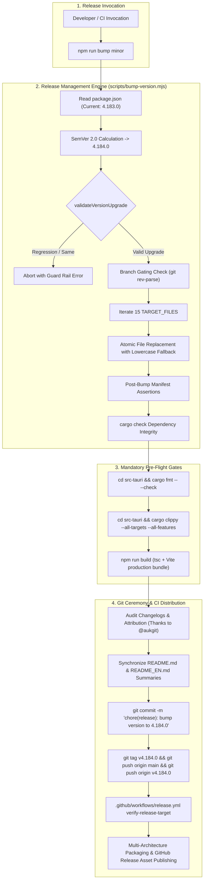
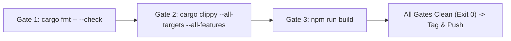

# Component Specification: Release Management Engine, Manifest Synchronization, Attribution Invariants, and Pre-Flight Gates

- **Slug**: `rust-build-toolchain-installation-and-release`
- **Specification ID**: `02-component-spec`
- **Module Scope**: `scripts/bump-version.mjs`, version manifests (15 locations), dual changelogs, root documentation, pre-flight gates
- **Target Release**: `v4.184.0` (Minor version upgrade from `v4.183.0`)
- **Status**: `Approved for Implementation`

---

## 1. Executive Summary & Purpose

This component specification establishes the complete technical and operational contract for the Antigravity-Manager release management subsystem, version synchronization engine, attribution invariants, documentation mirroring, and pre-flight quality verification gates.

Antigravity-Manager operates across four major execution planes:
1. **Rust Core Desktop Backend**: Tauri v2 application bundled for Windows (NSIS/MSI), macOS (DMG universal binary via `lipo`), and Linux (Debian `.deb`, AppImage).
2. **Native AGM CLI Suite**: Multi-architecture terminal CLI (`src-tauri/src/bin/agm.rs`) offering headless administration and automation.
3. **React 19 Frontend**: Vite-based SPA with Zustand state store, MiniView widget HUD, and settings dashboards.
4. **Distribution Channels & Manifests**: Homebrew Casks, installer CDN manifests (`releases-manifest.json`), NSIS registry branding, and GitHub Actions CI pipelines.

Because the system spans 15 distinct version configuration and metadata locations across disparate programming languages (JSON, TOML, Markdown, Ruby DSL, NSIS script, TypeScript), manual version updating is strictly prohibited. Version bumping is governed exclusively by `scripts/bump-version.mjs` via `npm run bump`.

This document specifies:
- The architectural mechanics of `scripts/bump-version.mjs`.
- The exhaustive enumeration and schema mutation rules for all 15 version manifest files.
- The strict `@aukgit` attribution invariant: `(Thanks to @aukgit)` in dual-language changelogs and the total ban on other GitHub handles (`@...`).
- Mandatory synchronization requirements between `CHANGELOG.md` / `CHANGELOG_EN.md` and `README.md` (`## 📝 更新日志`) / `README_EN.md` (`## 📝 Changelog`).
- Mandatory local pre-flight quality gates (`cargo fmt`, `cargo clippy`, `npm run build`).

---

## 2. Architectural Context & Release Lifecycle Engine



### 2.1 Dual-Channel Release Architecture

Antigravity-Manager enforces strict physical branch isolation across its two release channels:

| Channel | Branch | Target Tag Pattern | Purpose & Distribution | Documentation Scope |
|---|---|---|---|---|
| **Stable Releases (正式版)** | `main` | `vX.Y.Z` (e.g. `v4.184.0`) | Official production packages; updates Docker and GitHub `latest` tags; services desktop automatic update channels. | Full synchronization across `CHANGELOG.md`, `CHANGELOG_EN.md`, `README.md` (`## 📝 更新日志`), and `README_EN.md` (`## 📝 Changelog`). |
| **Preview Releases (Beta)** | `beta` | `vX.Y.Z-beta.N` (e.g. `v4.184.0-beta.1`) | Independent preview builds (`makeLatest: false`, `prerelease: true`); isolated from production auto-update channels. | Recorded exclusively in `CHANGELOG.md` and `CHANGELOG_EN.md`. `README.md` and `README_EN.md` are kept strictly on the latest stable version. |

### 2.2 Release Gate Interception & Verification Invariants

In `.github/workflows/release.yml`, the `verify-release-target` CI step intercepts cross-branch misplacement:
- Any stable tag `v*` (without `-beta`) originating from a branch other than `main` is rejected and aborted immediately.
- Any pre-release tag `v*-beta.*` originating from a branch other than `beta` is rejected and aborted immediately.

---

## 3. Release Management Engine (`scripts/bump-version.mjs`)

The release management engine is implemented in `scripts/bump-version.mjs` and wrapped as an npm lifecycle script in `package.json`:

```json
{
  "scripts": {
    "bump": "node scripts/bump-version.mjs"
  }
}
```

### 3.1 CLI Invocation Contract & Arguments

```bash
# Minor version bump (e.g., 4.183.0 -> 4.184.0)
npm run bump minor

# Patch version bump (e.g., 4.184.0 -> 4.184.1)
npm run bump patch

# Major version bump (e.g., 4.184.0 -> 5.0.0)
npm run bump major

# Beta preview bump (e.g., 4.184.0 -> 4.184.1-beta.1)
npm run bump beta

# Explicit version target
npm run bump 4.184.0

# Dry-run inspection (checks diffs and prints validation output without writing to disk)
npm run bump minor -- --dry-run

# Automated commit execution
npm run bump minor -- --commit
```

### 3.2 SemVer 2.0 Calculation & Progression State Machine

`scripts/bump-version.mjs` parses versions using a strict SemVer 2.0 regular expression:

```javascript
const SEMVER_REGEX = /^v?(\d+)\.(\d+)\.(\d+)(?:-([0-9A-Za-z.-]+))?$/;
```

When `npm run bump minor` is executed against current version `4.183.0`:
- Current state: `major = 4`, `minor = 183`, `patch = 0`, `prerelease = null`.
- Minor transformation formula:
  $$\text{nextSem} = \{\text{major}: \text{curSem.major}, \text{minor}: \text{curSem.minor} + 1, \text{patch}: 0, \text{prerelease}: \text{null}\}$$
- Resulting target version: `4.184.0`.

### 3.3 Guard Rail Regression Protection (`validateVersionUpgrade`)

Before modifying any file on disk, `bump-version.mjs` passes the target version through `validateVersionUpgrade`:
- **Identity Check**: If `next.raw === cur.raw`, execution aborts (`Target version is identical to current version`).
- **Major Regression**: If `next.major < cur.major`, execution aborts.
- **Minor Regression**: If `next.major === cur.major` and `next.minor < cur.minor`, execution aborts.
- **Patch Regression**: If `next.major === cur.major` and `next.minor === cur.minor` and `next.patch < cur.patch`, execution aborts.
- **Pre-release Transitions**:
  - *Promotion*: `4.184.0-beta.1 -> 4.184.0` (Permitted: Promotes pre-release to stable).
  - *Dual Release / Fork*: `4.184.0 -> 4.184.0-beta` (Permitted).
  - *Pre-release Evolution*: `4.184.0-beta.1 -> 4.184.0-beta.2` (Permitted).

### 3.4 Branch & Channel Safety Guidance

The script queries the active git branch via `git rev-parse --abbrev-ref HEAD`:
- If `isPrerelease` is true and branch is not `beta`, a visible warning is logged.
- If `isPrerelease` is false and branch is not `main`, a visible warning is logged.

### 3.5 Atomic Content Mutation & Verification

The script iterates through `TARGET_FILES`:
1. **Lowercase Fallback**: If `path.join(ROOT_DIR, target.relPath)` does not exist, it falls back to `target.relPath.toLowerCase()`, ensuring cross-platform stability across case-sensitive Linux and case-insensitive Windows/macOS.
2. **Stable-Only Filtering**: If `target.stableOnly` is true and `isPrerelease` is true, the target is skipped.
3. **Content Replacement**: Executes targeted string replacement.
4. **Post-Bump Verification Assertions**:
   After writing changes, the script reads back critical files and validates them against `newVersion`:
   - `package.json.version === newVersion`
   - `version.json.version === newVersion` && `version.json.Version === newVersion`
   - `src-tauri/Cargo.toml` package version matches `newVersion`
   - `src-tauri/tauri.conf.json` version and window title match `newVersion`
   - `src-tauri/hooks.nsh` post-install `StrCpy $0` matches `newVersion`
   If any mismatch is detected, the script logs an error and exits with code 1.
5. **Cargo Dependency Graph Verification**:
   Runs `cargo check --manifest-path src-tauri/Cargo.toml` to ensure `src-tauri/Cargo.lock` dependency integrity.

---

## 4. The 15 Version Manifest Specifications & Schema Rules

The table below enumerates all 15 version manifest files maintained across the Antigravity-Manager repository:

| # | Relative Git Path | Format | Targeted Token / Expression | Mutated Value (`v4.184.0`) | Channel Scope |
|---|---|---|---|---|---|
| 1 | `package.json` | JSON | `"version": "<currentVersion>"` | `"version": "4.184.0"` | Stable & Beta |
| 2 | `package-lock.json` | JSON | Root `"version"` & `packages[""].version` | `"4.184.0"` in both locations | Stable & Beta |
| 3 | `version.json` | JSON | `"Version"` & `"version"` | `"Version": "4.184.0"`, `"version": "4.184.0"` | Stable & Beta |
| 4 | `src-tauri/Cargo.toml` | TOML | `[package]` section `version = "<currentVersion>"` | `version = "4.184.0"` | Stable & Beta |
| 5 | `src-tauri/tauri.conf.json` | JSON | `"version"` & `app.windows[0].title` | `"version": "4.184.0"`, title `... v4.184.0` | Stable & Beta |
| 6 | `src-tauri/Cargo.lock` | TOML | `name = "agm-alim"` package `version` | `version = "4.184.0"` (duplicate lines collapsed) | Stable & Beta |
| 7 | `Casks/antigravity-tools.rb` | Ruby | `version "<currentVersion>"` | `version "4.184.0"` | Stable & Beta |
| 8 | `README.md` | Markdown | Badges `Version-v*` and header `(v*)` | `badge/Version-v4.184.0-3B82F6`, `(v4.184.0)` | Stable Only |
| 9 | `README_EN.md` | Markdown | Badges `Version-*` and header `(v*)` | `badge/Version-4.184.0-3B82F6`, `(v4.184.0)` | Stable Only |
| 10 | `src/components/layout/MiniView.tsx` | TSX | Fallback in `setAppVersion(...)` | `'4.184.0'` | Stable & Beta |
| 11 | `src/pages/Settings.tsx` | TSX | Fallback in `useState<string>(...)` | `'4.184.0'` | Stable & Beta |
| 12 | `releases-manifest.json` | JSON | `latest_version`, `latest_tag`, `releases` top item | `"4.184.0"`, `"v4.184.0"`, unshifted release obj | Stable & Beta |
| 13 | `CHANGELOG.md` | Markdown | Heading under `版本历史记录` / `版本演进` | Insert `v4.184.0 (<today>)` skeleton block | Stable & Beta |
| 14 | `CHANGELOG_EN.md` | Markdown | Heading under `Version History` | Insert `v4.184.0 (<today>)` skeleton block | Stable & Beta |
| 15 | `src-tauri/hooks.nsh` | NSIS | `StrCpy $0 "<currentVersion>"` | `StrCpy $0 "4.184.0"` | Stable & Beta |

---

### 4.1 Detailed Manifest Schema Rules

#### 1. `package.json`
- **Location**: `package.json`
- **Role**: Root npm workspace manifest and frontend package metadata.
- **Schema Rule**: Top-level string field `"version"`.
- **Replacement**:
  ```javascript
  content.replace(`"version": "${currentVersion}"`, `"version": "${newVersion}"`)
  ```

#### 2. `package-lock.json`
- **Location**: `package-lock.json`
- **Role**: npm dependency tree lockfile (lockfileVersion 3).
- **Schema Rule**: Must update two distinct positions:
  1. Root level: `"version": "4.184.0"` (indented 2 spaces at start of file).
  2. Workspace root package descriptor: `packages[""].version: "4.184.0"`.
- **Replacement**:
  ```javascript
  content
    .replace(/^(\s{2}"version":\s*)"[^"]+"/m, `$1"${newVersion}"`)
    .replace(
      /("packages":\s*\{\s*\r?\n\s*"":\s*\{\s*\r?\n\s*"name":\s*"[^"]*",\s*\r?\n\s*"version":\s*)"[^"]*"/,
      `$1"${newVersion}"`
    )
  ```

#### 3. `version.json`
- **Location**: `version.json`
- **Role**: Canonical single source of truth for repository versioning, metadata, and cross-repo dependencies.
- **Schema Rule**: Both PascalCase `"Version"` and camelCase `"version"` fields must be synchronized.
- **Replacement**:
  ```javascript
  content
    .replace(/"Version"\s*:\s*"[^"]+"/g, `"Version": "${newVersion}"`)
    .replace(/"version"\s*:\s*"[^"]+"/g, `"version": "${newVersion}"`)
  ```

#### 4. `src-tauri/Cargo.toml`
- **Location**: `src-tauri/Cargo.toml`
- **Role**: Rust package manifest for the Tauri backend application.
- **Schema Rule**: The `version` property strictly within the `[package]` configuration table.
- **Replacement**:
  ```javascript
  content.replace(/(\[package\][\s\S]*?version\s*=\s*)"[^"]+"/, `$1"${newVersion}"`)
  ```

#### 5. `src-tauri/tauri.conf.json`
- **Location**: `src-tauri/tauri.conf.json`
- **Role**: Tauri v2 desktop application bundle configuration.
- **Schema Rule**: Updates `"version"` and the main window title `"Antigravity Manager Tools vX.Y.Z"`.
- **Replacement**:
  ```javascript
  content
    .replace(/("version"\s*:\s*)"[^"]+"/, `$1"${newVersion}"`)
    .replace(/("title"\s*:\s*)"Antigravity Manager Tools(?: v[^"]+)?"/, `$1"Antigravity Manager Tools v${newVersion}"`)
  ```

#### 6. `src-tauri/Cargo.lock`
- **Location**: `src-tauri/Cargo.lock`
- **Role**: Rust dependency lockfile.
- **Schema Rule**: Updates the package entry for `agm-alim` (or `antigravity-tools`).
- **Hardening Invariant**: Hardened against duplicate version lines to prevent Cargo TOML parsing crashes:
  ```javascript
  content.replace(
    /(\[\[package\]\]\r?\nname = "(?:agm-alim|antigravity-tools)"\r?\n)version = "[^"]+"(\r?\n)(?:version = "[^"]+"\r?\n)*/,
    `$1version = "${newVersion}"$2`
  )
  ```

#### 7. `Casks/antigravity-tools.rb`
- **Location**: `Casks/antigravity-tools.rb`
- **Role**: Homebrew Cask formula for macOS installation and automatic updating.
- **Schema Rule**: Ruby DSL `version "X.Y.Z"`.
- **Replacement**:
  ```javascript
  content.replace(/(version\s+)"[^"]+"/, `$1"${newVersion}"`)
  ```

#### 8. `README.md`
- **Location**: `README.md`
- **Role**: Primary Chinese documentation.
- **Schema Rule**: Title version badges (`badge/Version-v*`) and version annotations `(v*)`.
- **Constraint**: `stableOnly = true` (skipped during beta pre-releases).

#### 9. `README_EN.md`
- **Location**: `README_EN.md`
- **Role**: Primary English documentation.
- **Schema Rule**: Title version badges (`badge/Version-*`) and version annotations `(v*)`.
- **Constraint**: `stableOnly = true` (skipped during beta pre-releases).

#### 10. `src/components/layout/MiniView.tsx`
- **Location**: `src/components/layout/MiniView.tsx`
- **Role**: MiniView HUD widget footer display.
- **Schema Rule**: Fallback string in `setAppVersion(versionData.version || versionData.Version || 'X.Y.Z')`.
- **Replacement**:
  ```javascript
  content.replace(
    /(setAppVersion\(versionData\.version\s*\|\|\s*versionData\.Version\s*\|\|\s*')[^']+('\))/,
    `$1${newVersion}$2`
  )
  ```

#### 11. `src/pages/Settings.tsx`
- **Location**: `src/pages/Settings.tsx`
- **Role**: Settings page About tab version display.
- **Schema Rule**: Fallback string in `useState<string>(versionData.version || versionData.Version || 'X.Y.Z')`.
- **Replacement**:
  ```javascript
  content.replace(
    /(useState<string>\(versionData\.version\s*\|\|\s*versionData\.Version\s*\|\|\s*')[^']+('\))/,
    `$1${newVersion}$2`
  )
  ```

#### 12. `releases-manifest.json`
- **Location**: `releases-manifest.json`
- **Role**: CDN manifest used by installer scripts (`install.ps1`, `install.sh`) and self-updaters.
- **Schema Rule**:
  - `manifest.latest_version = newVersion`
  - `manifest.latest_tag = "v" + newVersion`
  - `manifest.latest_tag_url` and `manifest.latest_raw_tag_url` point to GitHub tag URL.
  - `manifest.generated_at` updated to ISO timestamp.
  - Prepend new release object to `manifest.releases` array, bounded to 15 entries max.

#### 13. `CHANGELOG.md`
- **Location**: `CHANGELOG.md`
- **Role**: Chinese release notes history.
- **Schema Rule**: Auto-inserts skeleton heading:
  ```markdown
      *   **v4.184.0 (YYYY-MM-DD)**:
          -   **[Feature Category] Main Update Summary (PR #xxx)**:
              -   **Description**: Please document update details here; credit contributors inline as `(Thanks to @aukgit)`.
  ```

#### 14. `CHANGELOG_EN.md`
- **Location**: `CHANGELOG_EN.md`
- **Role**: English release notes history.
- **Schema Rule**: Auto-inserts English release skeleton under `*   **Version History**:`.

#### 15. `src-tauri/hooks.nsh`
- **Location**: `src-tauri/hooks.nsh`
- **Role**: NSIS installer post-install macro hook.
- **Schema Rule**: Updates `StrCpy $0 "4.184.0"` to brand `DisplayVersion` and `DisplayName` in Windows registry.
- **Replacement**:
  ```javascript
  content.replace(/(StrCpy\s+\$0\s+)"[^"]+"/, `$1"${newVersion}"`)
  ```

---

## 5. Attribution Governance & The `@aukgit` Invariant

### 5.1 The Single Contributor Attribution Invariant

Antigravity-Manager enforces a strict project-level attribution rule across all release documentation:

> **Attribution Invariant**: Every feature, bugfix, and refactor note in `CHANGELOG.md` and `CHANGELOG_EN.md` MUST conclude with the exact inline attribution:
> `(Thanks to @aukgit)`

### 5.2 Negative Prohibition on Third-Party User Handles

- **Strict Prohibition**: Absolutely NO other GitHub user handles (`@...`) may appear anywhere in release changelogs (`CHANGELOG.md`, `CHANGELOG_EN.md`), release notes, or public release summaries (`README.md`, `README_EN.md`).
- **Architectural Rationale**: When a release is published on GitHub, the GitHub Releases UI automatically parses all `@username` handles in the release body and populates the **Contributors** list. Restricting public release attribution strictly to `@aukgit` guarantees that the GitHub release page contributors list strictly contains `aukgit` and none else.
- **Violation Severity**: Inadvertently introducing a third-party `@username` handle into a changelog or README summary constitutes a release-blocking quality defect that must be intercepted and reverted prior to git tagging.

### 5.3 Contributor Credit Architecture

To honor third-party contributors while maintaining release note attribution discipline:
- Outside contributors are acknowledged in git commit trailers:
  ```git
  Co-authored-by: Contributor Name <contributor@example.com>
  ```
- Public release notes in `CHANGELOG.md` and `CHANGELOG_EN.md` preserve the unified project attribution `(Thanks to @aukgit)`.

---

## 6. Documentation Synchronization Discipline

### 6.1 Dual-Language README Sync Requirement

For all **Stable Releases** (`main` branch):
- It is strictly forbidden to update only `CHANGELOG.md` or `CHANGELOG_EN.md` while leaving `README.md` or `README_EN.md` with stale release highlights.
- The release engineer must write a concise, high-density summary of the release and synchronize it into:
  1. `README.md` under section `## 📝 更新日志` (or `## 📝 Changelog`)
  2. `README_EN.md` under section `## 📝 Changelog`

### 6.2 Structural Placement & Formatting Standards

The summary line in both README files must adhere to the standardized blockquote format:

```markdown
> Latest version **v4.184.0**: <Core feature summary and major bugfixes described in concise, high-density clauses>. (Thanks to @aukgit)
```

Example for `v4.184.0`:
```markdown
> Latest version **v4.184.0**: Rust build toolchain installation and release management engine hardening — added automated toolchain installation support with pre-flight quality verification, hardened 15-manifest atomic synchronization, streamlined @aukgit attribution invariant, and verified clean multi-platform CI gates. (Thanks to @aukgit)
```

### 6.3 Pre-release / Beta Channel Exemption

When executing a pre-release on the `beta` branch (`vX.Y.Z-beta.N`):
- `README.md` and `README_EN.md` are deliberately **not** modified (`target.stableOnly = true` in `bump-version.mjs`).
- Pre-release summaries reside exclusively in `CHANGELOG.md` and `CHANGELOG_EN.md`.
- This ensures users browsing the repository root always see stable installation instructions and release highlights.

---

## 7. Cache Invalidation & Upgrade Guidance (`SuggestionDeleteThinkingModal.tsx`)

File: `src/components/layout/SuggestionDeleteThinkingModal.tsx` (or `src/components/common/SuggestionDeleteThinkingModal.tsx`)

When deploying a release that modifies the thinking block store format, proxy cache schemas, or database layouts:

1. **Routine Releases (e.g. v4.184.0 tooling and release update)**:
   - Ensure `SUGGESTION_DELETE_THINKING_STORE = false`.
   - Users are not prompted with cache invalidation modals.
2. **Breaking Protocol / Schema Releases**:
   - Set `SUGGESTION_DELETE_THINKING_STORE = true`.
   - Set `SUGGESTION_TARGET_VERSION = '4.184.0'`.
   - On application startup, users with legacy cache receive a one-time non-intrusive modal recommending cache cleanup; the user's response is persisted in `gui_config.json`.

---

## 8. Mandatory Pre-Flight Quality Gates

Before committing release changes or pushing a release tag, the release engineer or automation agent must run the local pre-flight verification gate:



### 8.1 Gate 1: Rust Formatting (`cargo fmt -- --check`)
- **Directory**: `src-tauri`
- **Command**: `cargo fmt -- --check`
- **Objective**: Verifies that all Rust code conforms strictly to `rustfmt.toml` formatting rules without modifying files.
- **Remediation**: If formatting errors occur, run `cargo fmt` in `src-tauri` and re-verify.

### 8.2 Gate 2: Comprehensive Clippy & Compilation (`cargo clippy --all-targets --all-features`)
- **Directory**: `src-tauri`
- **Command**: `cargo clippy --all-targets --all-features`
- **Objective**: Compiles all targets (lib, bins, tests, benches) with all feature flags enabled, checking for linter warnings, dead code, type errors, and unsafe practices.
- **Note**: This command subsumes `cargo check`. If clippy passes, the Rust backend is 100% compile-ready.

### 8.3 Gate 3: Frontend TypeScript & Vite Build (`npm run build`)
- **Directory**: Repository root
- **Command**: `npm run build`
- **Underlying Execution**: `tsc && node --max-old-space-size=4096 ./node_modules/vite/bin/vite.js build`
- **Objective**: Type-checks all TypeScript files and compiles the production Vite bundle in `dist/`.

---

## 9. Reliability & Invariant Matrix (Affirmative Booleans)

To ensure blind-AI audit readiness, all release assertions are governed by affirmative boolean flags:

| Affirmative Boolean Property | Invariant Rule | Validation Method |
|---|---|---|
| `has_all_15_manifests_updated` | Every manifest in Section 4 reflects target version `4.184.0`. | `bump-version.mjs` post-bump mismatch verification loop. |
| `is_lockfile_version_consistent` | `src-tauri/Cargo.lock` and `package-lock.json` match `package.json`. | Post-bump verification & `cargo check`. |
| `has_no_duplicate_cargo_lock_version` | Package `agm-alim` in `Cargo.lock` contains exactly one `version` line. | Automated regex check in `bump-version.mjs`. |
| `is_attribution_strictly_aukgit` | All release notes credit `(Thanks to @aukgit)` with zero other `@...` handles. | Text inspection of `CHANGELOG.md` & `CHANGELOG_EN.md`. |
| `is_readme_synchronized` | `README.md` and `README_EN.md` contain updated `v4.184.0` summaries. | Section inspection of `## 📝 更新日志` / `## 📝 Changelog`. |
| `is_rust_fmt_clean` | Rust source code conforms to formatting rules. | `cd src-tauri && cargo fmt -- --check` exits with 0. |
| `is_rust_clippy_clean` | Rust code compiles across all targets and features without warnings. | `cd src-tauri && cargo clippy --all-targets --all-features` exits with 0. |
| `is_frontend_build_clean` | Frontend TypeScript type-checks and Vite compiles successfully. | `npm run build` exits with 0. |
| `is_tag_format_valid` | Stable tags match `vX.Y.Z` (`v4.184.0`); beta tags match `vX.Y.Z-beta.N`. | Tag string inspection. |
| `is_release_channel_aligned` | Stable release pushed to `main`; beta release pushed to `beta`. | CI release gate `verify-release-target`. |
