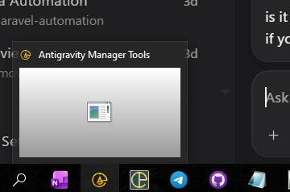

# Issue 06: Blank UI & Blank Windows Taskbar Preview (`Antigravity Manager Tools`) — 4-Part Root Cause Analysis

## 1. Reproduction & Symptom
- **Observed Symptom**: Hovering over the `Antigravity Manager Tools` icon in the Windows taskbar displays a **blank gray box with a generic window icon** (instead of the live application UI), and clicking the taskbar icon or launching the app sometimes leaves the UI blank or invisible off-screen.
- **Trigger Conditions**:
  1. Launching or restarting `agm-alim.exe` when `tauri-plugin-window-state` had previously persisted `"minimized": true` or off-screen coordinates (`x = -32000, y = -32000`).
  2. Launching `agm-alim.exe` with `-WindowStyle Minimized` or `"visible": false` in `tauri.conf.json`, causing Windows DWM (Desktop Window Manager) to create the taskbar button before any frame is rendered to the HWND swapchain.
  3. Windows WebView2 suspending the Chromium compositor and discarding GPU swapchain surfaces when a frameless (`decorations: false`) window is occluded or minimized (`CalculateNativeWindowOcclusion`).

## 2. Root Cause (Why It Happened)
1. **`StateFlags::MINIMIZED` in `tauri-plugin-window-state` (`src-tauri/src/lib.rs:538` & `lightweight.rs:63,92`)**:
   - `StateFlags::all().difference(StateFlags::VISIBLE)` still included `StateFlags::MINIMIZED`. When the app was closed or restarted while minimized, `tauri-plugin-window-state` restored the window in the `WS_MINIMIZE` (`-32000, -32000`) state prior to WebView2 painting its first frame. Because Windows DWM only captures a live window bitmap when the window is rendered in a non-minimized state, the taskbar thumbnail remained a blank gray box.
2. **`"visible": false` in `tauri.conf.json` + Incomplete `show_main_window` (`src-tauri/src/commands/mod.rs:1129`)**:
   - `tauri.conf.json` configured `"visible": false`, deferring window visibility until JavaScript (`src/main.tsx`) called `invoke("show_main_window")`. Furthermore, `show_main_window` only called `window.unminimize()` and `window.show()` without invoking `restore_and_focus_window` (Win32 `ShowWindow(SW_RESTORE)`, off-screen coordinate healing, and minimum `1200x800` size enforcement).
3. **WebView2 Background Surface Eviction on Windows**:
   - By default on Windows, Edge WebView2 enables `CalculateNativeWindowOcclusion`, `backgrounding-occluded-windows`, and `renderer-backgrounding`, which evicts the GPU swapchain of frameless (`decorations: false`) windows when minimized or behind other windows, causing a brief or persistent blank white/gray canvas on restore.

## 3. Code Fix Implemented
1. **Disable WebView2 Occlusion & GPU Swapchain Eviction (`src-tauri/src/lib.rs`)**:
   - Set `WEBVIEW2_ADDITIONAL_BROWSER_ARGUMENTS` to `--disable-features=CalculateNativeWindowOcclusion --disable-backgrounding-occluded-windows --disable-renderer-backgrounding` at startup on Windows.
2. **Exclude `StateFlags::MINIMIZED` from `tauri-plugin-window-state` (`src-tauri/src/lib.rs` & `src-tauri/src/modules/lightweight.rs`)**:
   - Changed window state flags to `StateFlags::all().difference(StateFlags::VISIBLE | StateFlags::MINIMIZED)` so persisted minimized states (`-32000, -32000`) are never restored on launch.
3. **Immediate Native Window Show & Win32 `SW_RESTORE` Healing (`src-tauri/tauri.conf.json`, `src-tauri/src/lib.rs`, `src-tauri/src/commands/mod.rs`)**:
   - Set `"visible": true` and `"center": true` in `src-tauri/tauri.conf.json`.
   - In `lib.rs` `setup`, immediately call `restore_and_focus_window(&window)` (unless `--minimized` CLI flag is explicitly passed) and run a 500ms post-setup verification check.
   - Upgraded `commands::show_main_window` in `src-tauri/src/commands/mod.rs` to call `crate::restore_and_focus_window(&window)`.

## 4. Prevention
- Never persist or restore `StateFlags::MINIMIZED` in `tauri-plugin-window-state`.
- Always disable `CalculateNativeWindowOcclusion` for frameless (`decorations: false`) Tauri + WebView2 windows on Windows.
