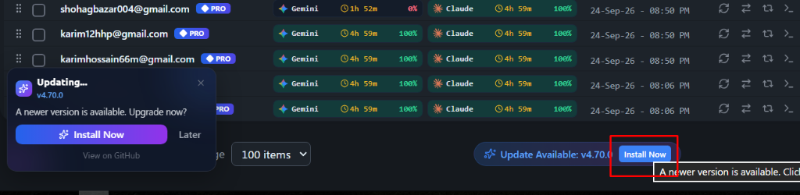

# Issue 07: "Clicking on Install Doesn't Do Anything" — 4-Part Root Cause Analysis

## 1. Reproduction & Symptom
- **Observed Symptom**: Clicking the `[Install Now]` pill button at the bottom-right footer of the Accounts table (`media_1790254274036.png`) or clicking `[Install Now]` inside the update notification popup appears to do nothing.
- **Trigger Conditions**:
  1. User has the `Update Available: v4.70.0` pill visible in the table footer and clicks `Install Now`.
  2. The notification card (`UpdateNotification`) was already open or minimized, and clicking `Install Now` in the footer only executed `setShowNotification(true)` without triggering the installer.
  3. Clicking `Install Now` inside `UpdateNotification` called `run_installer_update`, which on Windows executed `powershell` with `-WindowStyle Hidden` and blocked on `output().await`. Because `install.ps1` runs hidden and stops `agm-alim.exe` during update, the process either silently hung or was killed before returning any visual feedback to the user.

## 2. Root Cause (Why It Happened)
1. **Footer Button Action Mismatch (`src/pages/Accounts.tsx:1076`)**:
   - The footer button rendered `Install Now` text inside a red border, but its `onClick` was wired exclusively to `setShowNotification(true)`. If the notification was already mounted on the screen, clicking the button had zero effect.
2. **Hidden Blocking Subprocess in `run_installer_update` (`src-tauri/src/modules/update_checker.rs:598-620`)**:
   - On Windows, `run_installer_update()` spawned PowerShell with `-WindowStyle Hidden` and awaited `output().await` synchronously for up to 300 seconds.
   - Because `install.ps1 -Update` kills the running `agm-alim.exe` (`Stop-Process`), the parent process was terminated before `ps_cmd.output()` could complete, giving the user zero visible progress.

## 3. Code Fix Implemented
1. **Direct Action Dispatch on Footer Button (`src/pages/Accounts.tsx`)**:
   - Connected the footer `[Install Now]` button directly to `installUpdate()`. It now triggers the updater immediately, renders a loading spinner (`Loader2` + `Installing...`), displays a toast notification, and launches the detached installer console.
2. **Visible Detached Updater Console on Windows (`src-tauri/src/modules/update_checker.rs`)**:
   - Upgraded `run_installer_update` on Windows to spawn `cmd.exe /c start "Antigravity Tools Updater" powershell.exe -NoProfile -ExecutionPolicy Bypass ...`.
   - The user immediately sees a clean, visible PowerShell terminal window executing `install.ps1 -Update` with real-time download progress.
   - The function returns `Ok(...)` immediately in <50ms without blocking or being killed by parent process termination.
3. **Centralized Update Store Action (`src/stores/use-update-store.ts`)**:
   - Added `isInstalling: boolean` and `installUpdate: () => Promise<string | null>` with automatic GitHub download page fallback on network failure.

## 4. Prevention
- Buttons labeled `Install Now` must directly execute the installation action, not just toggle visibility of secondary dialogs.
- Self-updating desktop applications must always spawn the updater script in a detached process so that process termination during binary replacement does not abort the update routine.
