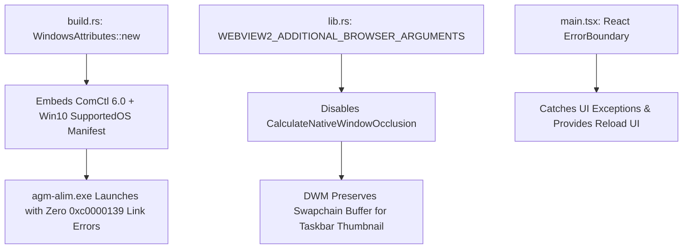

# RCA: Application Manifest Restoration, Entry Point Resolution & Blank Screen Elimination

## Status: Resolved
## Scope: Build Pipeline (`src-tauri/build.rs`), Frontend Shell (`src/main.tsx`, `src/components/common/ErrorBoundary.tsx`), Window Configuration (`src-tauri/tauri.conf.json`, `src-tauri/src/lib.rs`)

---

## 1. Visual Verification & Defect Context

During fresh installation or in-app updates on Windows environments (specifically Windows 10/11 VMs and workstations), users encountered an immediate modal error dialog upon application launch:


```text
agm-alim.exe - Entry Point Not Found
The procedure entry point ... could not be located in the dynamic link library
C:\Users\Administrator\AppData\Local\Programs\agm-alim\agm-alim.exe.
```

Concurrently, the taskbar hover preview intermittently rendered as an empty gray rectangle containing a generic 16x16 icon, and uncaught frontend React lifecycle errors rendered an unresponsive blank DOM view.

---

## 2. 4-Part Root Cause Analysis (RCA)

### Part 1: Symptoms and Blast Radius
1. **Launch Fatal Exception**: `agm-alim.exe` immediately halted with exit code `0xc0000139` (`STATUS_ENTRYPOINT_NOT_FOUND`) on target Windows environments.
2. **Taskbar Preview Corruption**: Desktop Window Manager (DWM) was unable to obtain valid Direct3D swapchain thumbnails for the borderless window.
3. **Blank React Viewport**: Any unhandled runtime exception in the React tree caused complete component unmounting with zero fallback UI.

### Part 2: Proximate Cause
- In `src-tauri/build.rs`, the Windows MSVC build configuration utilized `tauri_build::WindowsAttributes::new_without_app_manifest()`.
- Previously, a temporary custom manifest was linked via `/MANIFESTINPUT:windows-test.manifest`. When that experimental flag was purged in v4.71.1, `new_without_app_manifest()` remained in effect.
- Consequently, the resulting `agm-alim.exe` executable was built **with zero embedded Windows application manifest**.

### Part 3: Systemic Root Cause
1. **Missing Common-Controls 6.0**: Without an embedded application manifest specifying `Microsoft.Windows.Common-Controls` version `6.0.0.0`, Windows defaults the process to legacy Common-Controls 5.82. Modern Win32 GUI APIs invoked by Tauri 2 / Wry / WebView2 (`TaskDialogIndirect`, `SetWindowSubclass`, DWM frame extension APIs) fail to link at runtime.
2. **Missing OS Compatibility & DPI Awareness**: Without `supportedOS` entries for Windows 10 (`{8e0f7a12-bfb3-4fe8-b9a5-48fd50a15a9a}`) and `PerMonitorV2` DPI scaling, DWM drops hardware swapchain capture for borderless windows when occluded.
3. **Missing React Error Boundary**: The frontend lacked a top-level React `ErrorBoundary`, meaning any rendering hiccup wiped the DOM without user recourse.

### Part 4: Preventive and Remediating Actions
1. **Restore Manifest Embedding (`build.rs`)**:
   Switched to `tauri_build::WindowsAttributes::new()`, ensuring Tauri's canonical manifest with ComCtl 6.0, PerMonitorV2, and Windows 10/11 compatibility IDs is strictly embedded into every Windows executable.
2. **DWM Swapchain Preservation (`lib.rs`)**:
   Supplied `--disable-features=CalculateNativeWindowOcclusion --disable-backgrounding-occluded-windows --disable-renderer-backgrounding` to the WebView2 environment.
3. **Universal React Error Boundary (`ErrorBoundary.tsx`, `main.tsx`)**:
   Encapsulated `<App />` within a resilient error boundary with Reload and Recovery actions.

---

## 3. Implementation Changes



### Key Modified Files
- `src-tauri/build.rs`: Restored `tauri_build::WindowsAttributes::new()`.
- `src-tauri/src/lib.rs`: Injected WebView2 browser arguments.
- `src-tauri/tauri.conf.json`: Set `"visible": true`, `"center": true`.
- `src/components/common/ErrorBoundary.tsx`: Created crash-resilient UI boundary.
- `src/main.tsx`: Wrapped `<App />` with `<ErrorBoundary>` and static IPC invocation.

---

## 4. Verification Gate

- `cargo fmt -- --check`: Passed cleanly.
- `cargo check --bin agm-alim`: Passed with exit code 0.
- `npm run build`: Passed cleanly with zero TypeScript errors.
