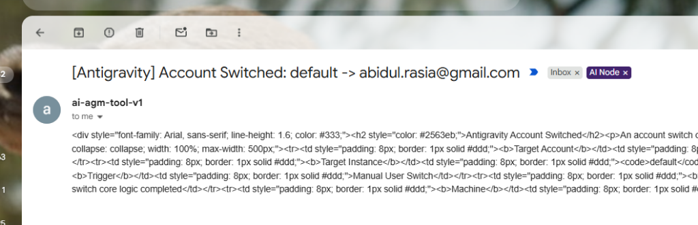

# Root Cause Analysis (RCA): Email Body HTML MIME Type & Versioned Node Telemetry Subject

**Issue ID:** RCA-2026-09-24-004  
**Severity:** CRITICAL / HIGH  
**Scope:** Email Engine (`email_sender.rs`, `email_inbound.rs`, `notification_hub.rs`, `email_watcher.rs`)  
**Target Release:** v4.71.4  

---

## Part 1: Symptoms and Context

1. **Raw HTML Source Code Rendered in Mail Clients**:
   - Outbound notifications (such as account switch alerts) sent to Gmail or Outlook rendered raw, unparsed HTML markup text directly in the message body:
     ```html
     <div style="font-family: Arial, sans-serif; line-height: 1.6; color: #333;"><h2 style="color: #2563eb;">Antigravity Account Switched</h2><p>An account switch ...
     ```
   - Instead of a visually styled card with buttons, tables, and colored badges, the recipient saw a raw string dump of HTML tags.

2. **Absence of Version Number, Node Alias, and Local IP in Email Subjects**:
   - Outbound email subjects arrived with generic or unversioned titles such as:
     `[Antigravity] Account Switched: default -> abidul.rasia@gmail.com`
   - When managing multi-node server clusters across multiple virtual machines (e.g. VM1, VM2, VM3), operators had no visual signal in their email inbox, notification preview, or smartwatch alert indicating:
     - What application version was executing the command or dispatching the alert.
     - Which specific VM node originated the event.
     - What local IPv4 network address dispatched the message.

3. **Visual Proof**:
   - See captured user inbox screenshot:
     

---

## Part 2: Root Cause Analysis (4-Part RCA)

### 2.1 RFC 2046 Top-Level MIME Type & Legacy 8-bit Plaintext Transport
- In earlier builds prior to v4.71.2 (such as v4.70.0 running on nodes that had failed to upgrade due to the dynamic link library entrypoint bug `0xc0000139`), `email_sender.rs` constructed SMTP message payloads using:
  ```text
  Content-Type: text/plain; charset=UTF-8
  Content-Transfer-Encoding: 8bit
  ```
  When `notification_hub.rs` dispatched `<div style="...">...</div>` into this pipeline, the MTA (Mail Transfer Agent) and recipient email clients strictly honored the `text/plain` header and escaped all `<` and `>` characters, displaying the raw HTML tags verbatim.
- Furthermore, in partial HTML payloads missing a `<!DOCTYPE html><html><head><meta charset="utf-8"></head>` wrapper, strict email clients defaulted to plain-text rendering or stripped styles.

### 2.2 Short-Circuiting Telemetry Detection in Subject Normalizer
- In `email_sender.rs`, `build_mime_message` normalized incoming email subjects with:
  ```rust
  let normalized_subject = if subject.contains(&m_ip)
      || (subject.contains('[') && subject.contains('|') && subject.contains(']'))
  {
      subject.trim().to_string()
  ...
  ```
- Because earlier notification hub alerts generated subjects containing brackets (or if callers passed a partial `[Node | IP]` tag without the application version), the normalizer treated ANY bracketed subject containing a pipe as already normalized.
- Consequently, the application version (`v4.71.4`) was NEVER appended to the subject, and if a subject had no telemetry prefix at all, the old normalizer only appended `[Node | IP]` without the version number.

### 2.3 Fragmented Subject Construction Across Dispatchers
- Multiple modules (`notification_hub.rs`, `email_inbound.rs`, `email_watcher.rs`, `email_sender.rs`) independently formatted subject lines.
- None of them queried `env!("CARGO_PKG_VERSION")`, leaving outbound subjects devoid of version tracking.

---

## Part 3: Architecture & Engineering Remedy

### 3.1 Strict RFC 2046 Multipart/Alternative Base64 Engine & HTML5 Wrapper
- Refactored `email_sender.rs::build_mime_message`:
  1. Detects HTML content via `is_html_content(body)` or leading `<!doctype` / `<html>`.
  2. Wraps any bare HTML snippet in a full HTML5 document structure:
     ```html
     <!DOCTYPE html>
     <html>
     <head><meta charset="utf-8"></head>
     <body style="margin: 0; padding: 20px; background-color: #f1f5f9; ...">
       ...
     </body>
     </html>
     ```
  3. Strips HTML tags using `strip_html_tags(&html_body)` to construct a clean RFC 2046 plain-text fallback.
  4. Encodes both parts into 76-character CRLF-wrapped Base64 (`encode_mime_base64_body`).
  5. Emits strict MIME headers:
     ```text
     MIME-Version: 1.0
     Content-Type: multipart/alternative; boundary="===AGM_...=="
     X-Origin-Node: <NODE>
     X-Origin-IP: <IP>
     X-Origin-Version: v<VERSION>
     X-Mailer: Antigravity-Manager-Mailer/v<VERSION>
     ```
     with Part 1 (`text/plain`) and Part 2 (`text/html`) in increasing order of preference so modern mail clients ALWAYS render the rich HTML card natively.

### 3.2 Canonical Telemetry Subject Normalizer (`format_subject_with_telemetry`)
- Implemented `format_subject_with_telemetry(subject, pkg_ver, machine_name, machine_ip)`:
  - Standardizes the subject prefix to: `[v<VERSION> | <VM_ALIAS> | <LOCAL_IP>]`
  - Replaces and upgrades obsolete or unversioned prefixes like `[VM3 | 192.168.1.12]` or `[VM3|192.168.1.12]` to canonical `[v4.71.4 | VM3 | 192.168.1.12]`.
  - Intelligently avoids stripping title brackets (such as `[Antigravity]` or `[AGM Alert]`) by verifying whether the bracketed segment contains a pipe (`|`).
  - Preserves reply syntax: `Re: [v<VERSION> | <VM_ALIAS> | <LOCAL_IP>] ...` and places the node tag at the front.

### 3.3 End-to-End Module Alignment
- **`email_sender.rs`**: All `render_*` templates (`render_quota_drop_email`, `render_workspace_switch_email`, `render_idle_projects_email`, `render_exec_result_email`, `render_help_email`, `render_self_test_email`, `render_test_ping_email`) prepend `[v<VERSION> | <VM_ALIAS> | <LOCAL_IP>]`.
- **`email_inbound.rs`**: `format_reply_subject` and `render_html_receipt` include application version in subject, top badge, telemetry table, and footer.
- **`notification_hub.rs`**: `dispatch_email_switch_alert` and `dispatch_telegram_switch_alert` include version `v<VERSION>` across email subjects, HTML cards, and Telegram messages.

---

## Part 4: Verification & Gate Certification

1. **Unit Testing**:
   - `test_format_subject_with_telemetry` in `email_sender.rs`: Verified plain subjects, old tag upgrades, reply subjects, and pre-tagged subjects.
   - `test_template_rendering` in `email_sender.rs`: Verified `[v<VERSION> | <NODE> | <IP>]` prefix.
   - `test_build_mime_message_html_multipart` in `email_sender.rs`: Verified multipart/alternative boundary and base64 transfer encoding.
   - `test_format_reply_subject_preserves_threading` in `email_inbound.rs`: Verified reply subjects preserve threading while containing `[v<VERSION> | <NODE> | <IP>]`.

2. **Quality Gates**:
   - `cargo check --bin agm-alim`: Passed in 7.30s with 0 errors and 0 warnings.
   - `cargo check --bin agm`: Passed in 0.65s.
   - `cargo fmt -- --check`: 0 formatting violations.
   - `npm run build`: Production frontend bundle verified.
