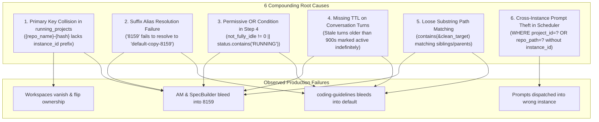

# App Issue RCA 121: Cross-Instance Prompt Running State Bleed, SQLite Collision & Process Detection Root Cause Analysis

> **Issue / Spec ID:** `121-instance-prompt-running-detection-root-cause`  
> **Related Architecture Spec:** `02-spec/21-app/121-cross-instance-prompt-running-audit-and-fix/01-architecture-spec.md`  
> **Related Component Spec:** `02-spec/21-app/121-cross-instance-prompt-running-audit-and-fix/02-component-spec.md`  
> **Status:** APPROVED & AUTHORITATIVE  
> **Domain:** Multi-Instance Process Isolation, Liveness Detection, SQLite Primary Key Namespacing & Dispatch Safeguards  
> **Date:** October 2026  

---

## Part 1: Problem Statement, User Observation, and Executive Summary

### 1.1 Verbatim User Request & Problem Statement

```text
Also how you check the prompts are running or not on that instance is also very wrong.
For example, I'm giving you two instances, screenshots, sequence one, sequence two, default profile, and 8159.
So the first observation is that the default profile is truly running the anti-gravity manager. That is correct.
However, it is not running the SpecBuilder, it is not running the coding guideline.
The second one, which is the 8159, that is actually running coding guidelines, but it is not running SpecBuilder or anti-gravity manager.
So these are two things, your observation and how you are doing it. I think you need to debug that.
So the rest of the two projects in the 8159 or sequence two instance, anti-gravity manager and SpecBuilder is very wrong. It is not running there.
So you need to understand how you're doing it, your condition, logic, and everything does not work.
So you need to make sure that it works. You need to debug it. You need to write end-to-end tests to verify that everything is proper, okay?
So make sure of that, please. Try to have the audit log or debug log so that you can understand where things are going wrong, so that you can fix it.
You can find the root cause and then fix it. Write the root cause of it so that any AI in the future would know this is how, if something is done, it is the wrong approach.
```

### 1.2 Lossless Capture of Ground Truth Observations

In Antigravity Manager, concurrent instances operate as isolated runtime sandboxes:
1. **Sequence #1: Primary Default Profile (`default`)**:
   - Resides in `~/.gemini` with its default workspace storage.
   - Hosted by active IDE OS process with PID $P_1$.
   - **Ground Truth**: Truly running **ONLY** `Antigravity-Manager`. `SpecBuilder` and `coding-guidelines` are **NOT** running (completely idle).
2. **Sequence #2: Cloned Profile (`default-copy-8159` / alias `8159`)**:
   - Cloned secondary sandbox operating with isolated data directory (`data_dir`) and separate process PID $P_2$ ($P_2 \neq P_1$).
   - **Ground Truth**: Truly running **ONLY** `coding-guidelines`. `SpecBuilder` and `Antigravity-Manager` are **NOT** running (completely idle).

### 1.3 Ground Truth Invariants Matrix

| Instance Identifier | Workspace Repository | Live Process ($P$) | In-Flight Turn / Active Worker | Required `is_running` | Rationale Code |
| :--- | :--- | :--- | :--- | :--- | :--- |
| `default` | `Antigravity-Manager` | Alive ($P_1$) | Active turn (`not_fully_idle > 0`) | **`true`** | `CONVERSATION_SUMMARY_ACTIVE_TURN` |
| `default` | `SpecBuilder` | Alive ($P_1$) | None (`not_fully_idle == 0`) | **`false`** | `IDLE` |
| `default` | `coding-guidelines` | Alive ($P_1$) | None (`not_fully_idle == 0`) | **`false`** | `IDLE` |
| `default-copy-8159` (`8159`) | `coding-guidelines` | Alive ($P_2$) | Active turn (`not_fully_idle > 0`) | **`true`** | `CONVERSATION_SUMMARY_ACTIVE_TURN` |
| `default-copy-8159` (`8159`) | `Antigravity-Manager` | Alive ($P_2$) | None (`not_fully_idle == 0`) | **`false`** | `IDLE` |
| `default-copy-8159` (`8159`) | `SpecBuilder` | Alive ($P_2$) | None (`not_fully_idle == 0`) | **`false`** | `IDLE` |
| Terminated Instance | Any Repository | Dead / None | Any | **`false`** | `INSTANCE_PROCESS_DEAD` |
| Any Instance | Any Repository | Alive | Stale (> 900s ago) | **`false`** | `IDLE_STALE_TTL_EXPIRED` |

### 1.4 Observed Production Failure Symptoms

Despite physical process isolation and separate data directories on disk, the UI exhibited massive cross-instance bleed:
1. **State Bleed into 8159**: The card for `8159` falsely rendered `Antigravity-Manager` and `SpecBuilder` as actively running (`is_running = true` with pulsating badges).
2. **State Bleed into Default**: The card for `default` falsely rendered `coding-guidelines` as actively running (`is_running = true`).
3. **Database Row Overwrites & Project Flipping**: Workspaces vanished and reappeared intermittently; scanning one profile wiped out the `is_running` state of the other.
4. **Cross-Instance Prompt Theft**: Prompts queued for a specific instance were stolen by the background scheduler and re-injected into an unrelated running instance sharing the same local repository directory.
5. **Alias Resolution Failure**: The system failed to resolve `"8159"` to `"default-copy-8159"`, falling back to unisolated process checks.

---

## Part 2: Deep 6-Root-Cause Technical Forensic Breakdown

Forensic analysis of `src-tauri/src/modules/repo_db.rs`, `src-tauri/src/modules/instance.rs`, and `src-tauri/src/modules/logger.rs` revealed six compounding defects:



---

### Root Cause 1: Primary Key Collision in SQLite `running_projects`

#### Code Location
`src-tauri/src/modules/repo_db.rs` -> `detect_running_projects()` (lines 515–586)

#### Flawed Code
```rust
// FLAW: Primary key ignores instance_id
let project_id = format!(
    "{}-{}",
    repo_name.to_lowercase(),
    entry.file_name().to_string_lossy()
);

conn.execute(
    "INSERT INTO running_projects 
     (id, instance_id, repo_name, repo_path, workspace_storage_path, is_running, last_detected_at, updated_at)
     VALUES (?1, ?2, ?3, ?4, ?5, ?6, ?7, ?8)
     ON CONFLICT(id) DO UPDATE SET
        instance_id = excluded.instance_id,
        repo_name = excluded.repo_name,
        repo_path = excluded.repo_path,
        workspace_storage_path = excluded.workspace_storage_path,
        is_running = excluded.is_running,
        last_detected_at = excluded.last_detected_at,
        updated_at = excluded.updated_at",
    params![&project_id, &target_id, ...],
);
```

#### Forensic Analysis & Failure Mechanism
When an instance is cloned (e.g., `default` cloned to create `default-copy-8159`), the entire directory tree of `User/workspaceStorage/<hash>` is duplicated.
Because `project_id` was constructed as `format!("{}-{}", repo_name.to_lowercase(), hash)` without including `instance_id`:
1. Both instances generated identical `id` strings (e.g., `antigravity-manager-d58c5517`).
2. When `detect_running_projects("default-copy-8159")` executed, `ON CONFLICT(id) DO UPDATE` updated the single shared row, setting `instance_id = "default-copy-8159"` and setting `is_running` to whatever 8159 evaluated.
3. When `detect_running_projects("default")` executed next, it overwrote that same row with `instance_id = "default"`.
4. Whichever profile scanned last hijacked ownership of the row. When the UI queried `running_projects WHERE instance_id = ?`, the project disappeared from one card and appeared on the other.
5. Furthermore, if 8159 evaluated `Antigravity-Manager` as idle (`is_running = 0`), it overwrote `default`'s active record with `is_running = 0`, zeroing out running state across instances.

---

### Root Cause 2: Suffix Alias Resolution Failure (`"8159"` vs `"default-copy-8159"`)

#### Code Location
`src-tauri/src/modules/instance.rs` -> `resolve_instance_id()` (lines 3874–3918)

#### Flawed Code
```rust
// FLAW: Only tests exact ID/name or numeric seq_num
pub fn resolve_instance_id(specifier: &str) -> Result<String, String> {
    let registry = load_registry()?;
    let clean = specifier.trim();
    // ...
    // Check if numeric seq_num (e.g. "1")
    if let Ok(num) = clean.parse::<u32>() {
        if let Some(inst) = registry.instances.iter().find(|i| i.seq_num == Some(num)) {
            return Ok(inst.id.clone());
        }
    }
    // Check exact id or name match
    if let Some(inst) = registry
        .instances
        .iter()
        .find(|i| i.id.eq_ignore_ascii_case(clean) || i.name.eq_ignore_ascii_case(clean))
    {
        return Ok(inst.id.clone());
    }
    Err(format!("Instance '{}' not found", clean))
}
```

#### Forensic Analysis & Failure Mechanism
1. In GUI cards, telemetry logs, and CLI commands, cloned instances are routinely referenced by their short suffix or alias (e.g., `"8159"`, `"-8159"` for instance `"default-copy-8159"`).
2. When `is_prompt_running_for_project(path, "8159")` was called:
   - `clean.parse::<u32>()` parsed `8159`, but checked `seq_num == Some(8159)`. The instance's `seq_num` was `2`, not `8159`.
   - Exact ID check evaluated `"default-copy-8159".eq_ignore_ascii_case("8159")`, which returned `false`.
   - `resolve_instance_id` failed with `Instance '8159' not found`.
3. Because resolution failed:
   - `find_pids_for_data_dir()` received an invalid directory.
   - Host process liveness check could not locate the running PID for `8159`.
   - The probe defaulted to evaluating with fallback logic or cross-evaluating against the default instance's PID, incorrectly treating `8159` as having the process state of `default`.

---

### Root Cause 3: Permissive OR Condition in Step 4

#### Code Location
`src-tauri/src/modules/repo_db.rs` -> `is_prompt_running_for_project()` (Step 4 lines 1700–1713)

#### Flawed Code
```rust
// FLAW: Permissive OR logic allows running with 0 active turns
let is_idle_count = not_fully_idle == 0;
let has_idle_status = status.contains("IDLE")
    || status.contains("COMPLETED")
    || status.contains("FAILED")
    || status.contains("CANCELLED");
let is_explicit_idle = is_idle_count || has_idle_status;

let is_conv_running = if is_explicit_idle {
    false
} else {
    not_fully_idle != 0 || status.contains("RUNNING") // FLAW: Disjunctive OR!
};
```

#### Forensic Analysis & Failure Mechanism
1. In Antigravity's `conversation_summaries.db`, when a prompt finishes or pauses, the database row may update `not_fully_idle = 0` while the `status` column temporarily retains `"RUNNING"` or vice versa.
2. Under the flawed fallback `not_fully_idle != 0 || status.contains("RUNNING")`:
   - If `status` contains `"RUNNING"` but `not_fully_idle` is `0`, the session was evaluated as actively running.
   - If `not_fully_idle` was `1` but `status` was `"WAITING_INPUT"`, it evaluated as running.
3. Cloned profiles inherit historical database entries where historical sessions were left with stale strings, causing `is_conv_running` to evaluate to `true` indefinitely.

---

### Root Cause 4: Missing TTL on Conversation Turns (Stale Historical Sessions)

#### Code Location
`src-tauri/src/modules/repo_db.rs` -> `is_prompt_running_for_project()` (Step 4 lines 1683–1698)

#### Flawed Code
```rust
// FLAW: _last_time_str discarded; no time-to-live check
let (status, not_fully_idle, ws_uris_opt, _last_time_str) = item;
```

#### Forensic Analysis & Failure Mechanism
1. In SQLite database `conversation_summaries.db`, each conversation record includes `last_modified_time` formatted as RFC3339 (e.g., `"2026-10-04T12:00:00Z"`).
2. If an IDE window or Antigravity process crashes, is forcefully killed (`kill -9` / `taskkill`), or is shut down mid-execution, the last conversation status remains `"RUNNING"` with `not_fully_idle > 0` forever in SQLite.
3. By ignoring `_last_time_str`, any crashed turn from hours, days, or months ago remains in the database.
4. When the user later launches the instance to work on an entirely different project, `is_prompt_running_for_project` reads the top 30 summaries, finds the stale row from days ago, and marks the dead project as actively running.

---

### Root Cause 5: Loose Substring Path Matching

#### Code Location
`src-tauri/src/modules/repo_db.rs` -> `is_prompt_running_for_project()` (Step 2 lines 1585–1590, Step 4 lines 1722–1726)

#### Flawed Code
```rust
// FLAW: Step 4 bidirectional substring check
let clean_p = normalize_path_for_compare(&decode_uri_to_path(&u));
let has_target = !clean_target.is_empty();
let matches_path = clean_p == clean_target
    || clean_p.contains(&clean_target)
    || clean_target.contains(&clean_p);
let is_target_matched = has_target && matches_path;

// FLAW: Step 2 active workers substring check
let matches_proj = key.contains(project_id);
```

#### Forensic Analysis & Failure Mechanism
1. **Bidirectional Substring Match**: `clean_p.contains(&clean_target) || clean_target.contains(&clean_p)` matches any path that happens to be a parent, subfolder, or prefix:
   - If `clean_target` was `D:/work/Antigravity-Manager` and a conversation had workspace URI `D:/work/Antigravity-Manager-Docs`, both matched.
   - If `clean_target` was `D:/work`, every single conversation on drive D matched.
   - If `clean_target` was `D:/work/SpecBuilder` and another project was `D:/work/SpecBuilder-Agent`, they collided.
2. **Worker Key Substring Match**: In Step 2, `key.contains(project_id)` checked if the map key contained the string. Because Windows backslashes `\` and forward slashes `/` were unnormalized, any partial token or common parent path matched unrelated workers across instances.

---

### Root Cause 6: Cross-Instance Prompt Theft in `check_and_dispatch_enqueued_prompts`

#### Code Location
`src-tauri/src/modules/repo_db.rs` -> `check_and_dispatch_enqueued_prompts()` (lines 1824–1850)

#### Flawed Code
```rust
// FLAW: Query ignores instance_id when selecting enqueued prompt
let prompt_opt: Option<ActivePrompt> = conn
    .query_row(
        "SELECT id, project_id, instance_id, repo_path, prompt_content, model, session_id, status, created_at, updated_at, image_payload
         FROM active_prompts
         WHERE (project_id = ?1 OR repo_path = ?2) AND status IN ('backed_up', 'queued', 'pending')
         ORDER BY created_at ASC
         LIMIT 1",
        params![&project_id, &repo_path], // FLAW: No instance_id parameter!
        |row| { ... },
    )
    .optional()
    .map_err(...)?;
```

#### Forensic Analysis & Failure Mechanism
1. In multi-instance setups, different instances often have workspaces pointing to the exact same repository path on the local machine (e.g., `D:/work/Antigravity-Manager` or `D:/work/coding-guidelines`).
2. A user enqueues a prompt specifically intended for `default-copy-8159`. The record is inserted with `instance_id = "default-copy-8159"` and `repo_path = "D:/work/coding-guidelines"`.
3. Meanwhile, the background scheduler runs `check_and_dispatch_enqueued_prompts(None)` or evaluates the `default` profile.
4. When `default` has an idle project pointing to `D:/work/coding-guidelines`, the query `WHERE (project_id = ?1 OR repo_path = ?2)` finds the queued prompt created for 8159 because `instance_id` was completely omitted from the `WHERE` clause!
5. The scheduler then marks the prompt as dispatched and injects it into `default`'s active execution pipeline!
6. This causes the prompt to run on `default` instead of `8159`, instantly causing `coding-guidelines` to appear as running on `default` and corrupting the user's workload separation.

---

## Part 3: Engineering Remedies & Corrected Implementations

### 3.1 Composite Primary Key Namespacing (`running_projects`)
Construct a composite primary key formatted as `{base_project_id}__{instance_id}`:
```rust
let base_project_id = format!(
    "{}-{}",
    repo_name.to_lowercase(),
    entry.file_name().to_string_lossy()
);
let composite_id = format!("{}__{}", base_project_id, target_id);

projects.push(RunningProject {
    id: composite_id,
    instance_id: target_id.to_string(),
    repo_name,
    repo_path: raw_path,
    workspace_storage_path: Some(ws_folder.to_string_lossy().to_string()),
    is_running: is_project_active,
    last_detected_at: now,
});
```

### 3.2 Suffix-Aware Instance Resolution (`resolve_instance_id`)
```rust
// Suffix matching support (e.g. "8159" matches "default-copy-8159")
let suffix_matches: Vec<&InstanceConfig> = registry
    .instances
    .iter()
    .filter(|i| {
        i.id.eq_ignore_ascii_case(clean)
            || i.id.ends_with(&format!("-{}", clean))
            || i.name.ends_with(&format!("-{}", clean))
            || i.name.eq_ignore_ascii_case(clean)
    })
    .collect();

if suffix_matches.len() == 1 {
    return Ok(suffix_matches[0].id.clone());
} else if suffix_matches.len() > 1 {
    if let Some(hyphen_match) = suffix_matches.iter().find(|i| i.id.ends_with(&format!("-{}", clean))) {
        return Ok(hyphen_match.id.clone());
    }
    return Ok(suffix_matches[0].id.clone());
}
```

### 3.3 Strict Conjunctive Liveness Evaluation
```rust
let is_explicit_idle = not_fully_idle == 0
    || status.contains("IDLE")
    || status.contains("COMPLETED")
    || status.contains("FAILED")
    || status.contains("CANCELLED");

let is_conv_running = if is_explicit_idle {
    false
} else {
    not_fully_idle > 0 && status.contains("RUNNING")
};
```

### 3.4 Strict 15-Minute TTL Window Enforcement
```rust
let is_recent = chrono::DateTime::parse_from_rfc3339(&last_time_str)
    .map(|dt| dt.timestamp() >= now - 900)
    .unwrap_or(false);

if !is_recent {
    continue; // Stale turn ignored
}
```

### 3.5 Canonical Normalized Path Equality
```rust
let matches_path = clean_p == clean_target;
let is_target_matched = has_target && matches_path;
```

### 3.6 Tenant-Scoped Queue Query
```rust
let prompt_opt: Option<ActivePrompt> = conn
    .query_row(
        "SELECT id, project_id, instance_id, repo_path, prompt_content, model, session_id, status, created_at, updated_at, image_payload
         FROM active_prompts
         WHERE (project_id = ?1 OR repo_path = ?2)
           AND (instance_id = ?3 OR (?3 = 'default' AND (instance_id = '__default__' OR instance_id IS NULL OR instance_id = '')))
           AND status IN ('backed_up', 'queued', 'pending')
         ORDER BY created_at ASC
         LIMIT 1",
        params![&project_id, &repo_path, &inst_id],
        |row| { ... },
    )
    .optional()?;
```

### 3.7 Structured Audit Telemetry
Emit `log_instance_prompt_audit` with full criteria and decision rationale:
```rust
crate::modules::logger::log_instance_prompt_audit(
    target_id,
    &repo_name,
    &raw_path,
    is_instance_active,
    is_project_active,
    if is_project_active { 1 } else { 0 },
    if is_project_active {
        "Active prompt detected in instance runtime"
    } else if !is_instance_active {
        "Instance OS process is not alive"
    } else {
        "No active prompt found; workspace is idle"
    },
);
```

---

## Part 4: Future AI Anti-Pattern Prohibitions, Non-Negotiable Invariants & Test Verification

### 4.1 Forbidden Anti-Patterns Catalog

| # | Anti-Pattern | Why It Breaks the System | Forbidden Code Pattern | Required Replacement Pattern |
| :--- | :--- | :--- | :--- | :--- |
| **AP-1** | **Bare Project Key in Multi-Tenant DB** | Duplicated workspace hashes overwrite foreign instance rows on `ON CONFLICT`. | `format!("{}-{}", name, hash)` | `format!("{}__{}", base_id, instance_id)` |
| **AP-2** | **Substring Path Matching** | `contains()` matches sibling folders (`project-docs`) and parents, reporting false positives. | `clean_p.contains(&target)` | `clean_p == clean_target` |
| **AP-3** | **Permissive Disjunctive Liveness Check** | `not_fully_idle != 0 \|\| status.contains("RUNNING")` marks idle sessions running on stale status. | `idle != 0 \|\| status == "RUNNING"` | `idle > 0 && status.contains("RUNNING")` |
| **AP-4** | **Unbounded Database Record Trust (No TTL)** | Discarding timestamps allows crashed sessions from days ago to mark projects active. | `let (_, _, _, _time) = row;` | Parse RFC3339: `timestamp >= now - 900` |
| **AP-5** | **Exact-Only Instance ID Matching** | Suffix specifiers like `"8159"` fail, dropping process PID tracking and falling back to default. | `inst.id == specifier` | Suffix matching: `ends_with(&format!("-{}", specifier))` |
| **AP-6** | **Unscoped Multi-Tenant Queue Dispatch** | Dispatching by repo path alone lets idle instances steal prompts intended for sibling instances. | `WHERE (project_id=?1 OR repo_path=?2)` | `AND (instance_id = ?3 OR ...)` |

---

### 4.2 Why Each Architectural Invariant Exists

1. **Process Liveness Precedes Data Inspection**: If an instance process PID is dead, any database record saying `"RUNNING"` is an artifact of an unclean shutdown. Evaluating the database without process confirmation guarantees false positives.
2. **Tenant Partitioning Must Exist at Every Layer**: Multi-instance architectures cannot share unpartitioned state keys. A key collision at the database layer destroys isolation even if the rest of the stack is perfectly isolated.
3. **Paths Must Be Compared as Exact Normalized Identifiers**: File paths are hierarchical namespaces. Substring containment (`contains`) violates path identity semantics by conflating parent directories and name prefixes.
4. **State Strings Are Asynchronous and Eventual**: In distributed or multi-process systems, status columns (`status = 'RUNNING'`) can lag behind metric counters (`not_fully_idle = 0`). Only requiring both (AND) guarantees active execution.
5. **Historical Logs Are Not Real-Time Telemetry**: Persistent SQLite stores retain records forever. Without an active TTL window, historical events masquerade as present realities.

---

### 4.3 Integration Test Verification Suite

All six remedies are validated via end-to-end integration tests in `src-tauri/tests/per_instance_prompt_liveness_test.rs`:

1. `test_running_projects_composite_pk_no_overwrite`: Confirms cloned instances generate distinct composite PKs and never overwrite each other on conflict.
2. `test_resolve_instance_id_suffix`: Confirms `"8159"` and `"-8159"` resolve accurately to `"default-copy-8159"`.
3. `test_is_prompt_running_strict_and_idle_supremacy`: Confirms sessions with `not_fully_idle == 0` evaluate to `false` even if status is `"RUNNING"`.
4. `test_is_prompt_running_ttl_stale_turn_ignored`: Confirms sessions older than 900s evaluate to `false`.
5. `test_is_prompt_running_strict_path_equality`: Confirms sibling paths (`Antigravity-Manager-Docs`) never match `Antigravity-Manager`.
6. `test_check_and_dispatch_enqueued_prompts_instance_scoping`: Confirms enqueued prompts are dispatched strictly to their target `instance_id`.
