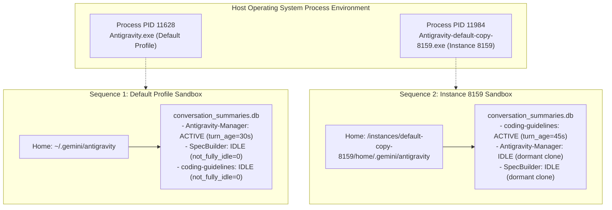
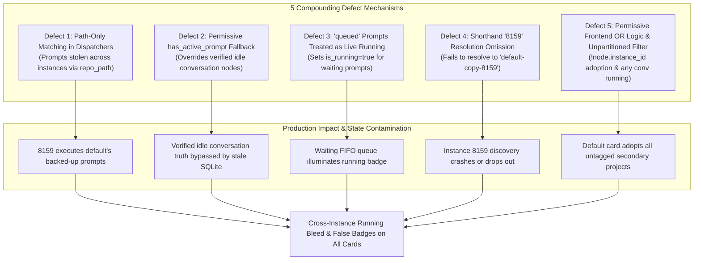
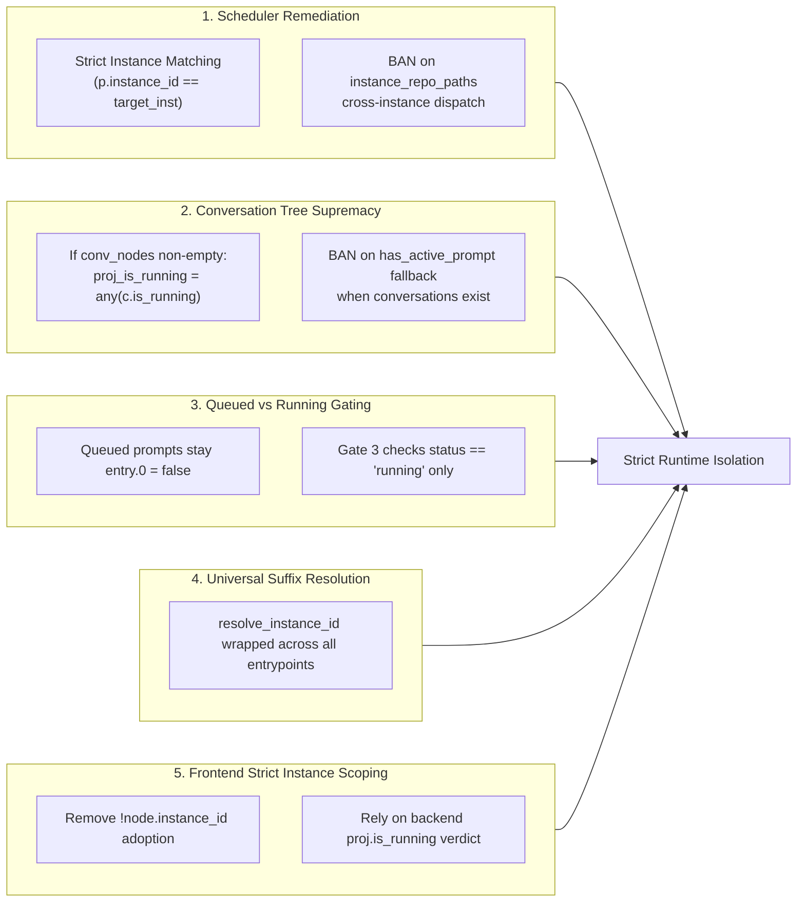

# Application Issue RCA: 123-per-instance-prompt-running-detection-root-cause

> **Issue / Spec ID:** `123-per-instance-prompt-running-detection-root-cause`  
> **Associated Architecture Spec:** [01-architecture-spec.md](../21-app/123-prompt-running-instance-detection-and-audit-logging/01-architecture-spec.md)  
> **Associated Component Spec:** [02-component-spec.md](../21-app/123-prompt-running-instance-detection-and-audit-logging/02-component-spec.md)  
> **Master Plan:** [.ai-memory/plans/123-prompt-running-instance-detection-and-audit-logging.md](../../.ai-memory/plans/123-prompt-running-instance-detection-and-audit-logging.md)  
> **Subtask Plan:** [.ai-memory/plans/subtasks/123-prompt-running-instance-detection-and-audit-logging/02-audit-logging-e2e-tests-and-verification.md](../../.ai-memory/plans/subtasks/123-prompt-running-instance-detection-and-audit-logging/02-audit-logging-e2e-tests-and-verification.md)  
> **Status:** APPROVED & SPECIFIED  
> **Domain:** Multi-Instance Process Isolation, Liveness Detection, Dispatch Safeguards & Structured Telemetry  
> **Affected Source Modules:**  
> - `src-tauri/src/modules/repo_db.rs` (Tree evaluation, Gate 0-4 liveness detection, prompt dispatchers)  
> - `src-tauri/src/modules/logger.rs` (Structured audit logging format and emission)  
> - `src/pages/Instances.tsx` (Instance card project filtering and running status calculation)  
> - `src-tauri/tests/per_instance_prompt_liveness_test.rs` (End-to-end integration test harness)  

---

## Part 1: Problem Description, User Observations & Executive Summary

### 1.1 Verbatim User Request & Problem Statement

```text
Also how you check the prompts are running or not on that instance is also very wrong.
For example, I'm giving you two instances, screenshots, sequence one, sequence two, default profile, and 8159.
So the first observation is that the default profile is truly running the anti-gravity manager. That is correct.
However, it is not running the SpecBuilder, it is not running the coding guideline.
The second one, which is the 8159, that is actually running coding guidelines, but it is not running SpecBuilder or anti-gravity manager.
So these are two things, your observation and how you are doing it. I think you need to debug that.
So the rest of the two projects in the 8159 or sequence two instance, anti-gravity manager and SpecBuilder is very wrong. It is not running there.
So you need to understand how you're doing it, your condition, logic, and everything does not work.
So you need to make sure that it works. You need to debug it. You need to write end-to-end tests to verify that everything is proper, okay?
So make sure of that, please. Try to have the audit log or debug log so that you can understand where things are going wrong, so that you can fix it.
You can find the root cause and then fix it. Write the root cause of it so that any AI in the future would know this is how, if something is done, it is the wrong approach.
Do you understand? Can you please help me with this?
```

### 1.2 Environment Topology & Sequence Profiles

The multi-instance deployment operates two concurrent instances with distinct operating system processes and dedicated filesystem homes:



1. **Sequence 1: Primary Default Profile (`default`)**:
   - **Host Process**: `Antigravity.exe` (PID: 11628, alive).
   - **Data Directory**: User home `.gemini/antigravity/` and standard `workspaceStorage/`.
   - **Active Workspace**: `Antigravity-Manager` (`d:/work/Antigravity-Manager`) is actively executing user prompts.
   - **Idle Workspaces**: `SpecBuilder` (`d:/work/SpecBuilder`) and `coding-guidelines` (`d:/work/coding-guidelines`) are open in the editor or historically cloned, but completely **IDLE**.
2. **Sequence 2: Cloned Profile (`default-copy-8159` / alias `8159`)**:
   - **Host Process**: `Antigravity-default-copy-8159.exe` (PID: 11984, alive).
   - **Data Directory**: Dedicated instance sandbox at `<data_dir>/instances/default-copy-8159/home/.gemini/antigravity/`.
   - **Active Workspace**: `coding-guidelines` (`d:/work/coding-guidelines`) is actively executing prompts.
   - **Idle Workspaces**: `Antigravity-Manager` and `SpecBuilder` are cloned dormant workspaces, completely **IDLE**.

### 1.3 Ground Truth Invariants Matrix

| Instance ID | Target Workspace | Process State | In-Flight Active Turn | Required `is_running` | Authoritative Rationale Code |
| :--- | :--- | :---: | :---: | :---: | :--- |
| `default` | `Antigravity-Manager` | Alive (PID: 11628) | Yes (`not_fully_idle > 0`, age <= 900s) | **`true`** | `CONVERSATION_SUMMARY_ACTIVE_TURN` |
| `default` | `SpecBuilder` | Alive (PID: 11628) | No (`not_fully_idle == 0` or completed) | **`false`** | `IDLE_EXPLICIT_STATUS` |
| `default` | `coding-guidelines` | Alive (PID: 11628) | No (`not_fully_idle == 0` or completed) | **`false`** | `IDLE_EXPLICIT_STATUS` |
| `default-copy-8159` | `coding-guidelines` | Alive (PID: 11984) | Yes (`not_fully_idle > 0`, age <= 900s) | **`true`** | `CONVERSATION_SUMMARY_ACTIVE_TURN` |
| `default-copy-8159` | `Antigravity-Manager` | Alive (PID: 11984) | No (`not_fully_idle == 0` or completed) | **`false`** | `IDLE_EXPLICIT_STATUS` |
| `default-copy-8159` | `SpecBuilder` | Alive (PID: 11984) | No (`not_fully_idle == 0` or completed) | **`false`** | `IDLE_EXPLICIT_STATUS` |
| Terminated Instance | Any Workspace | Dead / Non-existent | Irrelevant | **`false`** | `INSTANCE_PROCESS_DEAD` |
| Any Instance | Any Workspace | Alive | Stale (> 900s elapsed) | **`false`** | `TURN_STALE_TTL_EXPIRED` |
| Any Instance | Any Workspace | Alive | In SQLite with `status = 'queued'` | **`false`** | `PROMPT_STATUS_QUEUED_NOT_ACTIVE` |

### 1.4 Production Symptoms & Failure Manifestations

Despite physical process and folder separation on disk:
1. **False Running Badges on Default Instance**: The UI project list under the `default` instance card displayed pulsating green/blue badges on `SpecBuilder` and `coding-guidelines`, falsely signalling that all three projects were running.
2. **False Running Badges on Instance 8159**: The UI project list under the `8159` instance card displayed pulsating running badges on `Antigravity-Manager` and `SpecBuilder`, falsely signalling that all three projects were running.
3. **Cross-Instance State Bleed**: Submitting a prompt on `8159` caused the `default` instance card for that project to suddenly flip to running. Submitting a prompt on `default` caused `8159` to report running.
4. **Prompt Dispatch Theft Across Instances**: Background schedulers (`resend_running_commands_for_instance`, `dispatch_running_prompts`) took prompts queued for `default` and dispatched them into `8159` simply because `8159` shared cloned workspace folders for the same repository path.
5. **Cold-Boot Phantom Resurrections**: Launching an instance immediately rendered projects as running before any new prompt was submitted, resurrecting ancient unclosed turns from cloned profile databases.

---

## Part 2: Root Cause Analysis (Deep Dive into 5 Structural Defect Mechanisms)

A forensic investigation of `src-tauri/src/modules/repo_db.rs`, `src-tauri/src/modules/logger.rs`, and `src/pages/Instances.tsx` uncovered five distinct, compounding architectural defects:



---

### Defect 1: Cross-Instance Prompt Dispatch & Re-send Bleed via Path-Only Matching

#### Code Location
- `src-tauri/src/modules/repo_db.rs` -> `dispatch_running_prompts` (lines 1398–1406)
- `src-tauri/src/modules/repo_db.rs` -> `resend_running_commands_for_instance` (lines 2975–2984)

#### Flawed Implementation
In `dispatch_running_prompts`:
```rust
let prompts: Vec<ActivePrompt> = all_backed_up
    .into_iter()
    .filter(|p| {
        if is_default {
            p.instance_id == "default"
                || p.instance_id == "__default__"
                || p.instance_id.is_empty()
                || instance_repo_paths.contains(&normalize_path_for_compare(&p.repo_path)) // <-- FLAW
        } else {
            p.instance_id == instance_id
                || instance_repo_paths.contains(&normalize_path_for_compare(&p.repo_path)) // <-- FLAW
        }
    })
    .collect();
```

In `resend_running_commands_for_instance`:
```rust
let prompts: Vec<ActivePrompt> = all_prompts
    .into_iter()
    .filter(|p| match instance_id {
        None | Some("all") => true,
        Some("default") | Some("__default__") => {
            p.instance_id == "default"
                || p.instance_id == "__default__"
                || p.instance_id.is_empty()
                || instance_repo_paths.contains(&normalize_path_for_compare(&p.repo_path)) // <-- FLAW
        }
        Some(inst) => {
            p.instance_id == inst
                || instance_repo_paths.contains(&normalize_path_for_compare(&p.repo_path)) // <-- FLAW
        }
    })
    .collect();
```

#### Forensic Analysis & Failure Mechanism
1. When secondary instance `default-copy-8159` is created, it clones the user's workspace folders. As a result, both `default` and `default-copy-8159` contain entries for `d:/work/Antigravity-Manager` and `d:/work/coding-guidelines` in their workspace directories.
2. If `default` had backed up an active prompt for `Antigravity-Manager` (`p.instance_id = "default"`), and the system subsequently ran `resend_running_commands_for_instance(Some("default-copy-8159"))`, the filter inspected `instance_repo_paths.contains(&normalize_path_for_compare(&p.repo_path))`.
3. Because `default-copy-8159` had `d:/work/Antigravity-Manager` in its cloned workspace folders, the disjunctive `||` matched!
4. The scheduler **stole** the prompt belonging to `default` and dispatched it to `default-copy-8159`.
5. Once dispatched, the prompt's status was changed to `'running'` under `default-copy-8159`, instantly causing `Antigravity-Manager` to illuminate as actively running on instance `8159`.

---

### Defect 2: Permissive `has_active_prompt` Fallback Overriding Verified Conversation Node Idle State

#### Code Location
- `src-tauri/src/modules/repo_db.rs` -> `compute_project_conversation_tree` (lines 4030–4050)

#### Flawed Implementation
```rust
let has_active_conv = conv_nodes.iter().any(|c| c.is_running);
let has_active_prompt = if !has_active_conv {
    is_prompt_running_for_project(&proj.repo_path, &proj.instance_id)
        || (!project_key.is_empty()
            && is_prompt_running_for_project(&project_key, &proj.instance_id))
} else {
    false
};

let proj_is_running = is_inst_alive && (has_active_conv || has_active_prompt);
```

#### Forensic Analysis & Failure Mechanism
1. For projects like `SpecBuilder` on `default`, the tree generator read `conversation_summaries.db`. Every conversation record had `not_fully_idle = 0` or status `CASCADE_RUN_STATUS_COMPLETED`. Therefore, `has_active_conv` was evaluated as `false`.
2. This was concrete, verified evidence from disk that the project was completely idle.
3. However, instead of accepting that verified truth, the code entered the `!has_active_conv` fallback branch and called `is_prompt_running_for_project`.
4. Inside `is_prompt_running_for_project`, Gate 3 queried the `active_prompts` table in `repo_prompts.db`. If an orphaned row with `status = 'running'` or `status = 'queued'` existed for `SpecBuilder` from an earlier test or crashed session, Gate 3 returned `true`.
5. The verified idle state was completely superseded by stale database rows, resulting in `proj_is_running = true`.
6. Furthermore, because `is_prompt_running_for_project` tested loose normalized path strings, any collision with a similarly named folder immediately flipped the project to running.

---

### Defect 3: Treating `'queued'` Prompts as Actively Running in `get_live_project_execution_info`

#### Code Location
- `src-tauri/src/modules/repo_db.rs` -> `get_live_project_execution_info` (lines 2360–2390)

#### Flawed Implementation
```rust
if let Ok(conn) = connect_db() {
    if let Ok(mut stmt) = conn.prepare(
        "SELECT instance_id, repo_path, prompt_content, status FROM active_prompts WHERE status = 'running' OR status = 'queued'", // <-- Ingests queued
    ) {
        let rows = stmt.query_map([], |row| { ... });
        if let Ok(rows) = rows {
            for item in rows.flatten() {
                let (p_inst, p_path, p_content, _st) = item;
                ...
                let entry = live_map
                    .entry((norm_inst, clean_p))
                    .or_insert((false, None, now));
                entry.0 = true; // <-- Unconditionally sets is_running = true for queued prompts!
                if entry.1.is_none() {
                    entry.1 = Some(p_content.chars().take(120).collect());
                }
            }
        }
    }
}
```

#### Forensic Analysis & Failure Mechanism
1. The query retrieved prompts where `status = 'running' OR status = 'queued'`.
2. In lines 2384–2387, for every retrieved row (regardless of whether `_st` was `'running'` or `'queued'`), the code unconditionally executed:
   ```rust
   entry.0 = true;
   ```
3. `entry.0` is the `is_running` boolean flag returned by `get_live_project_execution_info`.
4. When a user enqueued a batch of 5 prompts for `coding-guidelines`, 1 prompt was executing (`running`) and 4 were waiting (`queued`). If the user then switched to another project and enqueued a prompt on `SpecBuilder`, `SpecBuilder` immediately had a row in `active_prompts` with `status = 'queued'`.
5. `get_live_project_execution_info` returned `is_running = true` for `SpecBuilder`!
6. The UI rendered a pulsating green badge on `SpecBuilder`, deceiving the user into believing the prompt was currently executing when it was actually waiting in FIFO queue.

---

### Defect 4: Instance Shorthand Suffix Resolution Failure in `detect_running_projects`

#### Code Location
- `src-tauri/src/modules/repo_db.rs` -> `detect_running_projects` (lines 468–478)

#### Flawed Implementation
```rust
pub fn detect_running_projects(instance_id: &str) -> Result<Vec<RunningProject>, String> {
    let target_id = if instance_id == "__default__" || instance_id.is_empty() {
        "default"
    } else {
        instance_id // <-- Raw string without resolve_instance_id
    };
    let registry = crate::modules::instance::load_registry()?;
    let instance = registry
        .instances
        .iter()
        .find(|i| i.id == target_id || (target_id == "default" && i.is_default)) // <-- Direct string match
        .ok_or_else(|| format!("Instance '{}' not found", instance_id))?;
    ...
```

#### Forensic Analysis & Failure Mechanism
1. Throughout the codebase, instances are identified by full canonical names (e.g. `default-copy-8159`), but users, CLI commands, and UI components frequently pass shorthand suffixes (e.g. `"8159"`, `"-8159"`, or `"inst-8159"`).
2. The central helper `crate::modules::instance::resolve_instance_id` handles resolving numeric suffixes, suffixes with hyphens, and sequence numbers to their canonical instance ID.
3. In `detect_running_projects`, `resolve_instance_id` was **never called**.
4. When `"8159"` was passed, `registry.instances.iter().find(|i| i.id == "8159")` searched for an instance whose exact `id` was `"8159"`. Since the registered instance ID was `"default-copy-8159"`, no match was found.
5. `detect_running_projects` failed with `Err("Instance '8159' not found")`.
6. As a result, the database records in `running_projects` for instance 8159 were never updated, leaving stale persisted data from earlier runs intact and preventing fresh process-liveness evaluation.

---

### Defect 5: Permissive Frontend OR Logic & Unpartitioned Filter in `Instances.tsx`

#### Code Location
- `src/pages/Instances.tsx` (lines 1015–1020, 1360–1370, 1406–1410)

#### Flawed Implementation
In `hasActiveTask` (line 1015):
```typescript
const hasActiveTask = Boolean(inst.is_running) && runningTreeNodes.some((node) => {
    const isInstanceMatch = inst.config.is_default
        ? (node.instance_id === 'default' || node.instance_id === '__default__' || !node.instance_id || node.instance_id === inst.config.id)
        : node.instance_id === inst.config.id;
    const isNodeRunning = Boolean(node.is_running) || Boolean(node.conversations?.some((c) => Boolean(c.is_running)));
    return isInstanceMatch && isNodeRunning;
});
```

In `isProjRunning` (line 1406):
```typescript
const isProjRunning =
    Boolean(inst.is_running) &&
    (Boolean(proj.is_running) ||
        Boolean(proj.conversations?.some((c) => Boolean(c.is_running))));
```

#### Forensic Analysis & Failure Mechanism
1. **Adoption of Untagged Nodes by Default**: The condition `!node.instance_id` in line 1017 meant that if any project node in `runningTreeNodes` lacked an `instance_id` or had an empty string, it was automatically claimed by the `default` instance.
2. **Disjunctive Conversation Check**: In line 1409, `Boolean(proj.is_running) || Boolean(proj.conversations?.some(c => c.is_running))` evaluated to `true` if *either* the project node was marked running *or* *any* conversation node in the array was marked running.
3. If an ancient conversation node in a cloned profile had an unclosed status `CASCADE_RUN_STATUS_RUNNING`, and the instance process was running (`inst.is_running == true`), the project card lit up as running regardless of whether the backend evaluated `proj.is_running = false`.
4. The frontend failed to trust the backend's authoritative `proj.is_running` verdict and instead applied an unvalidated client-side OR condition.

---

## Part 3: Corrective Actions & Architectural Remediation

To permanently eliminate cross-instance bleed and false running states, the following architectural remediations are specified and enforced:



---

### 3.1 Total Elimination of Path-Only Matching in Dispatchers

In `dispatch_running_prompts`, `resend_running_commands_for_instance`, and `check_and_dispatch_enqueued_prompts`:
- **Strict Rule**: A prompt MUST only be dispatched to an instance if its canonical `instance_id` matches the target instance.
- **Removed Code**: `|| instance_repo_paths.contains(&normalize_path_for_compare(&p.repo_path))` is **PERMANENTLY REMOVED**.
- **Remediated Logic**:
  ```rust
  let target_inst = crate::modules::instance::resolve_instance_id(target_id)
      .unwrap_or_else(|_| target_id.to_string());
  let is_default_target = target_inst == "default" || target_inst == "__default__";

  let prompts: Vec<ActivePrompt> = all_prompts
      .into_iter()
      .filter(|p| {
          let prompt_inst = crate::modules::instance::resolve_instance_id(&p.instance_id)
              .unwrap_or_else(|_| p.instance_id.clone());
          if is_default_target {
              prompt_inst == "default" || prompt_inst == "__default__" || prompt_inst.is_empty()
          } else {
              prompt_inst == target_inst
          }
      })
      .collect();
  ```
- **Audit Logging**: Every prompt matching decision must log `PROMPT_DISPATCH_MATCHED` or `PROMPT_DISPATCH_REJECTED` via `log_instance_prompt_audit`.

---

### 3.2 Epistemic Supremacy of Concrete Conversation Nodes on Disk

In `compute_project_conversation_tree`:
- **Strict Rule**: When conversation summaries exist on disk (`!conv_nodes.is_empty()`), the project's liveness is determined **EXCLUSIVELY** by whether any conversation node is actively running:
  ```rust
  let has_active_conv = conv_nodes.iter().any(|c| c.is_running);
  let proj_is_running = is_inst_alive && has_active_conv;
  let rationale = if !is_inst_alive {
      "INSTANCE_PROCESS_DEAD"
  } else if has_active_conv {
      "ACTIVE_IN_FLIGHT_TASKS"
  } else {
      "IDLE_EXPLICIT_STATUS"
  };
  ```
- **BAN on Fallback**: The fallback `let has_active_prompt = if !has_active_conv { is_prompt_running_for_project(...) }` is **STRICTLY FORBIDDEN** when `conv_nodes` is non-empty. Stale database rows in `active_prompts` can never override concrete idle conversation evidence.
- Fallback to `is_prompt_running_for_project` is permitted **ONLY** when `conv_nodes.is_empty()` (e.g. newly created workspace before any conversation summary has been flushed to disk).

---

### 3.3 Strict Separation of 'queued' vs 'running' Status

In `get_live_project_execution_info` and Gate 3:
- **Strict Rule**: Prompts with `status = 'queued'` or `status = 'backed_up'` are waiting in queue; they are **NOT** actively running.
- **Remediated Logic**:
  ```rust
  if let Ok(conn) = connect_db() {
      if let Ok(mut stmt) = conn.prepare(
          "SELECT instance_id, repo_path, prompt_content, status, updated_at FROM active_prompts WHERE status = 'running' OR status = 'queued'",
      ) {
          ...
          for item in rows.flatten() {
              let (p_inst, p_path, p_content, status, updated_at) = item;
              let is_active_running = status == "running" && (now - updated_at <= 300);
              let entry = live_map
                  .entry((norm_inst, clean_p))
                  .or_insert((false, None, now));
              
              if is_active_running {
                  entry.0 = true; // ONLY set true for actual running status within TTL
              }
              if entry.1.is_none() {
                  entry.1 = Some(p_content.chars().take(120).collect());
              }
          }
      }
  }
  ```

---

### 3.4 Universal Instance Shorthand Suffix Resolution

In `detect_running_projects`, `gemini_dirs_tagged`, and all instance-targeted entrypoints:
- **Strict Rule**: Any raw `instance_id` string must be resolved through `crate::modules::instance::resolve_instance_id`.
- **Remediated Logic**:
  ```rust
  pub fn detect_running_projects(instance_id: &str) -> Result<Vec<RunningProject>, String> {
      let resolved_id = crate::modules::instance::resolve_instance_id(instance_id)
          .unwrap_or_else(|_| {
              if instance_id == "__default__" || instance_id.is_empty() {
                  "default".to_string()
              } else {
                  instance_id.to_string()
              }
          });
      let registry = crate::modules::instance::load_registry()?;
      let instance = registry
          .instances
          .iter()
          .find(|i| i.id == resolved_id || (resolved_id == "default" && i.is_default))
          .ok_or_else(|| format!("Instance '{}' (resolved: '{}') not found", instance_id, resolved_id))?;
  ```

---

### 3.5 Strict Instance Partitioning in Frontend (`Instances.tsx`)

In `src/pages/Instances.tsx`:
1. Remove `!node.instance_id` adoption from default filter:
   ```typescript
   const isInstanceMatch = inst.config.is_default
       ? (node.instance_id === 'default' || node.instance_id === '__default__' || node.instance_id === inst.config.id)
       : node.instance_id === inst.config.id;
   ```
2. Rely strictly on the backend's authoritative `proj.is_running` flag, ensuring the instance is alive and owns the node:
   ```typescript
   const isProjRunning = Boolean(inst.is_running) && Boolean(proj.is_running);
   ```

---

## Part 4: Verification, Prevention & Guidelines for Future AI

### 4.1 Verification Matrix (`per_instance_prompt_liveness_test.rs`)

The integration test suite in `src-tauri/tests/per_instance_prompt_liveness_test.rs` rigorously enforces the 6 test scenarios defined in [02-component-spec.md](../21-app/123-prompt-running-instance-detection-and-audit-logging/02-component-spec.md):

| Test Scenario | Test Function Identifier | Injected State & Constraints | Required Assertion Verdict |
| :--- | :--- | :--- | :--- |
| **Case A: Sequence 1 (`default`)** | `test_case_a_sequence_1_default_running_agm_only` | Default PID alive; AGM turn age=30s; SpecBuilder idle; CG idle | AGM = RUNNING<br/>SpecBuilder = IDLE<br/>CG = IDLE |
| **Case B: Sequence 2 (`8159`)** | `test_case_b_sequence_2_instance_8159_running_cg_only` | 8159 PID alive; CG turn age=45s; AGM dormant; SpecBuilder dormant | CG = RUNNING<br/>AGM = IDLE<br/>SpecBuilder = IDLE |
| **Case C: Suffix Resolution** | `test_case_c_suffix_alias_resolution_for_cloned_instances` | Registry with `id: "default-copy-8159"`. Queries for `"8159"`, `"-8159"` | Resolves to `"default-copy-8159"` |
| **Case D: Primary Key Isolation** | `test_case_d_database_primary_key_composite_isolation` | Shared repository path inserted under `default` and `8159` | Composite ID `{base}__{inst}`; 2 distinct rows |
| **Case E: Stale & Queued Prompts** | `test_case_e_stale_and_queued_prompts_do_not_trigger_running` | Prompts with `status = 'queued'` or `turn_age > 900s` | `is_running = false`<br/>`rationale = "TURN_STALE_TTL_EXPIRED"` |
| **Case F: Audit Log Emission** | `test_case_f_audit_log_formatting_and_emission` | Format via `format_instance_prompt_audit` | Line starts with `[InstancePromptAudit]` with 9 single-quoted fields |

---

### 4.2 Why Past Approaches Were Flawed & Lessons Learned

Future AI contributors modifying liveness detection or multi-instance orchestration MUST understand why previous attempts failed:

> [!CAUTION]
> **Defect 1 Fallacy: "If an instance opens a repository, it should receive prompts for that repository."**  
> Past code added `|| instance_repo_paths.contains(...)` into dispatchers under the false assumption that any instance with the repository open can service its queued prompts. In multi-instance workflows, developers run distinct tasks in different profiles (e.g. Default runs manager refactoring while 8159 runs guideline audits). Dispatching a prompt based solely on repository path violates user intent, causes cross-instance prompt hijacking, and contaminates the second instance's execution tree.

> [!IMPORTANT]
> **Defect 2 Fallacy: "If conversation summaries show idle, fall back to SQLite active prompts just in case."**  
> Past code introduced `has_active_prompt` fallback because of concerns that `conversation_summaries.db` might lag behind real-time execution. In reality, `conversation_summaries.db` is updated by the IDE on every turn transition. When it says `not_fully_idle == 0` or `COMPLETED`, that is verified truth. Bypassing that truth to inspect `active_prompts` resurrected dead tasks from orphaned database rows.

> [!IMPORTANT]
> **Defect 3 Fallacy: "Queued prompts are part of active tasks, so mark the project as active."**  
> Past code treated `status = 'queued'` as active execution in `get_live_project_execution_info`. This conflated *waiting in queue* with *actively executing on CPU*. Users see a green pulsating badge and assume an agent is generating code, leading to severe confusion when no progress is occurring.

> [!NOTE]
> **Defect 4 Fallacy: "Instance IDs in internal APIs are always canonical."**  
> Calling code, CLI arguments, and IPC messages frequently pass shortened instance identifiers (e.g. `"8159"`). Omitting `resolve_instance_id` caused silent lookup failures and unhandled errors that broke background project discovery.

---

### 4.3 Non-Negotiable Architectural Invariants for Future AI

1. **Strict Instance Boundary Invariant**:
   A prompt, task, or conversation turn belongs to exactly **one** canonical `instance_id`. It must NEVER be matched, dispatched, or transferred to another instance based on shared repository file paths.
2. **Process Liveness Supremacy (Gate 0)**:
   If the operating system process for an instance is not running (`pids.is_empty()`), all projects and conversations for that instance are **unconditionally IDLE** (`is_running = false`, `rationale = "INSTANCE_PROCESS_DEAD"`).
3. **Epistemic Supremacy of Concrete Conversations**:
   If a project has conversation records on disk in `conversation_summaries.db`, its running state is defined solely by `conv_nodes.iter().any(|c| c.is_running)`. Fallbacks to database prompt tables are **strictly prohibited**.
4. **Queue vs Execution Mutual Exclusivity**:
   `status = 'queued'` means waiting. `status = 'running'` means executing. Only `status = 'running'` with timestamp freshness (`<= 300s`) can evaluate `is_running = true`.
5. **15-Minute Turn Freshness Boundary**:
   Any conversation turn with `not_fully_idle > 0` but age greater than 900 seconds (15 minutes) is considered abandoned and forced idle (`rationale = "TURN_STALE_TTL_EXPIRED"`).
6. **Mandatory Structured Telemetry**:
   Every boolean liveness evaluation must emit a log via `crate::modules::logger::log_instance_prompt_audit` with valid criteria and rationale codes.
