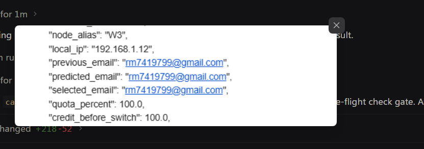

# 26 RCA: Previous, Selected, and Predicted Account Same-Email Collision

## Status
`resolved`

## User Request (Verbatim)

```text
How in your logic previous email and predicted email can be same are you stupid??
```

## Visual Telemetry & Screenshot Evidence



Observed Telemetry State Machine JSON:
```json
{
  "node_alias": "W3",
  "local_ip": "192.168.1.12",
  "previous_email": "rm7419799@gmail.com",
  "predicted_email": "rm7419799@gmail.com",
  "selected_email": "rm7419799@gmail.com",
  "quota_percent": 100.0,
  "credit_before_switch": 100.0
}
```

---

## 1. Reproduction & Symptoms

When an account rotation or switch notification is triggered on a machine (e.g. manual rotation, fast-forward, or instance switch), the resulting state telemetry JSON in email/system notifications displays:
- `"previous_email": "rm7419799@gmail.com"`
- `"predicted_email": "rm7419799@gmail.com"`
- `"selected_email": "rm7419799@gmail.com"`

All three account fields resolved to the EXACT same email address, representing a triple collision and total breakdown of rotation semantics.

---

## 2. Root Cause Analysis (4-Part RCA)

### Why
`previous_email`, `selected_email`, and `predicted_email` ended up identical because the system lacked mutual exclusivity invariant gates across all three fields during account resolution, candidate filtering, and telemetry rendering.

### How
1. **Previous vs. Selected Email Collision in `resolve_switch_context`**:
   In `src-tauri/src/modules/notification_hub.rs`, lines 66–96 contained fallback assignment logic:
   ```rust
   else if old_email.is_empty() && !cur_acc.email.is_empty() {
       old_email = cur_acc.email;
   }
   ```
   When `switch_account` had already committed the new active account ID to disk before triggering notifications, `cur_acc.email` returned the newly selected account. Because `old_email` was empty, it blindly assigned `old_email = cur_acc.email`, making `previous_email` identical to `selected_email`.
2. **Case-Sensitive Exclusion Check in Candidate Discovery (`select_candidate_profiles`)**:
   In `src-tauri/src/modules/auto_switcher.rs`, exclusion checking relied on `<[String]>::contains(&acc.email)` and `<[String]>::contains(&acc.id)`. This used standard case-sensitive string equality without trimming whitespace. Furthermore, callers frequently passed only the account ID or only the email into `excluded_account_ids`, allowing accounts to slip past exclusions if casing differed or if only one identifier was supplied.
3. **Lack of Invariant Exclusion Gate in `dispatch_email_switch_alert`**:
   In `notification_hub.rs`, `predicted_display` was filtered only against `selected_display`:
   ```rust
   filter(|s| !s.is_empty() && !s.eq_ignore_ascii_case(selected_display))
   ```
   It did NOT filter against `from_display` (`previous_email`). Additionally, if `from_display` was equal to `selected_display`, there was no sanitizer to reset `previous_email` to `"(none / standby)"`.
4. **Current Account Not Fully Excluded in Manual Rotation**:
   In `trigger_manual_rotation_for_instance`, `excluded` was only populated with `current_bound` (which was an account ID) rather than both the ID and the email, allowing the currently active account in the pool to be re-selected if inspected under different paths.

---

## 3. Code Fix & Remediation

1. **Strict Tri-Field Mutual Exclusivity Invariant Gate in `notification_hub.rs`**:
   - `resolve_switch_context()`: NEVER set `old_email` to `b_email`, `acc.email`, or `cur_acc.email` if it equals `new_email` (case-insensitive, trimmed).
   - `notify_account_switched_details()`: If `resolved_prev.eq_ignore_ascii_case(&selected_clean)`, force `final_prev = "(none / standby)"`.
   - `dispatch_email_switch_alert()`:
     - If `from_display.eq_ignore_ascii_case(selected_display)`, force `from_display = "(none / standby)"`.
     - `predicted_display` MUST filter against BOTH `selected_display` AND `from_display`:
       `!s.eq_ignore_ascii_case(selected_display) && !s.eq_ignore_ascii_case(from_display)`.
       If exhausted or matching either, fallback strictly to `"(none / pool exhausted)"`.
2. **Robust Case-Insensitive Exclusion Helper (`is_account_excluded`) in `auto_switcher.rs`**:
   - Centralize candidate exclusion check:
     ```rust
     pub fn is_account_excluded(exclusions: &[String], id: &str, email: &str) -> bool {
         let clean_id = id.trim();
         let clean_email = email.trim();
         exclusions.iter().any(|ex| {
             let clean_ex = ex.trim();
             clean_ex.eq_ignore_ascii_case(clean_id) || clean_ex.eq_ignore_ascii_case(clean_email)
         })
     }
     ```
   - In `select_candidate_profiles()`: Check both `inst.bound_email` and `inst.bound_account_id` in Step 1, and `acc.id` and `acc.email` in Step 2 using `is_account_excluded()`.
   - In `trigger_manual_rotation_for_instance()`: Inject both the ID and Email of the active instance, as well as `account::get_current_account()`'s ID and Email, into `excluded`.
3. **CLI Telemetry Consistency in `agm.rs`**:
   - Remove redundant `previous_account: active_acc.email` duplication on standby status outputs.
   - Enforce invariant `prev_email != selected_email` and `predicted_email != selected_email && predicted_email != prev_email` in `cmd_fast_forward()`.

---

## 4. Prevention & Quality Verification

- **Invariants**:
  1. `previous_email` $\neq$ `selected_email` (if equal, `previous_email` $\to$ `(none / standby)`).
  2. `predicted_email` $\neq$ `selected_email` (if equal, `predicted_email` $\to$ `(none / pool exhausted)`).
  3. `predicted_email` $\neq$ `previous_email` (if equal, `predicted_email` $\to$ `(none / pool exhausted)`).
- **Unit Testing**: Add comprehensive unit tests in `src-tauri/src/modules/notification_hub.rs` and `auto_switcher.rs` verifying that identical account collisions are strictly intercepted and neutralized.
