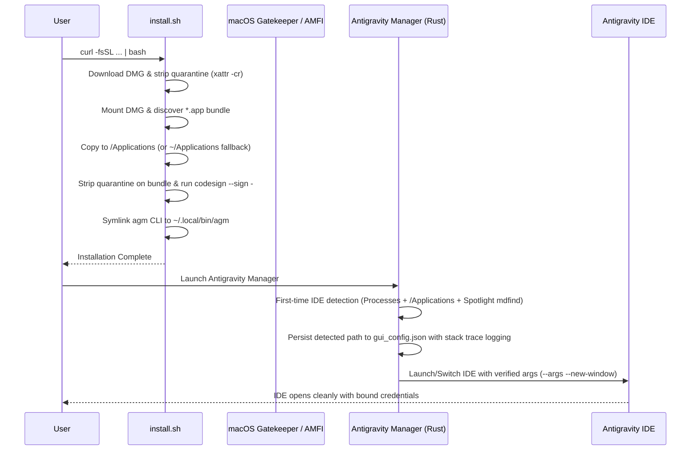

# App Issue RCA 31: macOS Installation Failure ("Move to Trash"), Gatekeeper Quarantine, and IDE Switching Defects

## 1. Reproduction & Symptoms

When users attempt to install and run Antigravity Manager Tools on macOS:
1. **Move to Trash Dialog**: macOS Gatekeeper blocks execution with:
   `"Antigravity Manager Tools" is damaged and can't be opened. You should move it to the Trash.`
2. **Silent Failure in Automated Installer**: Running `curl -fsSL .../install.sh | bash` attempts `sudo xattr -rd com.apple.quarantine "/Applications/Antigravity Manager Tools.app" 2>/dev/null || true`. Because stdin is consumed by the piped script, `sudo` cannot prompt for a password and fails silently without removing quarantine.
3. **IDE Launch Failures on macOS**:
   - `start_antigravity_with_fallback_path` appends `--new-window` directly to `/usr/bin/open` before `--args`, triggering `open: unrecognized option '--new-window'`.
   - `launch_instance_inner_with_extra_workspaces` executes `open -n -a "<script_path>"` on cloned instance launcher shell scripts, which `open -a` rejects because it only accepts Application bundles (`.app`) or registered system app names.
4. **Missing App Storage & First-Time Setup**: The `#[cfg(target_os = "macos")]` branch in `launch_instance_inner_with_extra_workspaces` omitted creating `.gemini` home folders, writing `ide-install-wizard-shown: true`, and syncing `app_storage.json`.

---

## 2. Root Cause Analysis (macOS vs. Windows Comparison)

### 2.1 Gatekeeper Quarantine & Unsigned Binary Policy
- **Windows**: Windows SmartScreen marks downloaded files with Zone.Identifier, which NSIS installers ignore or elevate via UAC.
- **macOS**: Every file downloaded via HTTP/curl or browser receives extended attribute `com.apple.quarantine`. When an app bundle with this attribute lacks an Apple Developer ID signature and notarization ticket, Gatekeeper immediately classifies it as corrupted/damaged and prompts the user to move it to Trash.
- **Remedy**:
  1. Strip quarantine before and after mounting: `xattr -cr "$APP_PATH"` and `xattr -r -d com.apple.quarantine "$APP_PATH"`.
  2. Apply an ad-hoc local Mach-O signature: `codesign --force --deep --sign - "$APP_PATH"`. This satisfies local AMFI (Apple Mobile File Integrity) checks on macOS 12-15+ (Monterey, Ventura, Sonoma, Sequoia).

### 2.2 Rigid Hardcoded App Bundle Matching
- **Windows (`install.ps1`)**: Iterates through candidate names (`agm-alim.exe`, `AGM by Alim.exe`, `Antigravity Tools.exe`, `antigravity-tools.exe`) and multiple directories (`Local\Programs`, `ProgramFiles`).
- **macOS (`install.sh`)**: Hardcoded `"${APP_NAME}.app"`. If the DMG volume name or bundle name varies across releases (e.g. `agm-alim.app`), `cp -R` fails with `No such file or directory`.
- **Remedy**: Dynamically discover `.app` bundles inside the mounted volume via `find "$mount_point" -maxdepth 2 -name "*.app" -type d`.

### 2.3 Privilege & Destination Separation
- **Windows**: Installs into user-writable `$env:LOCALAPPDATA\Programs`, completely eliminating UAC/admin privilege requirements for routine installations.
- **macOS**: Hardcoded `/Applications/` which in multi-user or enterprise systems requires root permissions.
- **Remedy**: Attempt installation to `/Applications/`. If unwritable or permission denied, fall back cleanly to `$HOME/Applications/`.

### 2.4 IDE Discovery & Argument Formatting
- **Windows**: Probes registry, standard Program Files, LocalAppData, and running process tables.
- **macOS**:
  - `start_antigravity_with_fallback_path` passed `--new-window` directly to `open` rather than placing it after `--args`.
  - Process audit looked only for `/Applications/{name}.app` directory and `Contents/MacOS/Electron`, ignoring the true binary name (`Contents/MacOS/{name}`) and custom user paths.
- **Remedy**:
  1. Re-structure `open` arguments: `open -n -a "<app>" --args [user_args...] --new-window`.
  2. Implement Spotlight `mdfind` fallback for dynamic discovery across any mounted disk.
  3. Detect whether executable is a script vs `.app` bundle before choosing between `open -n -a` and direct `Command::new()`.

---

## 3. Remediation Architecture

---

## 4. Prevention & Quality Guard

1. **POSIX Stack Trace Trap**: Add `trap 'echo "[ERROR] Command failed at line $LINENO: $BASH_COMMAND"' ERR` in `install.sh`.
2. **Automated Unit Tests**: Test macOS argument formatting and app path resolution in `src-tauri/src/modules/process.rs`.
3. **Multi-Platform CI Verification**: Ensure cargo fmt, clippy, and frontend build gates validate all cross-platform conditional compilation branches.
