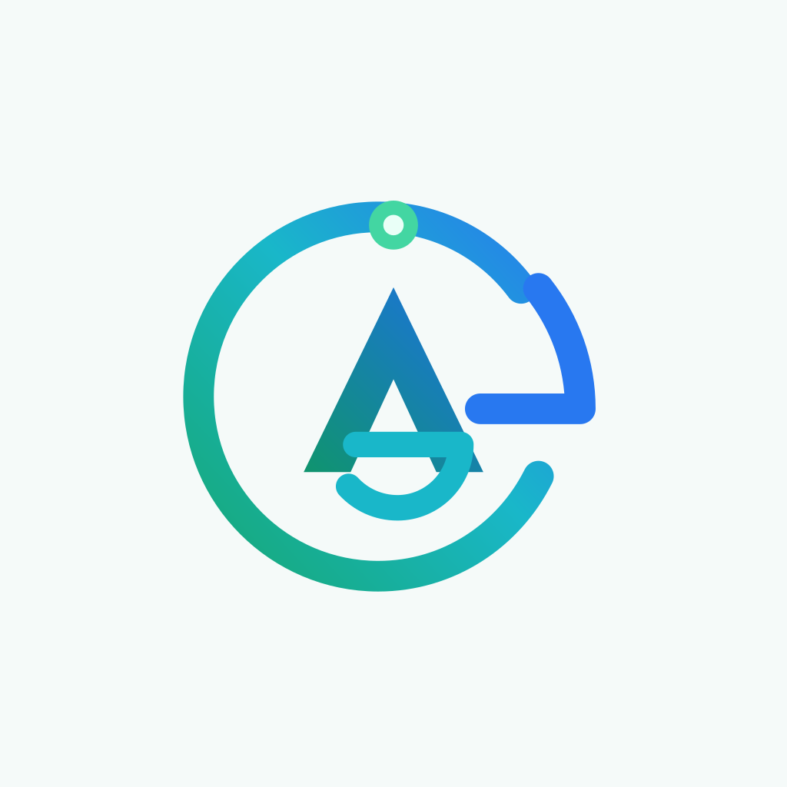

# AG Manager — branding and logo assets

AG Manager by Alim is an AI automation tool. Its identity combines an abstract AG monogram with a broken orbit and levitating core, expressing controlled lift, intelligent motion, and tasks moving beyond manual gravity.

## Vector logos

| Primary logo | Dark-surface logo | White monochrome |
|:---:|:---:|:---:|
|  |  |  |

## Transparent icon sizes

| 52 px | 128 px | 256 px | 512 px |
|:---:|:---:|:---:|:---:|
|  |  |  |  |

## Contrast mockups

| Light surface | Dark surface |
|:---:|:---:|
|  |  |

## Color palette

See the [brand palette](colors-themes/palette.md) for HEX, RGB, HSL, and usage guidance.

## File guidance

- Use `logo.svg` on light or neutral surfaces.
- Use `logo-dark.svg` on dark surfaces.
- Use `logo-white.svg` for single-color overlays or production constraints.
- The 52–512 px PNG files have transparent backgrounds.
- The 1024 px files are contrast presentation mockups and intentionally include their named surface.
