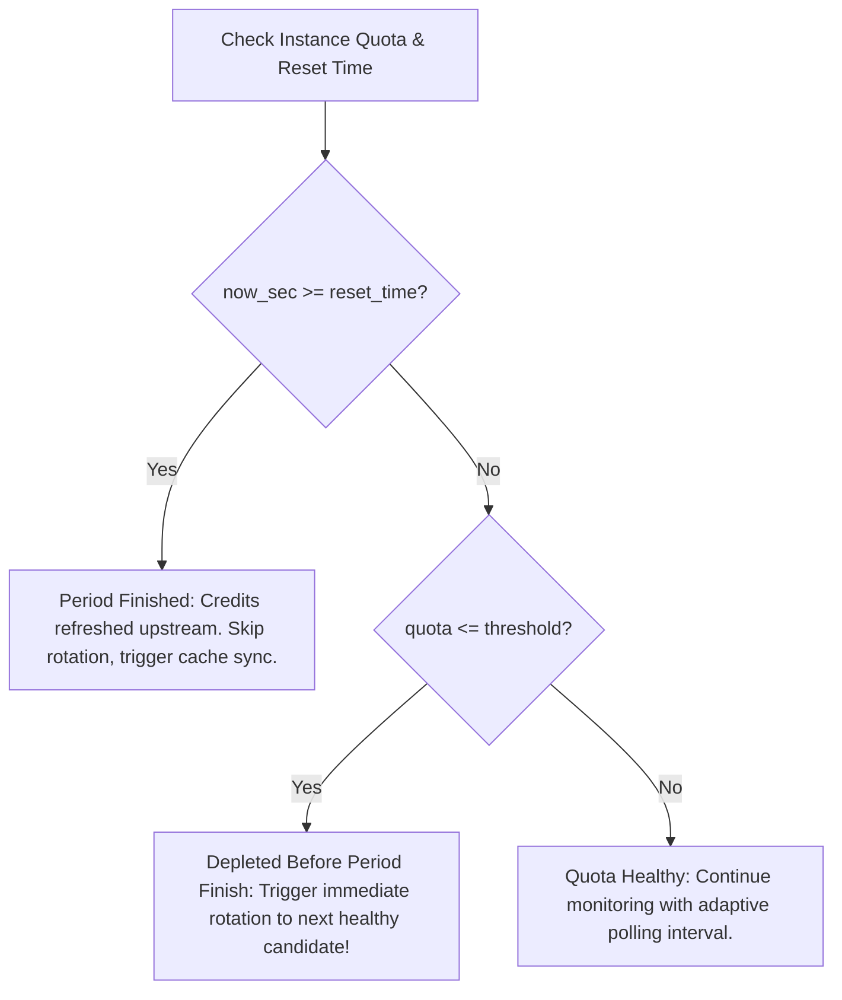
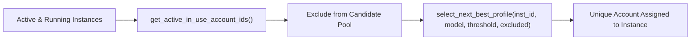

# Multi-Instance Period-Boundary Auto-Switching Architecture

This document specifies the design, lifecycle, and operational mechanisms of the Multi-Instance Period-Boundary Auto-Switching Engine in Antigravity Manager.

---

## 1. Executive Summary

Antigravity Manager allows developers to run multiple concurrent Antigravity IDE instances, each isolated to its own sandbox data directory (`--user-data-dir`) and bound account. Previously, the auto-profile switcher suffered from two major limitations:

1. **Single-Instance Blindspot:** The switcher daemon inspected only the active instance profile (`get_active_instance_id`), ignoring sibling instances running in parallel.
2. **Missing Period-Boundary Lookahead:** Accounts with depleted quotas were handled solely based on static percentage thresholds without inspecting the upstream provider's `reset_time` quota window. If an account exhausted its model quota before its period concluded, the system could fail to recognize whether the period had elapsed or was still active. Furthermore, candidate account selection could collide with accounts actively leased by running sibling instances.

The Multi-Instance Period-Boundary Auto-Switching Engine resolves these challenges through:
- Pre-period finish detection (`is_depleted_before_finish`).
- Period finish boundary awareness (`is_period_finished`).
- Global multi-instance discovery (`list_running_or_active_instances`).
- Sibling account collision prevention (`get_active_in_use_account_ids`).
- Selective PID-level termination preserving sibling processes.

---

## 2. Period-Boundary Lookahead Mechanism

Upstream quota data provides a `reset_time` field formatted in RFC 3339 (e.g., `2026-09-22T14:30:00Z`). The engine parses this timestamp into UNIX epoch seconds (`parse_reset_time_to_unix`) and evaluates it against current time `now_sec`.



### 2.1 Boundary Evaluation Rules

1. **Depleted Before Finish (`is_depleted_before_finish`):**
   When an account's quota drops below the low-quota threshold ($\le 10\%$) or critical threshold ($\le 12\%$) while `now_sec < reset_timestamp`, the quota is depleted *before the period finishes*. The account cannot service further requests until the reset window arrives. It is immediately rotated out.

2. **Period Concluded (`is_period_finished`):**
   When `now_sec >= reset_timestamp`, the quota period has concluded. Upstream credits have reset or are resetting. Rotating away prematurely in this state is prevented; instead, the system marks the instance ready for token/quota refresh.

3. **Candidate Priority Scoring (`score_candidate_account`):**
   Candidate accounts whose quota period has already finished receive an immediate score bonus (+15,000 points). Candidates with high remaining quotas and ample runway before reset receive proportional runway stability bonuses.

---

## 3. Multi-Instance Concurrency & Sandbox Isolation

### 3.1 Directory and Process Sandboxing

Each instance copy maintains a dedicated directory structure under the user data root:
```text
~/.gemini/antigravity/instances/
├── default/
│   └── data/
├── work-profile/
│   └── data/
└── personal-profile/
    └── data/
```

Antigravity IDE copies are spawned with explicit isolation flags:
`--user-data-dir <instance_data_dir>`

Process IDs (PIDs) associated with an instance copy are registered in SQLite table `instance_processes` in `instances.db`:
```sql
CREATE TABLE IF NOT EXISTS instance_processes (
    instance_id TEXT PRIMARY KEY,
    pid INTEGER NOT NULL,
    data_dir TEXT NOT NULL,
    launched_at INTEGER NOT NULL,
    is_active INTEGER NOT NULL DEFAULT 1
);
```

### 3.2 Selective PID Termination Invariant

When instance profile rotation executes for instance $X$:
- Only the PIDs registered to instance $X$ and matching instance $X$'s `data_dir` are terminated.
- On Windows, `taskkill /F /T /PID <pid>` terminates the specific process tree.
- Sibling instances $Y$ and $Z$ continue running without interruption, maintaining active sessions, open files, and background language servers.

---

## 4. Account Collision Avoidance Across Instances

To prevent two running instances from claiming the same account:



1. **Discovery:** `list_running_or_active_instances()` queries all registered instances and checks live running status via `is_instance_running`.
2. **In-Use Aggregation:** `get_active_in_use_account_ids()` collects all account IDs bound to active or running instances.
3. **Exclusion Mask:** When instance $A$ rotates, all in-use account IDs except instance $A$'s current account are passed to `select_next_best_profile`.
4. **Collision Prevention:** No running sibling copy can have its bound account stolen.

---

## 5. Candidate Account Multi-Factor Scoring

The candidate scoring algorithm evaluates potential accounts across five weighted criteria:

$$\text{Score} = S_{\text{idle}} + S_{\text{quota\_min}} + S_{\text{model}} + S_{\text{tier}} + S_{\text{reset\_window}}$$

1. **Idle Time Factor ($S_{\text{idle}}$):** Accounts never used receive 100,000 points. Accounts used previously receive up to 50,000 points based on hours since last usage.
2. **Lowest Remaining Quota ($S_{\text{quota\_min}}$):** Preserves accounts with higher baseline quotas ($200 \times \text{min\_percentage}$).
3. **Target Model Bonus ($S_{\text{model}}$):** $100 \times \text{model\_percentage}$.
4. **Subscription Tier Bonus ($S_{\text{tier}}$):** +10,000 points for Pro or Ultra subscriptions.
5. **Reset Window Factor ($S_{\text{reset\_window}}$):**
   - If `is_period_finished`: +15,000 points (quota refreshed upstream).
   - If runway remaining: $+(\text{seconds\_left} / 3600.0 \times 500.0)$, capped at 5,000 points.

---

## 6. Dynamic Polling Ladder

The background daemon adjusts its sleep duration based on the lowest remaining quota across all monitored instances:

| Minimum Monitored Quota | Polling Interval | Action |
|:---|:---|:---|
| $> 20.0\%$ | `check_interval_seconds` (default 300s) | Normal background heartbeat |
| $12.1\% - 20.0\%$ | `caution_interval_seconds` (default 180s) | Heightened monitoring |
| $\le 12.0\%$ (Critical) | `critical_interval_seconds` (default 60s) | Aggressive evaluation & fast-forward |

---

## 7. Operational Troubleshooting

### 7.1 All Accounts Depleted
If all accounts in the pool have depleted quotas and no candidate passes the threshold:
- The engine logs a warning: `[AutoSwitcher] Instance 'X' quota low (Y%) but no healthy alternative profile found in pool.`
- The current instance continues running without crashing.
- As soon as any account crosses its `reset_time` boundary, the next daemon cycle awards it the +15,000 bonus and rotates it in.

### 7.2 Stale SQLite Locks
If an unexpected system shutdown leaves lock files:
- `close_instance` automatically clears `code.lock` and `singleton*` files from the target instance's `data_dir`.
- Pre-switch settle delays (150ms - 300ms) ensure OS file handles flush before writing to `state.vscdb`.

### 7.3 Multi-Instance IPC Monitoring
Frontend state can monitor all instances via `AutoSwitcherStatus.monitored_instances`:
```typescript
interface InstanceQuotaSummary {
    instance_id: string;
    instance_name: string;
    bound_email?: string;
    quota_percent?: number;
    reset_time_iso?: string;
    seconds_until_reset?: number;
    is_running: boolean;
    is_depleted_before_finish: boolean;
}
```
