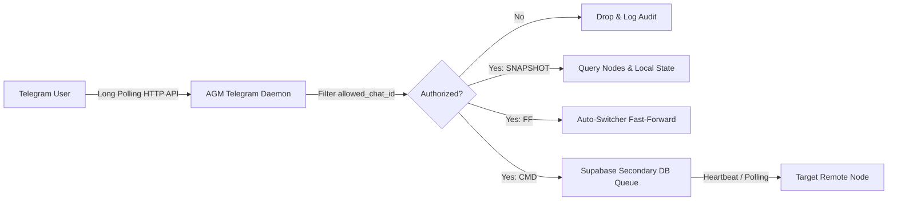

# Antigravity Manager - Telegram Remote Control Guide

Antigravity Manager features an autonomous background daemon that connects directly to the official Telegram Bot API via long-polling. It enables cluster health monitoring, remote fast-forward account switching, and distributed command execution across all online instances.

---

## 1. Prerequisites: Create a Telegram Bot

1. Open Telegram and search for [@BotFather](https://t.me/BotFather).
2. Start a chat and send `/newbot`.
3. Choose a friendly name (e.g., `My Antigravity Manager`).
4. Choose a unique username ending in `bot` (e.g., `my_agm_fleet_bot`).
5. Copy the generated **HTTP API Bot Token** (format: `123456789:ABCDefGhIJKlmNoPQRsTUVwxyZ_12345`).

---

## 2. Configuration Setup

You can configure the bot either via the automated script, the AGM GUI, or manually via JSON.

### Option A: Automated PowerShell Wizard (Recommended)

Run the setup wizard from the project repository:

```powershell
.\scripts\setup-telegram-bot.ps1 -BotToken "<YOUR_BOT_TOKEN>" -EnableNow
```

The script performs the following automatically:
- Validates the token against the official Telegram API (`/getMe`).
- Queries recent chat updates (`/getUpdates`) so you can select and bind your personal Telegram user account (`allowed_chat_id`).
- Writes the formatted configuration into `$HOME/.antigravity_tools/telegram_config.json`.

### Option B: Manual Configuration

Edit or create `~/.antigravity_tools/telegram_config.json` (or `$env:ABV_DATA_DIR/telegram_config.json`):

```json
{
  "bot_token": "123456789:ABCDefGhIJKlmNoPQRsTUVwxyZ_12345",
  "allowed_chat_id": 987654321,
  "is_enabled": true,
  "poll_interval_secs": 5
}
```

> [!IMPORTANT]
> Always configure `allowed_chat_id` to restrict bot commands to your own Telegram account. When left `null`, any user with your bot handle can send commands.

---

## 3. Remote Control Commands

Once active, open your bot chat on Telegram and send any of the following commands:

| Command | Syntax | Description |
| :--- | :--- | :--- |
| **Cluster Snapshot** | `/start`, `/status`, or `SNAPSHOT` | Returns a live summary of all online cluster nodes, internal/public IP addresses, and uptime minutes. |
| **Fast-Forward Workspace** | `FF` | Triggers immediate account rotation and workspace refresh on the local node. |
| **Targeted Fast-Forward** | `FF:<node-alias>` | Fast-forwards the designated remote node in your multi-machine fleet. |
| **Remote Command Execution** | `CMD:<node-alias>:<command>` | Dispatches an administrative PowerShell/Bash command to the target node via the Supabase Secondary DB queue. |

### Example Interactions

#### 1. Cluster Status Query
```text
User:
SNAPSHOT

Bot:
🌐 Antigravity Cluster Snapshot

Currently Online Machines: 2

• Node-Alpha (IP: 192.168.1.50) | Uptime: 245m
• Node-Beta  (IP: 192.168.1.51) | Uptime: 112m

📋 Remote Command Formats:
• CMD:<node-alias>:<command> (Execute PowerShell/Bash)
• FF or FF:<node-alias> (Fast-Forward Workspace)
• SNAPSHOT (Refresh machine list)
```

#### 2. Trigger Fast-Forward
```text
User:
FF

Bot:
🔄 Fast-Forward Initiated: Workspace switched to account 'dev@example.com' (Quota: 95%).
```

#### 3. Remote Command Execution
```text
User:
CMD:Node-Alpha:agm clean

Bot:
⚡ Command Enqueued: Saved to Supabase Secondary DB for target node Node-Alpha:
agm clean
```

---

## 4. Architecture & Security Model



- **Daemon Lifespan**: Runs alongside the AGM proxy daemon and IDE watchdog.
- **Zero Inbound Ports**: Uses outbound long-polling to Telegram Bot API; does not require public webhooks, domain names, or reverse proxies.
- **Queue Fail-Safety**: Remote commands dispatched to distributed machines traverse the encrypted Supabase Command Queue (`cluster_commands`) with atomic deduplication.
