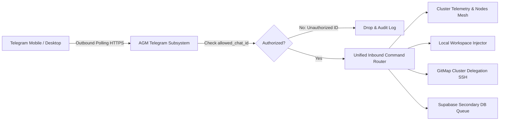

# Antigravity Manager - Telegram Command Center & Remote Control Guide

Antigravity Manager features an autonomous inbound/outbound Telegram subsystem that connects directly to the official Telegram Bot API via long-polling. It enables cluster health monitoring, prompt queue inspection, remote prompt injection across distributed VM nodes, GitMap telemetry forwarding, and mobile remote control.

---

## 1. Prerequisites: Create Your Telegram Bot

1. Open Telegram and search for [@BotFather](https://t.me/BotFather) (verified badge with blue checkmark).
2. Start a conversation with BotFather and send the command:
   ```text
   /newbot
   ```
3. Enter a friendly display name (for example: `My AGM Bot`).
4. Enter a unique username ending with `bot` (for example: `my_company_agm_bot`).
5. BotFather will reply with your **HTTP API Bot Token** in the format:
   ```text
   1234567890:ABCDefGhIJKlmNoPQRsTUVwxyZ_1234567
   ```
> [!CAUTION]
> **Keep your bot token strictly confidential.** Never share it publicly, commit it to Git repositories, or post it in public logs. Anyone with your token can control the bot.

---

## 2. Connecting with the User Interface (GUI)

You can easily configure and test your Telegram Bot directly from the Antigravity Manager desktop interface:

1. Launch **Antigravity Manager**.
2. Click **Settings** (gear icon in the navigation bar).
3. Scroll to the **Telegram Inbound Bot Integration** card (or locate it within **Cluster & Cloud Sync**).
4. **Enable the Integration**: Toggle the switch in the top-right corner to active (blue).
5. **Enter Bot Token**: Paste your Telegram Bot Token into the **Telegram Bot Token** password field.
6. **Detect Chat ID**:
   - Open Telegram on your phone or desktop.
   - Search for your newly created bot username (e.g. `@my_company_agm_bot`) and click **Start** (or send `/ping`).
   - In the Antigravity Manager UI, click the **Auto-Detect Chat ID** button (or click **Test Bot & Detect ID**).
   - The system queries Telegram's `getUpdates` API and automatically populates your numeric **Allowed Chat ID**!
7. **Save Configuration**: Click **Save Telegram** to persist your settings securely in your local configuration directory (`telegram_config.json`).
8. **Verify Delivery**: Click **Send Ping** to transmit an immediate live telemetry card to your Telegram app.

---

## 3. Finding and Connecting Your Telegram Allowed Chat ID

### What is the Allowed Chat ID?
The Allowed Chat ID is your personal numeric Telegram account ID (e.g. `8857550071`). Antigravity Manager uses this as an essential security firewall: **only messages from this exact Chat ID will be processed by the bot**, blocking unauthorized third parties from controlling your machine.

### Method 1: Automatic Detection (Recommended)
1. In Telegram, open the chat with your bot and send `/start` or `/ping`.
2. Run either of the following:
   - **GUI**: Click **Auto-Detect Chat ID** in the Settings panel.
   - **Terminal CLI**:
     ```bash
     agm telegram connect <YOUR_BOT_TOKEN>
     ```
     or
     ```bash
     agm telegram detect-chat-id <YOUR_BOT_TOKEN>
     ```
3. The application inspects the latest update from your account and binds the Chat ID automatically.

### Method 2: Using Telegram Info Bots
1. Search for [@userinfobot](https://t.me/userinfobot) or [@RawDataBot](https://t.me/RawDataBot) in Telegram.
2. Send `/start`. The bot will respond with your numeric User ID (e.g., `Id: 8857550071`).
3. Copy this number and enter it into the **Allowed Chat ID** input field in the GUI, or pass it via CLI:
   ```bash
   agm telegram set <YOUR_BOT_TOKEN> <YOUR_CHAT_ID>
   ```

---

## 4. Command Line Terminal Interface (`agm telegram`)

Antigravity Manager provides full headless parity through the `agm telegram` CLI command suite:

| CLI Command | Description |
| :--- | :--- |
| `agm telegram connect <token> [chat_id]` | Auto-detects Chat ID, saves credentials, registers bot commands, and sends a welcome ping |
| `agm telegram set <token> [chat_id]` | Saves bot credentials (auto-detects chat ID if omitted) |
| `agm telegram detect-chat-id [token]` | Queries Telegram `getUpdates` to auto-discover your numeric Chat ID |
| `agm telegram ls [--json]` | Displays configured bot status, token prefix, and allowed Chat ID |
| `agm telegram ping` | Sends a rich telemetry ping card to the configured Telegram chat |
| `agm telegram observe` (or `status`) | Sends a live workspaces, quota, and prompt queue telemetry report |
| `agm telegram nodes` | Inspects and reports the entire cluster VM nodes topology and connection mesh |
| `agm telegram projects` | Lists all discovered workspaces, paths, and project IDs |
| `agm telegram prompts [node]` | Lists active and recent prompt queues in the state database |
| `agm telegram prompt <node> <proj> "<txt>"` | Injects a prompt locally or dispatches to a remote cluster VM node |
| `agm telegram gitmap [args...]` | Runs any GitMap command (e.g. `pe`, `status`) and forwards formatted output to chat |
| `agm telegram api` | Queries local API proxy status, active port, and bound Google account |
| `agm telegram backup [ls]` / `backpack` | Inspects split SQLite prompt backups and delivers inventory to chat |
| `agm telegram restore` | Restores backed-up prompts into the active queue and notifies Telegram |
| `agm telegram email [status\|ping]` | Checks email alert configuration and dispatches test emails |
| `agm telegram send "<message>"` | Dispatches any custom notification message directly to Telegram |
| `agm telegram poll [--once]` | Runs the background polling daemon to execute inbound commands |
| `agm telegram cmds` | Displays the list of supported slash commands |

---

## 5. Interactive Telegram Inbound Slash Commands

When the daemon is running (either inside the desktop app or via `agm telegram poll`), you can chat directly with your bot using these slash commands:

- `/start` or `/help`: Displays the interactive command manual and shortcuts.
- `/ping`: Tests bot connectivity and returns host uptime, node alias, and build version.
- `/observe` or `/status`: Delivers a full telemetry report of running workspaces, prompt queues, and quota.
- `/nodes` or `/node ls`: Displays the multi-machine VM cluster fleet and mesh connectivity.
- `/nodes <alias> prompts`: Scopes and inspects prompt queues for a specific cluster node.
- `/projects`: Lists all discovered local workspaces and execution targets.
- `/prompts`: Lists recent and active prompts in the split SQLite database.
- `/prompt <project> <text>`: Injects a prompt into a local project workspace.
- `/prompt <node> <project> <text>`: Dispatches an injected prompt across cluster nodes via GitMap SSH / Supabase queue.
- `/gitmap <args>`: Runs GitMap commands (e.g. `/gitmap pe` to monitor CI/CD pipelines).
- `/api`: Checks API proxy gateway status and bound account.
- `/backpack`: Inspects split SQLite prompt backups.
- `/restore`: Re-queues backed-up prompts into the execution stream.
- `/email status` or `/email ping`: Checks email notification channels.
- `/ff`: Fast-forwards quota rotation to the next available healthy account.

---

## 6. Architecture & Security Highlights


```mermaid
flowchart LR
    A[Telegram Mobile / Desktop] -->|Outbound Polling HTTPS| B[AGM Telegram Subsystem]
    B -->|Check allowed_chat_id| C{Authorized?}
    C -->|No: Unauthorized ID| D[Drop & Audit Log]
    C -->|Yes| E[Unified Inbound Command Router]
    E --> F[Cluster Telemetry & Nodes Mesh]
    E --> G[Local Workspace Injector]
    E --> H[GitMap Cluster Delegation SSH]
    E --> I[Supabase Secondary DB Queue]
```

- **Zero Inbound Ports**: Uses outbound long-polling to the official Telegram Bot API (`https://api.telegram.org`); no webhooks, public IP addresses, or router port forwards required.
- **Strict Chat Filtering**: All requests from unidentified chat IDs are immediately discarded before parsing.
- **Automatic Message Chunking**: Payloads exceeding Telegram's 4096-character limit are automatically chunked into sequential messages at newline boundaries with pacing delays to prevent API drops.
- **Config Storage Isolation**: Bot tokens and configuration are stored locally in the application user directory (`telegram_config.json`) and excluded from Git commits.
