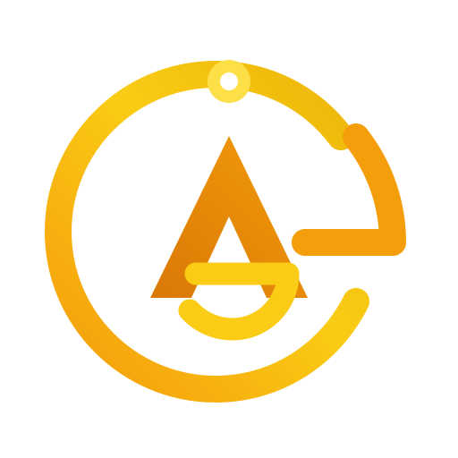
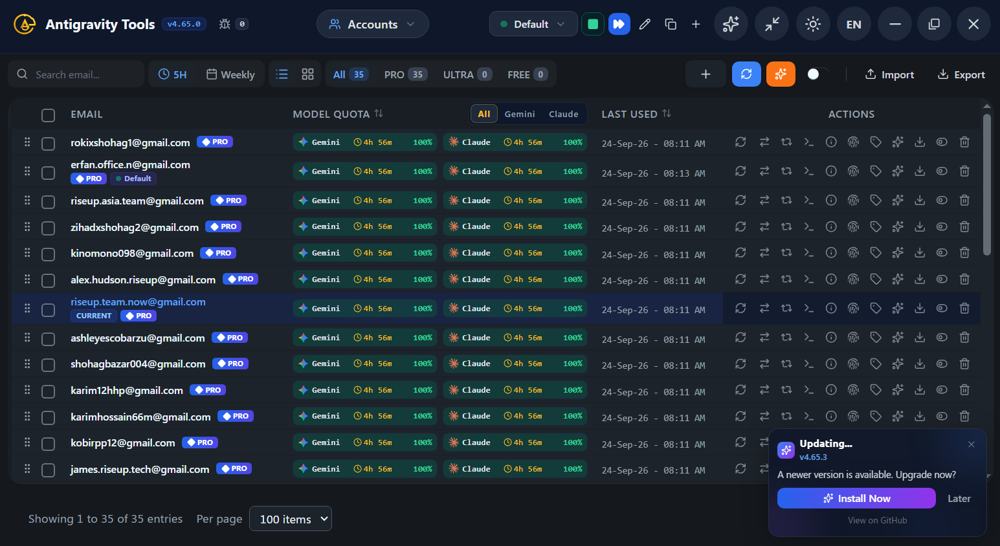
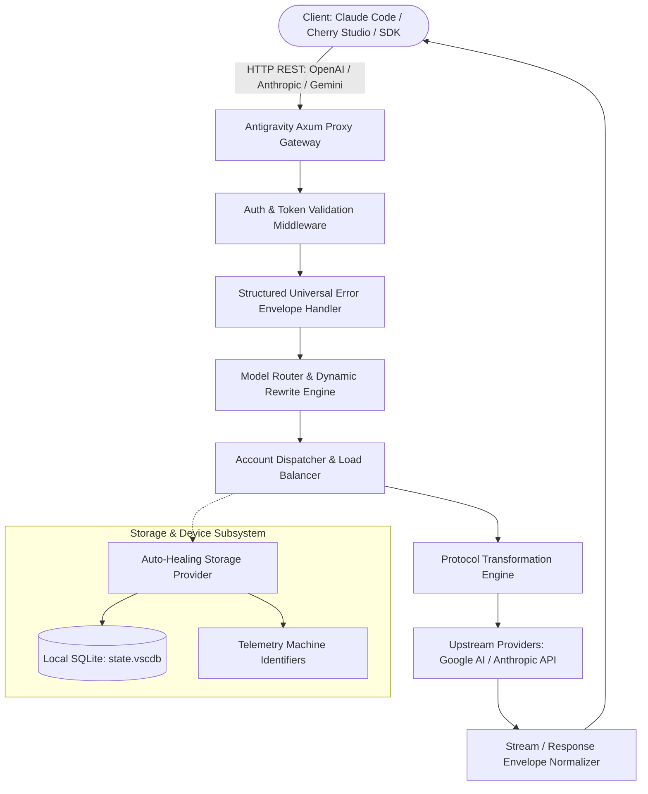
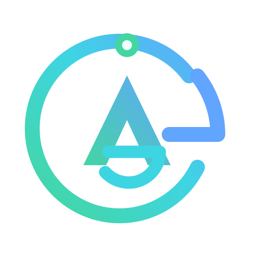
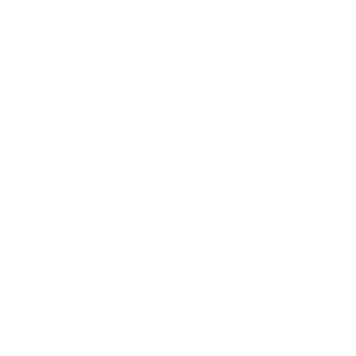
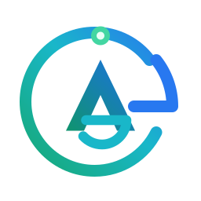

<p align="center">
  <a href="https://github.com/alimtvnetwork/Antigravity-Manager">
    <picture>
      <source media="(prefers-color-scheme: dark)" srcset="assets/icons-svg/logo-dark.svg" />
      <source media="(prefers-color-scheme: light)" srcset="assets/icons-svg/logo.svg" />
      
    </picture>
  </a>
</p>

<h1 align="center">Antigravity Tools</h1>

<p align="center">
  <strong>Enterprise-Grade AI Account Management &amp; High-Performance Protocol Proxy Gateway</strong>
</p>

<p align="center">
  <!-- STAMP:BADGES -->
  <a href="https://github.com/alimtvnetwork/Antigravity-Manager/releases">
    
  </a>
  
  
  
  
  
  <!-- STAMP:PLATFORM_BADGES -->
</p>

<p align="center">
  
  
  
  
  <a href="https://trendshift.io/repositories/18224" target="_blank" rel="noopener noreferrer">
    
  </a>
</p>

<p align="center">
  <strong>Lead Architect &amp; Maintainer: <a href="https://alimkarim.com/">Md. Alim Ul Karim</a></strong> (<a href="https://github.com/aukgit">@aukgit</a> / <a href="https://github.com/alim-ul-karim">@alim-ul-karim</a>)<br/>
  Chief Software Engineer, <a href="https://riseup-asia.com/"><strong>Riseup Asia LLC</strong></a> (Official Corporate Sponsor)<br/>
  <a href="https://github.com/aukgit">GitHub (@aukgit)</a> ·
  <a href="https://alimkarim.com/">Personal Website</a> ·
  <a href="https://www.linkedin.com/in/alimkarim">LinkedIn</a> ·
  <a href="https://stackoverflow.com/users/513511/md-alim-ul-karim">Stack Overflow</a> ·
  <a href="docs/author.md">Full Biography</a>
</p>

<p align="center">
  <em>Maintained and enhanced by <strong><a href="https://github.com/aukgit">Md. Alim Ul Karim</a></strong> &amp; <strong><a href="https://riseup-asia.com/">Riseup Asia LLC</a></strong> · Special thanks and heartfelt gratitude to <strong><a href="https://lbjlaq.github.io/Antigravity-Manager/">lbjlaq</a></strong> for creating this project in the first place</em>
</p>

---

<p align="center">
  <a href="#-screenshot--gui-overview">📸 GUI Overview</a> •
  <a href="#%EF%B8%8F-install-scripts">🛠️ Install Scripts</a> •
  <a href="#-brand-identity-logos--icons">🎨 Logos &amp; Icons</a> •
  <a href="#-about-this-repo">📖 About</a> •
  <a href="#-for-ai-agents">🤖 For AI Agents</a> •
  <a href="#-key-features--capabilities">🌟 Key Features</a> •
  <a href="#-usage--integration-examples">🚀 Usage</a> •
  <a href="#%EF%B8%8F-technical-architecture">🏗️ Architecture</a> •
  <a href="#-contributing--original-authors">🤝 Contributors</a> •
  <a href="#-sponsors--special-thanks">💖 Sponsors</a>
</p>

---

## 📸 Screenshot & GUI Overview

<p align="center">
  <em>High-density quota tracking, real-time smart account switching, multi-format protocol reverse proxy, and system diagnostics.</em>
</p>

| Dashboard & Real-Time Monitoring | Account Inventory & Status Tracking |
| :---: | :---: |
| <br><sub><b>Smart Dashboard</b>: Real-time quota metrics (Gemini Pro, Flash, Claude, Imagen 3) with intelligent recommendation</sub> | <br><sub><b>Account Inventory</b>: High-density token view, active account badges, and automatic 403 anomaly isolation</sub> |
| **Reverse Proxy & Gateway Settings** | **System Configuration & Device Identity** |
| <br><sub><b>API Gateway Controls</b>: Port binding, auth token validation, max body limits (100MB+), and CORS routing</sub> | <br><sub><b>System Settings</b>: Device telemetry spoofing, baseline backup, and portable directory mapping</sub> |

<p align="center">
  
  <br>
  <sub><b>Antigravity Manager Tools</b>: Unified multi-account dashboard, real-time quota metrics, and multi-instance management</sub>
</p>

### Real-World Integration Gallery

| Claude Code CLI with Structured Web Search | Cherry Studio Native Integration |
| :---: | :---: |
| <br><sub>Structured web citations and reasoning chain output in Claude Code</sub> | <br><sub>Native search citations, token streaming, and citation cards in Cherry Studio</sub> |
| **Imagen 3 Ultra-HD Image Generation** | **Kilo Code Cross-Account Penetration** |
| <br><sub>Prompt-faithful multi-ratio rendering with 4K resolution upscaling</sub> | <br><sub>Sub-millisecond model routing and transparent account failover</sub> |

---

## 🛠️ Install Scripts

### Option A: One-Liner Installers (Recommended)

Our universal installation script detects your operating system, CPU architecture (`x86_64` or `aarch64`), and available package manager to install the latest stable binary.

#### Windows (PowerShell 5.1+)

**Bar 1: Latest Version (Auto-Updating)**
```powershell
irm https://raw.githubusercontent.com/alimtvnetwork/Antigravity-Manager/main/install.ps1 | iex
```

**Bar 2: Version-Based Installation (v4.154.0)**
```powershell
& ([scriptblock]::Create((irm https://github.com/alimtvnetwork/Antigravity-Manager/releases/download/v4.72.0/install.ps1))) -Version "4.72.0"
```

---

#### Linux & macOS (Bash)

**Bar 1: Latest Version (Auto-Updating)**
```bash
curl -fsSL https://raw.githubusercontent.com/alimtvnetwork/Antigravity-Manager/main/install.sh | bash
```

**Bar 2: Version-Based Installation (v4.72.0)**
```bash
curl -fsSL https://github.com/alimtvnetwork/Antigravity-Manager/releases/download/v4.72.0/install.sh | bash -s -- --version "4.72.0"
```

> [!TIP]
> **Advanced Script Options**:
> - Install specific release: `curl -fsSL https://raw.githubusercontent.com/alimtvnetwork/Antigravity-Manager/main/install.sh | bash -s -- --version 4.66.0`
> - Dry-run verification: `curl -fsSL https://raw.githubusercontent.com/alimtvnetwork/Antigravity-Manager/main/install.sh | bash -s -- --dry-run`

---

### 📌 Version Pinning & Known Good Releases

This version pinning matrix allows developers, enterprise deployments, and users to target any verified release, move smoothly across known stable checkpoints, or roll back if regressions occur.

<!-- STAMP:VERSION_PIN_TABLE_START -->
| Target Release | Release Date | Quality Gate | Windows PowerShell (One-Liner) | Linux / macOS (Bash) | Git Tag Checkout |
| :--- | :---: | :---: | :--- | :--- | :--- |
| **v4.154.0** (Latest) | 2026-10-05 | 🟢 Verified | `irm https://raw.githubusercontent.com/alimtvnetwork/Antigravity-Manager/v4.154.0/install.ps1 \| iex` | `curl -fsSL https://raw.githubusercontent.com/alimtvnetwork/Antigravity-Manager/v4.154.0/install.sh \| bash` | `git checkout v4.154.0` |
| **v4.153.0** | 2026-10-05 | 🟢 Verified | `irm https://raw.githubusercontent.com/alimtvnetwork/Antigravity-Manager/v4.153.0/install.ps1 \| iex` | `curl -fsSL https://raw.githubusercontent.com/alimtvnetwork/Antigravity-Manager/v4.153.0/install.sh \| bash` | `git checkout v4.153.0` |
| **v4.151.0** | 2026-10-05 | 🟢 Verified | `irm https://raw.githubusercontent.com/alimtvnetwork/Antigravity-Manager/v4.151.0/install.ps1 \| iex` | `curl -fsSL https://raw.githubusercontent.com/alimtvnetwork/Antigravity-Manager/v4.151.0/install.sh \| bash` | `git checkout v4.151.0` |
| **v4.150.0** | 2026-10-05 | 🟢 Verified | `irm https://raw.githubusercontent.com/alimtvnetwork/Antigravity-Manager/v4.150.0/install.ps1 \| iex` | `curl -fsSL https://raw.githubusercontent.com/alimtvnetwork/Antigravity-Manager/v4.150.0/install.sh \| bash` | `git checkout v4.150.0` |
| **v4.142.0** | 2026-10-04 | 🟢 Verified | `irm https://raw.githubusercontent.com/alimtvnetwork/Antigravity-Manager/v4.142.0/install.ps1 \| iex` | `curl -fsSL https://raw.githubusercontent.com/alimtvnetwork/Antigravity-Manager/v4.142.0/install.sh \| bash` | `git checkout v4.142.0` |
| **v4.65.0** | 2026-09-23 | 🟢 Verified | `irm https://raw.githubusercontent.com/alimtvnetwork/Antigravity-Manager/v4.65.0/install.ps1 \| iex` | `curl -fsSL https://raw.githubusercontent.com/alimtvnetwork/Antigravity-Manager/v4.65.0/install.sh \| bash` | `git checkout v4.65.0` |
| **v4.64.0** | 2026-09-23 | 🟢 Verified | `irm https://raw.githubusercontent.com/alimtvnetwork/Antigravity-Manager/v4.64.0/install.ps1 \| iex` | `curl -fsSL https://raw.githubusercontent.com/alimtvnetwork/Antigravity-Manager/v4.64.0/install.sh \| bash` | `git checkout v4.64.0` |
| **v4.63.0** | 2026-09-23 | 🟢 Verified | `irm https://raw.githubusercontent.com/alimtvnetwork/Antigravity-Manager/v4.63.0/install.ps1 \| iex` | `curl -fsSL https://raw.githubusercontent.com/alimtvnetwork/Antigravity-Manager/v4.63.0/install.sh \| bash` | `git checkout v4.63.0` |
| **v4.57.0** | 2026-09-22 | 🟢 Verified | `irm https://raw.githubusercontent.com/alimtvnetwork/Antigravity-Manager/v4.57.0/install.ps1 \| iex` | `curl -fsSL https://raw.githubusercontent.com/alimtvnetwork/Antigravity-Manager/v4.57.0/install.sh \| bash` | `git checkout v4.57.0` |
| **v4.56.0** | 2026-09-22 | 🟢 Verified | `irm https://raw.githubusercontent.com/alimtvnetwork/Antigravity-Manager/v4.56.0/install.ps1 \| iex` | `curl -fsSL https://raw.githubusercontent.com/alimtvnetwork/Antigravity-Manager/v4.56.0/install.sh \| bash` | `git checkout v4.56.0` |
<!-- STAMP:VERSION_PIN_TABLE_END -->

#### How to Pin or Rollback Releases

1. **CLI Parameter Pinning:**
   - **Windows:**
     ```powershell
     .\install.ps1 -Version "4.65.0"
     ```
   - **Linux & macOS:**
     ```bash
     curl -fsSL https://raw.githubusercontent.com/alimtvnetwork/Antigravity-Manager/main/install.sh | bash -s -- --version 4.65.0
     ```

2. **Git Workspace Pinning:**
   - Switch your local cloned codebase directly to any historical checkpoint:
     ```bash
     git fetch --tags
     git checkout tags/v4.65.0
     ```

> [!NOTE]
> The installer automatically detects pinned release URLs and honors the requested release version, falling back through up to 10 historical candidate releases if target assets cannot be retrieved.

---

### Option B: Package Managers

#### macOS (Homebrew Cask)
```bash
brew tap alimtvnetwork/antigravity-manager https://github.com/alimtvnetwork/Antigravity-Manager
brew install --cask antigravity-tools
```

#### Arch Linux (Dedicated Installer)
```bash
curl -sSL https://raw.githubusercontent.com/alimtvnetwork/Antigravity-Manager/main/deploy/arch/install.sh | bash
```

---

### Option C: Docker & Headless Deployment (NAS & Servers)

Run Antigravity Tools as a headless background container for your local network, private home lab, or cloud server.

```bash
docker run -d --name antigravity-manager \
  -p 8045:8045 \
  -e API_KEY=sk-your-private-api-key \
  -e WEB_PASSWORD=your-secure-admin-password \
  -e ABV_MAX_BODY_SIZE=104857600 \
  -v ~/.antigravity_tools:/root/.antigravity_tools \
  --restart unless-stopped \
  alimtvnetwork/antigravity-manager:latest
```

#### Docker Compose Deployment
```bash
cd docker
docker compose up -d
```

- **Web Dashboard**: `http://localhost:8045`
- **API Endpoint**: `http://localhost:8045/v1`
- **Data Persistence**: Mount `/root/.antigravity_tools` to preserve accounts, preferences, and logs.

---

<h2 align="center">📖 About this Repo</h2>

<p align="center">
  <strong>Antigravity Tools bridges client applications, developer IDEs, and frontier foundation models through an ultra-fast, local Rust gateway.</strong>
</p>

### Genesis & Upstream Attribution
This project is an active, production-hardened fork originating from the groundbreaking work done by **[lbjlaq](https://github.com/lbjlaq)** and contributors on **[lbjlaq/Antigravity-Manager](https://github.com/lbjlaq/Antigravity-Manager)**.

We extend our deepest gratitude, respect, and praise to **lbjlaq** and the upstream development community for creating the foundational architecture of Antigravity Manager. Their ingenuity demonstrated how local session tokens could be multiplexed into high-availability AI gateways. Full credit, respect, and sincere thanks are given to **[lbjlaq/Antigravity-Manager](https://github.com/lbjlaq/Antigravity-Manager)** and all original upstream contributors.

### Maintenance & Continuous Enhancement
This project is **maintained and enhanced by [Md. Alim Ul Karim](https://github.com/alim-ul-karim)** and the **[Riseup Asia LLC](https://riseup-asia.com/)** engineering team · **Originally created by lbjlaq and upstream contributors**.

This edition introduces critical enterprise hardening, automated self-healing, and developer tooling:
1. **Auto-Switch Quota Polling (< 15% Credit Threshold)**: Intelligent background supervisor actively monitoring residual model credits and auto-switching to the highest-quota profile when remaining quota drops below 15%.
2. **Split Repo DB & Running Prompts Direct Dispatch**: Dedicated SQLite state database (`repo_prompts.db`) capturing running project prompts before profile rotation, and immediately dispatching them directly upon profile switch without queuing.
3. **Ubuntu & Linux Deterministic Process Switching**: Synchronous process termination with graceful SIGTERM polling and automatic SIGKILL (`kill -9`) fallback, eliminating SQLite lock contention and state overwrite on Ubuntu/Debian.
4. **Account Rotation HTTP API Endpoint**: Programmatic `/api/accounts/rotate` and `/api/auto-switcher/rotate` endpoints enabling external CLI tools, IDE extensions, or background scripts to trigger account rotation on demand.
5. **Ubuntu & Linux Auto-Healing**: Fully resolves missing `storage.json` issues on clean OS installations, containers, and portable setups by auto-generating complete telemetry profiles (`telemetry.machineId`, `macMachineId`, `devDeviceId`, `sqmId`) and ensuring SQLite schema initialization.
6. **Deep Linux Executable Discovery**: Scans standard paths, dynamic `PATH` resolution, Snap paths (`/snap/bin`), Flatpak packages, AppImages, and system `.desktop` files.
7. **Multi-Instance Isolation Architecture**: Allows concurrent, conflict-free operations across multiple isolated profiles and developer instances.
8. **Structured Error Management Architecture**: End-to-end universal error models in Rust (`error.rs`) and TypeScript (`error-store.ts`, `error-modal.tsx`), complete with an interactive AI-sharable Compact Markdown error exporter.
9. **Rigorous CI/CD Pipelines**: Zero-touch multi-platform automated builds, typecheck enforcement, and release orchestration.

---

## 🤖 For AI Agents

AI coding agents and autonomous workflows operating within this repository can find canonical resources below:

| Resource Type | Relative Path | Purpose |
| :--- | :--- | :--- |
| **Agent Guidelines** | `AGENTS.md` | Core constraints, boolean rules, CI/CD protections |
| **Coding Standards** | `02-spec/02-coding-guidelines/` | Language-specific architectural specifications |
| **Error Management Spec** | `02-spec/03-error-manage/` | Error codes, envelopes, and modal standards |
| **README Conventions** | `02-spec/01-spec-authoring-guide/13-root-readme-conventions.md` | Non-negotiable README structure and styling |
| **Active Plans** | `.ai-memory/plans/` | Plan index, active subtasks, and completion logs |

---

## 📦 Bundle Installers

Pre-built binaries for every major platform are published with every release:

| Platform | Target Architecture | Package Format | Direct Release Link |
| :--- | :--- | :--- | :--- |
| **macOS** | Apple Silicon (`aarch64`) / Intel (`x64`) | `.dmg` | [Download macOS Release](https://github.com/alimtvnetwork/Antigravity-Manager/releases) |
| **Windows** | Windows 10/11 (`x64`) | `.msi` / Portable `.zip` | [Download Windows Release](https://github.com/alimtvnetwork/Antigravity-Manager/releases) |
| **Ubuntu / Debian** | Linux (`x64`, `arm64`) | `.deb` | [Download Debian Release](https://github.com/alimtvnetwork/Antigravity-Manager/releases) |
| **Fedora / RHEL** | Linux (`x64`) | `.rpm` | [Download RPM Release](https://github.com/alimtvnetwork/Antigravity-Manager/releases) |
| **Universal Linux** | Linux (`x64`) | `.AppImage` | [Download AppImage](https://github.com/alimtvnetwork/Antigravity-Manager/releases) |

---

## 🌟 Key Features & Capabilities

### 1. 🎛️ Intelligent Quota Monitoring & Rotation
- **Real-Time Fleet Health**: Continuously measures residual rate limits and quota percentages across all configured accounts for Gemini Pro, Gemini Flash, Claude 3.5/3.7 Sonnet, and Imagen 3.
- **Smart Recommendation Engine**: Dynamically identifies the optimal account with the highest available quota threshold and lowest latency.
- **Sub-Millisecond Account Switching**: Switch accounts instantly with a single click or let the gateway rotate accounts transparently upon upstream `429 (Too Many Requests)` rate-limiting.

### 2. 🔌 Universal Protocol Translation (Multi-Sink Gateway)
- **OpenAI Compatible Endpoint**: Exposes `/v1/chat/completions` and `/v1/models`, allowing plug-and-play integration with 99% of modern AI clients (NextChat, LibreChat, Cherry Studio, Cursor, OpenCode).
- **Anthropic Messages Endpoint**: Exposes native `/v1/messages` compatible with the official **Claude Code CLI**, including reasoning traces, system prompts, and tool calling.
- **Google Gemini Endpoint**: Direct passthrough and protocol mapping for Google AI Studio and Vertex API client libraries.

### 3. 🔀 Smart Model Routing & Tiered Priority
- **Semantic Model Families**: Map incoming generic model requests (e.g. `gpt-4o`) to high-speed foundation models (e.g. `gemini-2.5-pro` or `claude-3-7-sonnet`).
- **Tiered Quota Preservation**: Automatically routes low-priority background requests (such as title generators or code indexing) to lightweight Flash models, conserving high-tier quotas.

### 4. 🎨 Imagen 3 Multimodal Studio
- **Flexible Aspect Ratios**: Map standard OpenAI `size` parameters (`1024x1024`, `1920x1080`, `1280x720`) to native Imagen 3 aspect ratios (`1:1`, `16:9`, `9:16`, `4:3`, `3:4`, `21:9`).
- **Ultra-HD Resolution Modes**: Full support for `1K`, `2K`, and `4K` rendering with high prompt fidelity.
- **Heavy Payload Processing**: Configurable payload body limits up to **100MB** for handling high-resolution image analysis and multimodal inputs.

### 5. 🛡️ Enterprise Hardware & Telemetry Emulation
- **Cross-Platform Auto-Healing**: Automatically provisions machine identifiers, device IDs, and SQLite tables so clean Linux setups never crash with missing configuration errors.
- **Fingerprint Spoofing**: Generates unique Cursor/VSCode telemetry fingerprints (`telemetry.machineId`, `telemetry.macMachineId`, `telemetry.devDeviceId`, `telemetry.sqmId`) with one-click baseline restoration.

---

## 🚀 Usage & Integration Examples

### 1. Claude Code CLI
```bash
# Point Claude Code CLI to your local Antigravity Gateway
export ANTHROPIC_API_KEY="sk-antigravity"
export ANTHROPIC_BASE_URL="http://127.0.0.1:8045"

# Launch Claude Code
claude
```

### 2. OpenCode Synchronization
1. Open **API Reverse Proxy** &rarr; **External Providers** &rarr; **OpenCode Sync**.
2. Click **Sync** to automatically generate `~/.config/opencode/opencode.json` with dedicated `antigravity-manager` provider bindings.
3. Test provider execution:
```bash
opencode run "Explain quantum entanglement briefly" --model antigravity-manager/claude-sonnet-4-5-thinking --variant high
```

### 3. Python OpenAI SDK
```python
import openai

client = openai.OpenAI(
    api_key="sk-antigravity",
    base_url="http://127.0.0.1:8045/v1"
)

response = client.chat.completions.create(
    model="gemini-2.5-flash",
    messages=[
        {"role": "system", "content": "You are a concise engineering assistant."},
        {"role": "user", "content": "What are the advantages of Axum in Rust?"}
    ]
)

print(response.choices[0].message.content)
```

### 4. Imagen 3 Python Example
```python
import base64
import openai

client = openai.OpenAI(
    api_key="sk-antigravity",
    base_url="http://127.0.0.1:8045/v1"
)

response = client.images.generate(
    model="gemini-3-pro-image",
    prompt="Futuristic high-tech research laboratory, cinematic lighting, photorealistic, 8k",
    size="1920x1080",
    quality="hd",
    response_format="b64_json"
)

image_bytes = base64.b64decode(response.data[0].b64_json)
with open("laboratory.png", "wb") as file:
    file.write(image_bytes)

print("Rendered image saved as laboratory.png")
```

### 5. Telegram Bot & Terminal CLI Integration (`agm telegram`)

Connect your own Telegram Bot (created via `@BotFather`) to receive real-time quota alerts, system update notifications, and execute remote node diagnostics from your phone or terminal. Credentials are stored strictly locally in `~/.antigravity_tools/telegram_config.json`.

#### Option A: Connect via Desktop UI (with Auto-Detected Chat ID)
1. Open **Settings → Email & Alerts** (scroll to **Telegram Bot & Alert Notifications**) or **Settings → Supabase Sync**.
2. Paste your **Telegram Bot Token** (`<BOT_ID>:<BOT_SECRET>`).
3. Open your bot in Telegram and send `/ping` (or `/start`).
4. Click **Auto-Detect Chat ID** — AGM automatically discovers and fills your numeric `Allowed Chat ID` from `getUpdates`.
5. Click **Save Telegram Settings** and **Send Test Alert**.

#### Option B: One-Command Terminal CLI Setup
```bash
# Auto-detects your Chat ID from recent /ping messages, saves config, registers slash commands & sends a test ping:
agm telegram connect "<YOUR_BOT_TOKEN>"

# Or specify your numeric Chat ID explicitly:
agm telegram connect "<YOUR_BOT_TOKEN>" <YOUR_CHAT_ID>
```

#### Supported Terminal CLI & Bot Slash Commands
```bash
agm telegram ping                  # Send live node IP, version & Git telemetry to Telegram
agm telegram observe               # Send active account, model quota & running vs idle workspace report
agm telegram gitmap pe             # Run gitmap pe and forward CI/CD pipeline status to Telegram
agm telegram api                   # Send API proxy & account pool status to Telegram
agm telegram backup                # Trigger split-SQLite prompt backup ("backpack") & notify Telegram
agm telegram email status          # Send email vault status (or 'ping' / 'help' to dispatch SMTP emails)
agm telegram send "Hello from AGM" # Send custom alert message to your bound Telegram chat
```
Inside your Telegram chat with the bot, send `/ping`, `/observe`, `/status`, `/gitmap pe`, `/agm status`, `/api`, `/backup` (`/backpack`), `/restore`, `/email [status|ping|help]`, `/ff`, `/snapshot`, or `/help`. See the full [Telegram Bot Setup Guide](02-spec/21-app/telegram-bot-setup-guide.md).

---

## 🏗️ Technical Architecture


```mermaid
graph TD
    Client([Client: Claude Code / Cherry Studio / SDK]) -->|HTTP REST: OpenAI / Anthropic / Gemini| Gateway[Antigravity Axum Proxy Gateway]
    Gateway --> AuthMiddleware[Auth & Token Validation Middleware]
    AuthMiddleware --> ErrorInterceptor[Structured Universal Error Envelope Handler]
    ErrorInterceptor --> ModelRouter[Model Router & Dynamic Rewrite Engine]
    ModelRouter --> AccountDispatcher[Account Dispatcher & Load Balancer]
    AccountDispatcher --> ProtocolMapper[Protocol Transformation Engine]
    ProtocolMapper --> UpstreamAPI[Upstream Providers: Google AI / Anthropic API]
    UpstreamAPI --> ResponseTransformer[Stream / Response Envelope Normalizer]
    ResponseTransformer --> Client

    subgraph Storage & Device Subsystem
        StorageHealer[Auto-Healing Storage Provider]
        SQLiteStorage[(Local SQLite: state.vscdb)]
        TelemetryProfile[Telemetry Machine Identifiers]
        StorageHealer --> SQLiteStorage
        StorageHealer --> TelemetryProfile
    end

    AccountDispatcher -.-> StorageHealer
```

---

## 📚 Documentation & Troubleshooting

<details>
<summary><b>🛠️ macOS Gatekeeper: "Application is damaged and cannot be opened" (Click to expand)</b></summary>

Because macOS Gatekeeper quarantines downloaded binaries outside the Mac App Store, execute the following command in Terminal:
```bash
sudo xattr -rd com.apple.quarantine "/Applications/Antigravity Tools.app"
```
*(Installing via Homebrew automatically removes quarantine attributes).*
</details>

<details>
<summary><b>🛠️ Linux: Black Window or Transparent Display on Wayland (Click to expand)</b></summary>

When running under Wayland compositors (Hyprland, Sway, Niri), pass the following environment flags:
```bash
env WEBKIT_DISABLE_DMABUF_RENDERER=1 ANTIGRAVITY_FORCE_WAYLAND=1 antigravity-tools
```
- `ANTIGRAVITY_FORCE_WAYLAND=1`: Forces native Wayland rendering without fallback to XWayland.
- `WEBKIT_DISABLE_DMABUF_RENDERER=1`: Disables hardware DMA-BUF surface buffer rendering.
</details>

---

## 🔄 What's New

- **v4.128.1** (2026-10-03):
  - **Rust Compilation Fixes & Type Alignment**: Resolved mismatched types in `instance.rs` and `account.rs` by properly mapping `get_antigravity_executable_path` `PathBuf` to `String`, fixed `AuditTask` drop move errors in `task_history_db.rs`, and enhanced CLI E2E test parsing.
  - **Supabase Workspace Lease & Lock Table**: Added real-time Workspace Lease and Cluster Lock table to the Supabase tab with live node status, profile name, countdown timer, and click-to-unmask email toggle.
  - **Accounts Segmented Pill Capsule Toolbar**: Modernized Accounts top toolbar into uniform segmented pill capsules (`rounded-full`, dark glass backdrop) grouping Focus, +, Refresh, Warm, and Show All Quotas.
- **v4.128.0** (2026-10-03):
  - **Audit Pagination & Two-Tier SQLite Cache**: Added 100/200 pagination dropdown backed by `hot_tasks_cache` for sub-millisecond retrieval and enriched transition facts (`From → To`, instance ID, IDE path, reason).
  - **First-Class Supabase Tab**: Top-level tab between Email and Audit with dual-endpoint cluster governance, node health, and cross-DB migration tools.
  - **Instances Card & List Views**: Introduced `InstanceTable` list view, multi-field search, and `PromptTreeViewModal` with prompt backup/restore and asset inspector.
- **v4.127.2** (2026-10-03):
  - **CLI Formatting & Output Polish**: Enhanced `agm instance settings` and related CLI command helpers with clean tabular output and robust non-zero error reporting.
  - **Architectural Invariants**: Codified UI segmented pill encapsulation and headless duplication parity into project engineering guidelines.
- **v4.127.0** (2026-10-03):
  - **Navbar Header Button Consolidation**: Unified Quick Clean + Preferences and Window Controls (Minimize, Maximize, Close) into sleek segmented pill control capsules with dark-glass styling.
  - **Deep Settings Synchronization & Parity**: CLI `agm instance copy-settings` and UI modal to synchronize theme colors, turbo mode, browser policy, and file permissions across instances with executable path auto-discovery (`--exe`).
  - **Open Projects & Folder Copy Parity**: Added full support for copying open workspace projects (`workspaceStorage`, `state.vscdb`) during duplication in CLI (`agm instance duplicate --copy-projects`, `agm instance copy-projects`) and UI clone modal.
  - **Baseline Defaults Enforcement & Fast Toggles**: Added commands to enforce baseline settings (turbo mode ON, plan review always proceed) across single or all instances (`agm instance settings enforce-defaults`, `set-turbo`, `set-plan-review`).
  - **JSON Import/Export & Clipboard Settings**: Added settings JSON export/import and UI clipboard Copy/Paste with undo/redo snapshot history and instance count reporting.
- **v4.110.1** (2026-10-01):
  - **Taskbar Pin Preservation**: Resolved taskbar pin loss during `install.ps1` reinstallation/updates by backing up pins, banning taskbar shortcut deletions, fixing unquoted registry path comparison, and auto-updating pin targets.
  - **8 Sandboxing Laws Compliance**: Full multi-instance blind testing flow with strict PID and folder isolation, Supabase sync hardening, and dev tool cache cleaner.
  - **CI Formatting Gates**: A tracked pre-commit hook (installed by `npm install`) blocks unformatted Rust, and the release workflow refuses tags whose Rust code fails `cargo fmt --check`.
  - **Installer Asset Validation**: `install.ps1` and `install.sh` verify platform assets exist before downloading and skip incomplete releases.
  - **Multi-Instance E2E**: Comprehensive test suite covering switch, fast-forward, per-instance prompt backup, and heartbeat end to end.
- **v4.109.4** (2026-09-30):
  - **Prompt-Safe Instance Switching**: Switching or fast-forwarding an instance backs up and restores its running prompt, and each isolated instance keeps its own bound account.
  - **`agm clear` Retention**: Keep the newest N prompts and clean Rust/Cargo build caches.
  - **Update Settings Compatibility**: Older `update_settings.json` files without `auto_check` no longer fail to load (E9001 when closing the update dialog).
  - **UI & Error Reports**: Stack traces with URL-only frames parse correctly; the Accounts focus action and the cleanup dialog's Escape key work again.
  - **Test Runner**: `npm run test` runs the frontend tests; stale tests fixed.
- **v4.94.0** (2026-09-28):
  - **5-Step Non-Destructive Account Switching**: Seamless prompt snapshot, IDE graceful restart, and automatic prompt restoration across instances.
  - **Dual Supabase Endpoints Integration**: Full root (Lovable) and secondary Supabase integration with real-time multi-node synchronization.
  - **Upstream v4.8.4 Merged**: Synchronized upstream protocol updates, Tool Call ID canonicalization, and in-place Protobuf signature self-healing.
  - **Distinct Tri-Field Account Telemetry**: Clear terminal indicators with mutual exclusivity across previous, selected, and predicted accounts.
- **v4.29.0** (2026-09-18):
  - **Test Suite Resilience & SQLite Persistence**: Dual-tier tool signature persistence (`clear_tool_signatures`) in `proxy_db` and nanosecond-precision test isolation.
  - **Canonical Model Resolution**: Preserved canonical `gemini-3.7-flash` model identifier across dynamic variant mappings.
  - **Payload Audit Sizing**: Harmonized payload audit threshold with disk budget quotas to prevent unexpected truncation.
  - **Strict Lint & Rustfmt Compliance**: Multi-line tuple return formatting and universal response envelope standards.
- **v4.16.0** (2026-09-17):
  - **Unified Pipeline Architecture**: Upstream synchronization introducing canonical Inbound/Outbound pipeline for OpenAI, Claude, Responses, and Gemini Native protocols.
  - **Thinking Store & Cryptographic Signatures**: Integrated server-authoritative Thinking Store with Gzip compression and cryptographic signature healing.
  - **SQLite Performance & Bounded Logs**: Read-only connection caching for sub-second tool queries and configurable disk quota bounds.
  - **Ecosystem Risk Mitigation**: Filtered Claude desktop billing tracking metadata to prevent upstream 429 RESOURCE_EXHAUSTED errors.
- **v4.15.0** (2026-09-17):
  - Unified branding overhaul: App and window title updated to "AGM by Alim", product name "Anti-Gravity Tools by Alim".
  - High-density Accounts quota UI overhaul: consolidated model quota displays into unified Gemini and Claude shared buckets.
  - Multi-instance management and execution fixes; added comprehensive automatic rotation guidance in Settings.
  - Complete removal of Chinese comments in backend Cargo manifests and release orchestration scripts; refreshed attribution giving full credit to upstream `lbjlaq/Antigravity-Manager`.
- **v4.14.0** (2026-09-17):
  - Comprehensive Linux/Ubuntu IDE executable discovery (`which`, Snap `/snap/bin`, Flatpak, `/usr/local/bin`, and `.desktop` parsing).
  - Storage JSON auto-healing and initial telemetry synthesis on Linux/Ubuntu.
  - End-to-end Structured Universal Error Management in Rust and TypeScript with AI-sharable Compact Markdown error reports.
  - Root README English-only overhaul with comprehensive upstream attribution.
- **v4.12.0** (2026-09-16):
  - Enhanced error handling, CI/CD pipeline bugfixes, and multi-instance profile launch arguments.
- **v4.11.0** (2026-09-15):
  - Advanced model routing, rate limit backoff optimization, and database connection pooling.

👉 **[View Complete Changelog (CHANGELOG.md)](CHANGELOG.md)**

---

## 🎨 Brand Identity, Logos & Icons

Antigravity Tools features an abstract AG monogram with a broken orbit and levitating core, symbolizing controlled lift, high performance, and liberation from manual cloud console gravity. All branding assets follow strict transparent alpha-channel standards.

### Vector Logos

| Primary Logo (Light/Neutral) | Dark Surface Logo | Monochrome White |
| :---: | :---: | :---: |
|  |  |  |
| `assets/icons-svg/logo.svg` | `assets/icons-svg/logo-dark.svg` | `assets/icons-svg/logo-white.svg` |

### Transparent App Icons

Every raster icon is exported with a 100% transparent background (`#00000000`) for seamless rendering across desktop docks, taskbars, and web interfaces:

| 52 px (Small) | 128 px (Standard) | 256 px (Retina) | 512 px (High-DPI) |
| :---: | :---: | :---: | :---: |
|  |  |  |  |
| `logo-052.png` | `logo-128.png` | `logo-256.png` | `logo-512.png` |

> [!TIP]
> Explore the full brand kit, contrast mockups, and color palette tokens in [assets/readme.md](assets/readme.md) and [assets/colors-themes/palette.md](assets/colors-themes/palette.md).

## 📝 Changelog

> Latest version **v4.154.0**: Restored crisp row dividing borders across accounts table, grouped middle quota section (`4H Model Quota` & `Weekly Quota`) with subtle background styling, converted progress bars and audit badges to refined VS Code cyan/teal theme palette, implemented auto-discovery for Supabase credentials across repo-secrets, added local running sibling instance and cross-machine lease conflict guards with 30–60m email cooldown, eliminated horizontal table scrollbar at 1280px+ via combined `Profile & Account` column, truncated path locations (`...\<folder>`), normalized button radii to 5–6px, and compacted Card view to strictly 4 items per row with 2-row action capsules. (Thanks to @aukgit)

👉 **[View Full Changelog → changelog_en.md](changelog_en.md)**

---

## 🤝 Contributing & Maintainer

<p align="center">
  <a href="https://github.com/aukgit"></a>
</p>
<p align="center">
  <em>Maintained and developed by <a href="https://github.com/aukgit"><strong>Md. Alim Ul Karim (aukgit)</strong></a></em>
</p>

---

## 💖 Sponsors & Special Thanks

### Official Corporate Sponsor

<p align="center">
  <a href="https://riseup-asia.com/">
    <picture>
      <source media="(prefers-color-scheme: dark)" srcset="assets/icons-svg/logo-dark.svg" />
      <source media="(prefers-color-scheme: light)" srcset="assets/icons-svg/logo.svg" />
      
    </picture>
    <br/>
    <strong>Riseup Asia LLC</strong>
  </a>
  <br/>
  <em>Proudly sponsoring the research, multi-instance orchestration, and ongoing enterprise engineering of Antigravity Tools.</em>
</p>

### Relay & Infrastructure Partners
- **PackyCode**: Reliable API relay provider supporting Claude Code, Codex, and Gemini.
- **APIKEY.FUN**: Enterprise-grade multi-model API access.
- **Claude API**: High-stability Anthropic gateway provider.
- **AICodeMirror**: Official high-concurrency developer relay.

### Related Open-Source References
- [learn-claude-code](https://github.com/shareAI-lab/learn-claude-code)
- [Practical-Guide-to-Context-Engineering](https://github.com/WakeUp-Jin/Practical-Guide-to-Context-Engineering)
- [CLIProxyAPI](https://github.com/router-for-me/CLIProxyAPI)
- [OmniRoute](https://github.com/diegosouzapw/OmniRoute)
- [antigravity-claude-proxy](https://github.com/badrisnarayanan/antigravity-claude-proxy)
- [aistudio-gemini-proxy](https://github.com/zhongruichen/aistudio-gemini-proxy)

---

## 👤 Lead Architect & Company

<p align="center">
  <strong><a href="https://alimkarim.com/">Md. Alim Ul Karim</a></strong> (<a href="https://github.com/aukgit">@aukgit</a> / <a href="https://github.com/alim-ul-karim">@alim-ul-karim</a>)<br/>
  Chief Software Engineer, <a href="https://riseup-asia.com/"><strong>Riseup Asia LLC</strong></a><br/>
  <a href="https://github.com/aukgit">GitHub Profile (@aukgit)</a> ·
  <a href="https://alimkarim.com/">Personal Website</a> ·
  <a href="https://www.linkedin.com/in/alimkarim">LinkedIn</a> ·
  <a href="https://stackoverflow.com/users/513511/md-alim-ul-karim">Stack Overflow</a> ·
  <a href="docs/author.md">Full Biography</a>
</p>

---

## 📜 License & Security Notice

- **License**: Released under the **Creative Commons Attribution-NonCommercial-ShareAlike 4.0 International (CC BY-NC-SA 4.0)** license. Commercial usage is strictly prohibited.
- **Security Statement**: All tokens, credentials, and session state are securely encrypted and stored locally in SQLite database files on your machine. No telemetry or authentication credentials leave your device.

<p align="center">
  <em>Antigravity Tools · Managed and enhanced by Md. Alim Ul Karim &amp; Riseup Asia LLC · Special thanks and heartfelt gratitude to <a href="https://lbjlaq.github.io/Antigravity-Manager/">lbjlaq</a> and the original upstream repository <a href="https://github.com/lbjlaq/Antigravity-Manager">lbjlaq/Antigravity-Manager</a> for creating this project in the first place.</em>
</p>
